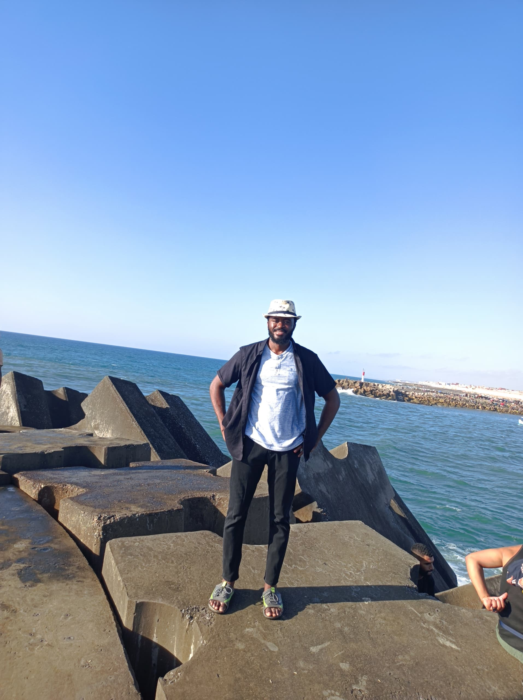

### What I do

I am a scientist always hungry to learn new things about Technology, Mathematics, Machine Learning, and Project Management. I am very curious and always ready to work on challenging tasks. I really prefer deliberate practice and I am used to taking part in competitions on [Kaggle](https://www.kaggle.com/) and [Zindi](https://zindi.africa/).

Here, I write articles on everything I learn. It's a kind of log journal for me. I cover topics like data visualization, modelling, engineering and also share techniques I use in programming contests.

### Personal

In the twenties, beninese and passionate of activities such as playing basket ball, jogging, reading and blogging, I am aiming to become a renaissance man, someone who is passionate about every arts and sciences, someone who keeps to have doubts about the answers to his questions.

### Academic Background

[Even though my interest is in data science generally, I started off majoring in [Economic Statistics](http://eneam.uac.bj/) as an undergraduate, and eventually obtained a certification in [Data Science](https://dit.sn/). During undergraduate school, I became interested in data science for practical reasons, eventually choosing it as a concentration. That turned out to be a good fit for me, and I've been exploring and analyzing data ever since. At the moment, I am more passionate about the applications of Data in the field of finance, and the development of innovative and robust financial models.]{itemprop="description"}

### Present

[Currently I am an]{itemprop="description"}[Independent Data Scientist]{itemprop="jobTitle"}, and I provide analytical insights and programming expertise to enable customers from a different range of industries realize their objectives.

 Previously, I was a Data Analyst Intern for [APG](https://www.afripayway.com/) in Dakar, Senegal. Before that, I was a Statistician intern [[INSAE](https://insae.bj/) at the National Institute of Economic and Statistical Analysis in Benin. In both settings I provided analytical, visualization, programming, conceptual, and other support to companies.]{itemprop="affiliation alumniOf"}

 

I am passionate about doing quality work that answers the questions at hand. What drew me to the world of data science and keeps my interest is that it frees me to engage in whatever science I like, and provides a great many tools with which to discover more about the things we humans are most interested in. CV can be found [here](medias/CV_AI_ENGLISH.pdf). Feel free to reach me if you got any questions.

   

::: {style="text-align: center;  color: #0085a1"}
[DOSSEH Ameck Guy-Max Désiré]{itemprop="name" style="font-variant: small-caps; color: #0085a1; font-size: 150%"}

<a style='color: #0085a1' href="mailto:desiredosseh20@gmail.com" title="Email me" class='social-icon'> [<i class="fa fa-circle fa-stack-2x"></i> <i class="fa fa-envelope fa-stack-1x fa-inverse"></i>]{.fa-stack .fa-lg aria-hidden="true"} [Email me]{.sr-only} </a> <a style='color: #0085a1' href="https://github.com/QuantBender" title="GitHub" class='social-icon'> [<i class="fa fa-circle fa-stack-2x"></i> <i class="fa fa-github fa-stack-1x fa-inverse"></i>]{.fa-stack .fa-lg aria-hidden="true"} [GitHub]{.sr-only} </a> <a style='color: #0085a1' href="https://www.linkedin.com/in/d%C3%A9sir%C3%A9-a-d-72b624110/" title="LinkedIn" class='social-icon'> [<i class="fa fa-circle fa-stack-2x"></i> <i class="fa fa-linkedin fa-stack-1x fa-inverse"></i>]{.fa-stack .fa-lg aria-hidden="true"} [LinkedIn]{.sr-only} </a> <a style='color: #0085a1' href="https://twitter.com/desire_dosseh" title="twitter" class='social-icon'> [<i class="fa fa-circle fa-stack-2x"></i> <i class="fa fa-twitter fa-stack-1x fa-inverse"></i>]{.fa-stack .fa-lg aria-hidden="true"} [Twitter]{.sr-only} </a>
:::
