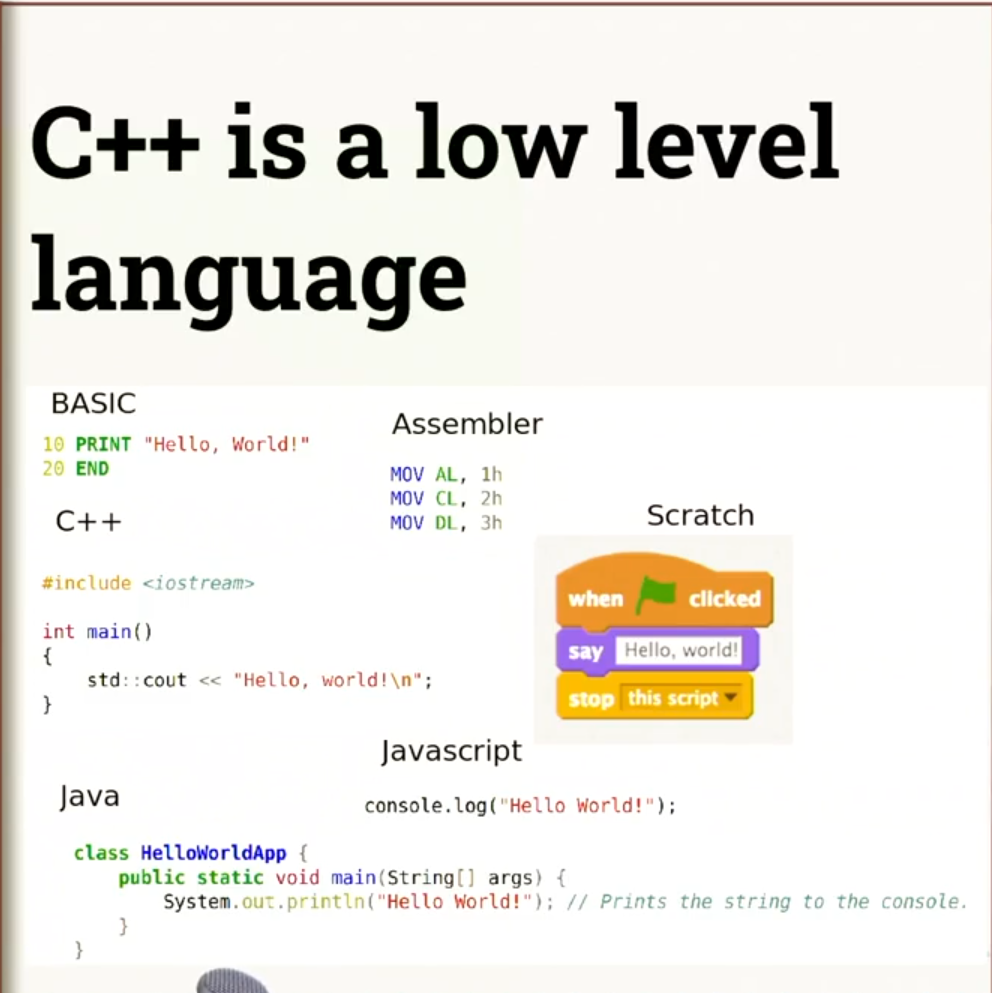

> Estimated reading time: ~5 minutes

# High vs. Low-Level Programming Languages: A Quick Guide

When learning about programming languages, it's important to understand the distinction between high-level and low-level languages. This difference primarily revolves around how closely a language interacts with the underlying hardware of a computer.

## What Makes a Language High or Low Level?

A high-level language provides a significant level of abstraction from the hardware. Programmers using these languages don't need to worry about the intricate details of how the machine operates—such as how transistors switch or how the CPU manages memory. These details are handled by the language itself, allowing developers to focus on expressing their ideas and building applications without delving into hardware specifics.

On the other hand, a low-level language requires the programmer to be more aware of the hardware. These languages offer more direct access to the computer's operating system and hardware features. As a result, developers have greater control over how their programs execute, which can be crucial for certain types of applications.

## Where Does C++ Fit In?

C++ is considered a low-level language because it allows programmers to interact closely with the hardware. This level of control makes C++ especially valuable for building critical and real-time systems, such as digital signal processing or avionics control. In these scenarios, being able to fine-tune how the software interacts with the hardware can lead to more efficient and reliable systems.

## The Trade-Offs

While high-level languages make development easier by hiding hardware complexities, low-level languages like C++ empower developers to optimize performance and behavior. The choice between high and low-level languages depends on the needs of the project and the level of control required.

------------------------------------------------------------------------

**Discussion Prompt:**

Think about some programming languages you know. Based on your research or experience, would you classify them as high or low level? Feel free to get in touch with me if you have any questions or need further clarification on this topic. Understanding the nuances of programming languages can significantly impact your development approach and the performance of your applications.
