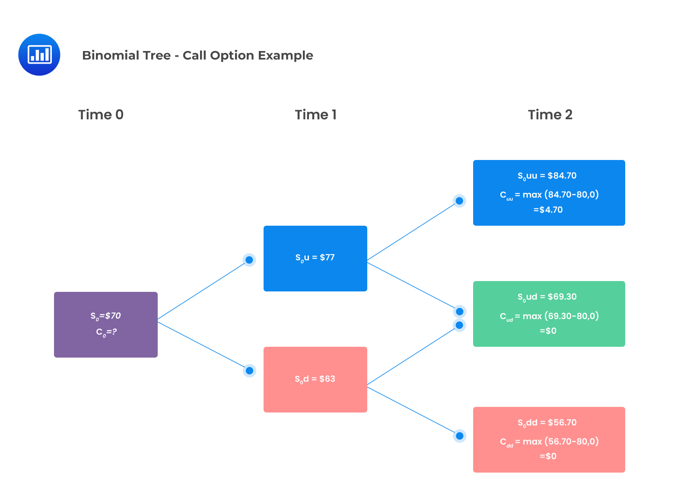

```{r, echo=FALSE, include=FALSE}
library(rmarkdown)
render("The Binomial No-Arbitrage Pricing Model.Rmd", output_format = "html_document", output_file = "The Binomial No-Arbitrage Pricing Model.html")
```

> Estimated reading time: \~15 minutes



<iframe src="The Binomial No-Arbitrage Pricing Model.html" width="100%" height="600px">

</iframe>

</html>
