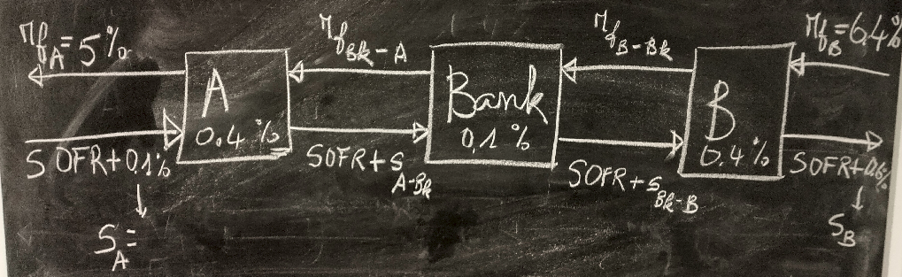

```{r, echo=FALSE, include=FALSE}
library(rmarkdown)
render("SDUCP.Rmd", output_format = "html_document", output_file = "SDUCP.html")
```

> > Estimated reading time: \~7 minutes



> DISCLAIMER: Educational illustration only. Not investment advice. Rates and spreads are stylized / simplified.

## Motivation

Structured interest rate and currency swaps are often introduced with a *comparative advantage* argument: each counterparty has a relative funding edge in one market (fixed vs floating, or currency A vs B) and an intermediary (the bank) captures part of the total surplus while allocating the remainder symmetrically (or per negotiation) to participants.

Traditional textbook presentations pick one feasible set of internal swap legs. Here we formalize each design as a **constraint satisfaction / optimization** problem and enumerate *all* feasible internal rate assignments consistent with fairness and target profit splits.

We use **OR-Tools CP-SAT** (Python) for discrete search by scaling rates to integers. Visualization of a sample of feasible structures is done in R.

Why CP instead of simple algebra? For small textbook examples algebra suffices, but a CP model:

1.  Scales to more constraints (regulatory, credit, netting, bounds, tiers).
2.  Enables enumeration / counting of feasible designs.
3.  Allows objective variants (e.g., minimize max deviation from mid, or impose discrete tick sizes).

## General Modeling Pattern

Each swap situation introduces:

-   Observed external borrowing (or investing) costs for companies.
-   Target gains (surplus) allocated to each party and the intermediary.
-   Decision variables: internal fixed legs and internal floating spreads (or cross-currency fixed legs).
-   Linear balance constraints ensuring each party’s net improvement equals its target gain.
-   Feasibility / dominance constraints (e.g., internal fixed offered to a company cannot exceed its standalone fixed quote, etc.).

We represent rates as percentages (e.g., 5% -\> 5.0) then scale by an integer precision factor to convert to integers for CP-SAT.

<iframe src="SDUCP.html" width="100%" height="600px">

</iframe>

</html>

## Extensions & Ideas

Some natural extensions leveraging CP:

1.  Introduce discrete tick sizes (e.g., 1bp) instead of arbitrary decimals.
2.  Add credit constraints: internal spreads must stay within rating-based corridors.
3.  Optimize an objective (e.g., minimize variance of internal legs around mid-market quotes) instead of pure enumeration.
4.  Add notional scaling decisions under capital limits.
5.  Enforce regulatory capital usage thresholds (linear approximations) as extra constraints.

## Takeaways

-   Constraint Programming makes the space of feasible swap designs explicit.
-   Enumerating solutions supports negotiation insight (range of internal legs that preserve fairness & profit targets).
-   The method generalizes beyond simple two-party + bank cases.
