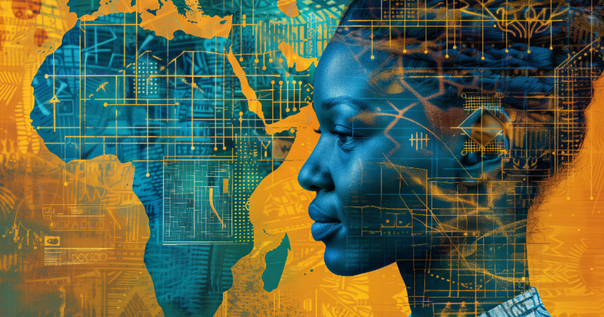
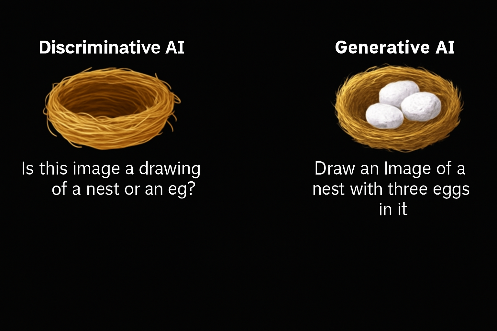

This post is an introduction to Generative AI, a fascinating field of artificial intelligence that focuses on creating new content rather than just analyzing existing data. In this post, we will explore the basics of generative AI, its evolution, and its applications in various domains.

> Estimated reading time: \~3 minutes

# Introduction to Generative AI

## What is Generative AI?

Generative AI refers to artificial intelligence models that can generate new content based on the data they are trained on. Unlike traditional AI, which focuses on analyzing and classifying data, generative AI is designed to create novel data instances, such as text, images, audio, video, code, and more.

## Evolution of AI

Artificial intelligence has been shaping our lives for years, revolutionizing how we live and work. At its core, AI simulates human intelligence using machines, learning from vast amounts of data through a process called training.

## Discriminative AI vs. Generative AI

There are two fundamental approaches to AI:

-   **Discriminative AI**: Learns to distinguish between different classes of data. It is best suited for classification tasks, such as spam detection in emails. Discriminative models use labeled data to identify patterns and make predictions but cannot generate new content or understand context.
-   **Generative AI**: Learns to generate new content by capturing the underlying distribution of the training data. It can respond to prompts (text, image, video, etc.) and produce output in the same or different form. For example, generative AI can create an image from a text prompt or generate text from an image.

### Example

## Deep Learning and Generative Models

Both discriminative and generative models are built using deep learning techniques, which involve training artificial neural networks. These networks consist of neurons modeled after the human brain's information processing.

### Building Blocks of Generative AI

The creative capabilities of generative AI come from models such as: - [Generative Adversarial Networks (GANs)](https://arxiv.org/abs/1406.2661) - [Variational Autoencoders (VAEs)](https://arxiv.org/abs/1906.02691) - [Transformers](https://arxiv.org/abs/1706.03762) - [Diffusion Models](https://arxiv.org/abs/1503.03585)

## Historical Development

-   **1950s**: Early machine learning explored algorithms for creating new data[COMPUTING MACHINERY AND INTELLIGENCE](https://courses.cs.umbc.edu/471/papers/turing.pdf).
-   **1990s**: Neural networks advanced generative AI.
-   **2010s**: Deep learning, large datasets, and enhanced computing power accelerated progress.
-   **2014**: GANs introduced by Ian Goodfellow transformed generative AI.
-   **2018**: [OpenAI introduced GPT](https://cdn.openai.com/research-covers/language-unsupervised/language_understanding_paper.pdf), a transformer-based large language model (LLM).

## Foundation Models and Large Language Models

Foundation models are broad AI models that can be adapted for specialized tasks. Large language models (LLMs) are a category of foundation models trained to understand and generate human language.

Notable LLMs include: - [GPT-3](https://cdn.openai.com/papers/Training_language_models_to_follow_instructions_with_human_feedback.pdf) and [GPT-4](https://arxiv.org/pdf/2303.08774)(OpenAI) - [Pathways Language Model (Google)](https://arxiv.org/abs/2204.02311) - [LLAMA (Meta)](https://arxiv.org/abs/2302.13971)

Other generative models for images include Stable Diffusion and [DALL-E](https://arxiv.org/abs/2102.12092).

## Generative AI Tools and Applications

The development of generative models has led to a growing market for AI tools: - **Text Generation**: ChatGPT, Gemini - **Image Generation**: DALL-E2, MidJourney - **Video Generation**: Synthesia - **Code Generation**: Copilot, AlphaCode

Generative AI is being applied across various domains and industries, offering new possibilities for creativity and productivity.

## Economic Impact

According to [McKinsey](https://www.mckinsey.com/capabilities/mckinsey-digital/our-insights/the-economic-potential-of-generative-ai-the-next-productivity-frontier), generative AI has the potential to change the anatomy of work, augmenting individual capabilities and automating activities. Its impact on productivity could add trillions of dollars in value to the global economy.

## Summary

-   Generative AI models generate new content based on training data.
-   Creative skills of generative AI are built from models like GANs, VAEs, transformers, and diffusion models.
-   Foundation models can be adapted for specialized use cases.
-   Generative AI tools have wide applications across domains and industries.
