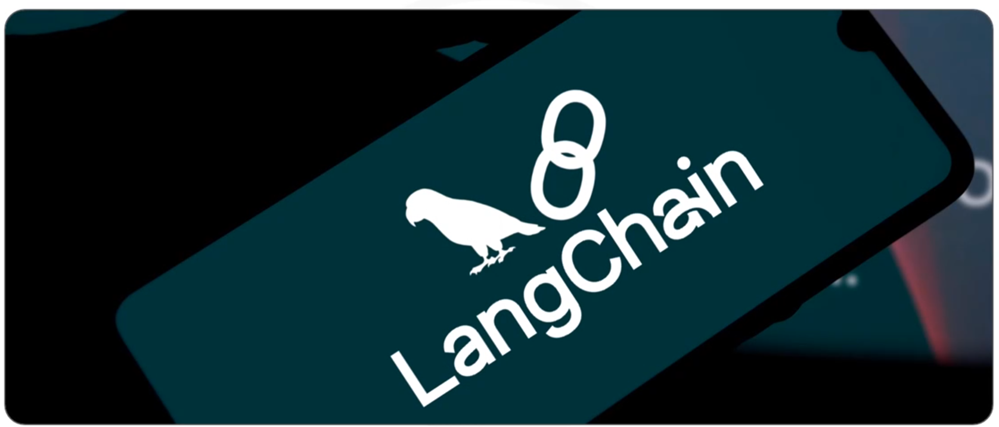

>Estimated reading time: ~4 minutes

## Overview

This post offers a compact primer on three core ideas in LangChain—chains, memory, and agents—and shows how they fit together to build language-powered applications. You’ll see how sequential chains pass information step-by-step, how memory preserves context across turns, and how agents orchestrate tool-using workflows (including a Pandas DataFrame agent for data queries).

## Chains: Structured LLM Workflows

In LangChain, a chain is a sequence of calls that transform inputs into outputs in a predictable flow. The most common pattern is a sequential chain, where each step’s output becomes the next step’s input. This structure makes multi-step reasoning transparent and debuggable.

A simple three-step sequential workflow might look like this:

- Step 1: Given a user’s location, propose a well-known local dish (e.g., for “China,” return “Peking Duck”).
- Step 2: Take the dish name from Step 1 and generate a simple recipe.
- Step 3: Take the recipe from Step 2 and estimate a cooking time.

Typical implementation steps include:
- Define prompt templates for each step with clear input variables.
- Instantiate LLM-powered chain objects per step (for example, using a Mixtral-family chat model).
- Set explicit output keys (e.g., meal, recipe, time) so later steps can reliably consume earlier outputs.
- Combine the steps into a single sequential chain and enable verbose logging to trace the flow end-to-end.

Why it helps:
- Composability: Break complex tasks into small, testable units.
- Transparency: Inspect each stage’s inputs and outputs.
- Reuse: Swap steps or prompts without rewriting the entire flow.

## Memory: Preserving Context Across Interactions

Memory in LangChain stores conversational history and past results so your application can respond with continuity. A chain can:
- Read from memory to enrich or contextualize the current user input.
- Write the latest inputs and outputs back to memory after execution.

One common utility is ChatMessageHistory, which keeps a sequence of human and AI messages. For example, you might:
- Append an AI greeting (“Hi”).
- Append the user’s question (“What is the capital of France?”).
- Use the stored history to inform the next response—allowing the system to remain consistent and context-aware across turns.

Why it helps:
- Better coherence across multi-turn conversations.
- Personalization and continuity without manual state-passing.
- Cleaner code: memory handling is encapsulated, not hard-coded in prompts.

## Agents: Tool-Using, Decision-Making Runtimes

Agents are higher-level controllers that decide which actions to take next—often invoking tools like search engines, databases, or code execution to fulfill a user’s request. The LLM provides reasoning and planning, while the agent executes chosen tools step by step.

Example flow:
- The user asks for Italy’s population.
- The agent plans an approach (e.g., use a search tool, then parse results).
- It runs the tools, curates the answer, and returns a final, user-friendly response.

### Example: Pandas DataFrame Agent

A practical agent in LangChain can query and describe data using natural language:
- Instantiate a DataFrame agent (passing a chat model and a Pandas DataFrame).
- Enable verbose mode to inspect the agent’s reasoning traces.
- Invoke with a question like “How many rows are in the DataFrame?”

Behind the scenes, the model translates the question into Python snippets, executes them safely, and surfaces the result (e.g., “139 rows”).

Why it helps:
- Natural language access to tabular data.
- Reusable, auditable logs of reasoning and code execution.
- Bridges LLM strengths (language + reasoning) with Python’s data tooling.

## Putting It Together

- Chains give you reliable, stepwise transformations.
- Memory adds continuity and context, improving multi-turn results.
- Agents extend capability by selecting and invoking the right tools at the right time.

Start small with a sequential chain, layer in memory once you need continuity, and introduce agents when your use case requires tool use, retrieval, or code execution.

## Recap

- Chains: predictable sequences where each step’s output feeds the next.
- Memory: read/write context that preserves conversation and results across turns.
- Agents: decision-makers that leverage tools (search, code, data) to accomplish tasks.
- DataFrame agent: a focused agent that converts natural language into Python operations over Pandas data.

## References

- LangChain: Chains (Python)
  - https://python.langchain.com/docs/concepts/#chains
  - https://python.langchain.com/docs/how_to/#chains
- LangChain: Memory
  - https://python.langchain.com/docs/concepts/#memory
  - Chat message history: https://python.langchain.com/docs/how_to/message_history/
- LangChain: Agents
  - https://python.langchain.com/docs/concepts/#agents
  - Tools and execution: https://python.langchain.com/docs/how_to/#agents
- Pandas DataFrame Agent
  - (Classic) create_pandas_dataframe_agent: https://python.langchain.com/docs/integrations/toolkits/pandas/
- Mixtral / Mistral Models
  - Mistral AI overview: https://mistral.ai/news/mixtral-of-experts/
