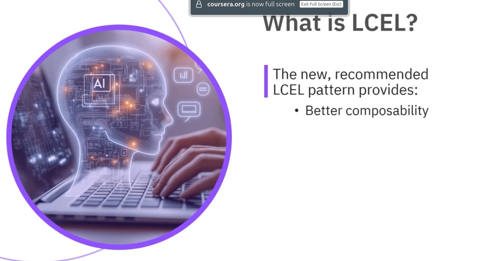

> Estimated reading time: \~4–5 minutes

## Overview

LangChain Expression Language (LCEL) is a modern, composable pattern for wiring up LLM applications. It emphasizes clarity and reuse by connecting components with a pipe operator, simplifying how data flows from inputs (prompts, retrievers, tools) to outputs (model responses, parsed results).

Compared to older, monolithic “LLM chain” styles, LCEL improves composability, readability, and flexibility—especially for tasks that benefit from clean orchestration, parallel execution, streaming, and tracing.

## Why LCEL

-   Clear data flow: The pipe operator makes sequences explicit and easy to read.
-   Composable: Swap in/out prompts, models, parsers, and tools without changing the overall structure.
-   Productive defaults: LCEL automatically wraps common Python objects/functions into runnable components.
-   Practical orchestration: Great fit for everyday chains; for complex, branching workflows, pair LCEL with LangGraph.

## Core Concepts

-   Runnables: A unified interface for building blocks like LLMs, retrievers, tools, and functions that can be sequenced or parallelized.
-   Composition primitives:
    -   RunnableSequence: Connects components in order, passing each output to the next.
    -   RunnableParallel: Feeds the same input to multiple components concurrently and aggregates results.
-   Pipe operator (\|): Concise syntax that replaces verbose sequence definitions. It’s the preferred way to connect components in LCEL.

## Automatic Type Coercion

LCEL reduces boilerplate by converting common Python structures into runnables:

-   Functions → RunnableLambda (transform inputs to outputs)
-   Dictionaries → RunnableParallel (run multiple subchains simultaneously and return a dict of results)

This lets you mix standard Python code with LangChain components without manual adapters.

## Example: Parallel Summarize, Translate, and Analyze

The dictionary form maps keys to subchains. LCEL interprets the dict as a parallel runnable; each subchain receives the same input:

``` python
# Illustrative example (Python LCEL)
from langchain_core.prompts import PromptTemplate
from langchain_core.output_parsers import StrOutputParser
from langchain_openai import ChatOpenAI

llm = ChatOpenAI(model="gpt-4o-mini")  # or another provider

summary_prompt = PromptTemplate.from_template("Summarize:\n\n{text}")
translate_prompt = PromptTemplate.from_template("Translate to Spanish:\n\n{text}")
sentiment_prompt = PromptTemplate.from_template("Assess sentiment (pos/neg/neutral):\n\n{text}")

summary_chain = summary_prompt | llm | StrOutputParser()
translation_chain = translate_prompt | llm | StrOutputParser()
sentiment_chain = sentiment_prompt | llm | StrOutputParser()

# Dict becomes RunnableParallel under LCEL
multi_chain = {
  "summary": summary_chain,
  "translation": translation_chain,
  "sentiment": sentiment_chain,
}

result = multi_chain.invoke({"text": "Your input passage here."})
# result -> {"summary": "...", "translation": "...", "sentiment": "..."}
```

## Example: A Simple Prompt-to-LLM Sequence

Here a Python function is auto-wrapped as RunnableLambda and piped into the LLM, then parsed to a string:

``` python
from langchain_core.output_parsers import StrOutputParser
from langchain_openai import ChatOpenAI

def format_prompt(adjective: str, content: str) -> str:
    return f"Write a {adjective} joke about: {content}"

llm = ChatOpenAI(model="gpt-4o-mini")

chain = format_prompt | llm | StrOutputParser()

output = chain.invoke({"adjective": "witty", "content": "compilers"})
# output -> final string from the LLM
```

-   The function receives a dict with keys adjective and content.
-   LCEL formats the prompt via the function, sends it to the LLM, then parses the model output.

## When to Use LCEL vs LangGraph

-   Use LCEL for:
    -   Straight-line or lightly branching chains
    -   Prompt templating + LLM calls + parsing
    -   Parallel fan-out/fan-in patterns
    -   Streaming and tracing with minimal setup
-   Use LangGraph for:
    -   Complex, stateful, tool-rich workflows
    -   Conditional routing, looping, and recovery
    -   Multi-agent or multi-step planning
    -   Still compose each node internally with LCEL

## Key Takeaways

-   LCEL structures chains with a pipe operator for clear, readable data flow.
-   Prompts are templates with variables (e.g., {var}) you bind at runtime.
-   RunnableSequence and RunnableParallel describe sequential and concurrent execution.
-   The pipe operator is concise syntax that effectively replaces explicit sequences.
-   Functions and dicts are auto-coerced into runnables, reducing boilerplate.
-   For advanced orchestration, integrate LCEL nodes within LangGraph.

## References

-   LangChain Expression Language (LCEL) overview: https://python.langchain.com/docs/expression_language/
-   Runnables and composition: https://python.langchain.com/docs/expression_language/interface/
-   Output parsing: https://python.langchain.com/docs/concepts/output_parsers/
-   LangGraph project: https://langchain-ai.github.io/langgraph/
-   Templates and prompting:
