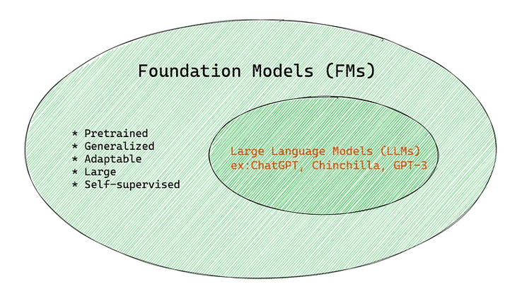

\> Estimated reading time: \~4 minutes

## Introduction

Large language models (LLMs) have accelerated the practical impact of generative AI across tasks such as drafting, summarization, classification, code assistance, and knowledge transformation. These systems are instances of a broader shift toward **foundation models**—large pretrained models adaptable to many downstream applications with minimal additional data.

## What Are Foundation Models?

A foundation model is a model pretrained (typically self-supervised) on broad, heterogeneous corpora and then adapted via fine-tuning, lightweight parameter-efficient methods, or prompting to specialized tasks [1](https://arxiv.org/abs/2108.07258). This shifts AI strategy from maintaining many narrow models to cultivating a single adaptable backbone.

## Pretraining Objective

In language, common objectives include next-token prediction (autoregressive) and masked-token reconstruction. Scaling studies show performance improves predictably with model size, data size, and compute budget [2](https://arxiv.org/abs/2001.08361). Although the base objective is generative, emergent representations enable strong performance on classification, extraction, reasoning, and retrieval-augmented tasks.

## Adaptation Techniques

| Technique | Data Need | Update Scope | Typical Use Case |
|----|---:|----|----|
| Full Fine-Tuning | Medium–High | All parameters | High-stakes domain shifts |
| Parameter-Efficient Tuning (Adapters, LoRA, Prefix) | Low–Medium | \<5% parameters | Multi-task / multi-tenant deployments |
| In-Context Prompting (Zero/Few-Shot) | Minimal | None | Rapid prototyping & evaluation |
| Instruction Tuning / Alignment (e.g., RLHF) | Curated instructions & preferences | Select phases | Safer, more helpful behavior |

Representative methods include Adapters [3](https://arxiv.org/abs/1902.00751), LoRA [4](https://arxiv.org/abs/2106.09685), and Prompt/Prefix Tuning [5](https://arxiv.org/abs/2104.08691). Prompt engineering and chain-of-thought styles can further boost reasoning performance [6](https://arxiv.org/abs/2107.13586).

## Cross-Domain Expansion

Foundation model paradigms now span: - Text-to-Image & Vision (diffusion + text encoders) [7](https://arxiv.org/abs/2204.06125), [13](https://arxiv.org/abs/2112.10752) - Code generation and completion [8](https://arxiv.org/abs/2107.03374) - Molecular and materials discovery (chemical encoders) [9](https://arxiv.org/html/2405.04912v2) - Geospatial and climate modeling (earth observation encoders) [10](https://arxiv.org/html/2505.17136v1) - Multimodal unification (language + vision + structured data)

## Enterprise Advantages

1.  Performance: Strong zero/few-shot baselines reduce labeled data demands.\
2.  Productivity: Reuse one backbone for many workflows.\
3.  Consistency & Governance: Centralized model governance vs. fragmented task silos.\
4.  Extensibility: Rapid addition of new tasks via adapters or prompts.\
5.  Time-to-Value: Prototype with prompting before committing to fine-tuning.

## Key Challenges

| Category | Challenge | Impact |
|----|----|----|
| Compute & Cost | Training + inference expense | Higher operational TCO |
| Latency | Large parameter counts | UX degradation under concurrency |
| Trust & Safety | Bias, toxicity, hallucination, provenance gaps [1](https://arxiv.org/abs/2108.07258) | Compliance & reputation risk |
| IP & Licensing | Unclear training data composition | Legal exposure |
| Security | Prompt injection, data leakage | Data governance failures |
| Sustainability | Energy & carbon footprint | ESG constraints |
| Evaluation | Benchmark obsolescence | Blind spots in deployment quality |

## Mitigation Strategies

-   Data Curation: Deduplication, toxicity filtering, source stratification.\
-   Alignment Layers: Instruction tuning, preference optimization, refusal policies, output classifiers.\
-   Parameter-Efficient Fine-Tuning: Adapters/LoRA to localize risk.\
-   Inference Optimization: Quantization, sparsity, Mixture-of-Experts, distillation.\
-   Observability: Structured logging (prompt, output, latency, safety flags).\
-   Retrieval Augmented Generation (RAG): Ground answers in auditable corpora to reduce hallucination.\
-   Model & System Cards: Document scope, limitations, risk taxonomy.\
-   Access & Guardrails: Tiered API policies, prompt sanitization, secret detection.

## Adoption Playbook

| Phase | Goal | Selected Actions |
|----|----|----|
| Discovery | Identify high-ROI, low-risk targets | Task triage, feasibility scoring |
| Prototype | Validate utility & cost envelope | Prompt variants, small eval set |
| Pilot | Measure KPIs & safety | A/B test vs. baseline models |
| Hardening | Reliability & governance | Monitoring, rollback, guardrails |
| Optimization | Cost & performance tuning | Quantize, batch, adapter library |
| Continuous Assurance | Ongoing trust & drift control | Bias audits, red-teaming, retraining cadence |

Potential KPIs: task accuracy, hallucination rate, latency (P95), cost per 1K tokens, override rate, safety incident count.

## Hallucination Measurement & Reduction

Measurement: retrieval grounding scores, contradiction detection, uncertainty heuristics (entropy, self-consistency variance), human sampling.\
Reduction: retrieval augmentation, constrained decoding, citation enforcement, abstention policies, tool-integrated reasoning.

## Efficiency & Cost Engineering

-   Batching & request multiplexing\
-   KV-cache reuse for conversational contexts\
-   Quantization (INT8 / INT4 / QLoRA) [15](https://arxiv.org/abs/2305.14314)\
-   Early exit / layer dropping for latency-sensitive use\
-   Distillation to smaller specialist models after task stabilization

## Governance & Compliance

Adopt layered controls: pre-deployment red teaming, model cards, privacy-preserving preprocessing (PII redaction), continuous monitoring dashboards, and periodic fairness & robustness audits aligned with emerging AI regulatory frameworks.

## Strategic Outlook

Evolving directions: - Modular, composable adapter ecosystems - Energy-aware sparse and low-rank training recipes - Retrieval-grounded verifiable generation - Multimodal and agentic orchestration with auditable tool use - Domain-specialized foundation derivatives for regulated industries

## Summary

Foundation models provide a unifying substrate for diverse AI capabilities, unlocking performance and productivity while introducing new governance and efficiency challenges. Sustainable value requires disciplined evaluation, alignment, efficiency engineering, and continuous trust assurance.

## References

\[1\] Bommasani et al. 2021. On the Opportunities and Risks of Foundation Models. arXiv:2108.07258.\
\[2\] Kaplan et al. 2020. Scaling Laws for Neural Language Models. arXiv:2001.08361.\
\[3\] Houlsby et al. 2019. Parameter-Efficient Transfer Learning for NLP (Adapters). ACL.\
\[4\] Hu et al. 2022. LoRA: Low-Rank Adaptation of Large Language Models. arXiv:2106.09685.\
\[5\] Lester, Al-Rfou, Constant. 2021. The Power of Scale for Parameter-Efficient Prompt Tuning. EMNLP.\
\[6\] Liu et al. 2023. Pre-train, Prompt, and Predict: A Systematic Survey of Prompting. ACM CSUR.\
\[7\] Ramesh et al. 2022. Hierarchical Text-Conditional Image Generation with CLIP Latents (DALL·E 2). arXiv:2204.06125.\
\[8\] Chen et al. 2021. Evaluating Large Language Models Trained on Code (Codex). arXiv:2107.03374.\
\[9\] Ross, J., et al. (2023). Large-Scale Chemical Language Representations Capture Molecular Structure and Properties. arXiv preprint arXiv:2301.09653. \[10\] Ji et al. 2025. Foundation Models for Geospatial Reasoning: Assessing the Capabilities of Large Language Models in Understanding Geometries and Topological Spatial Relations. arXiv:2505.17136. \[11\] Brown et al. 2020. Language Models are Few-Shot Learners (GPT-3). NeurIPS.\
\[12\] Ouyang et al. 2022. Training Language Models to Follow Instructions with Human Feedback. arXiv:2203.02155.\
\[13\] Rombach et al. 2022. High-Resolution Image Synthesis with Latent Diffusion Models. CVPR.\
\[14\] Wei et al. 2022. Chain-of-Thought Prompting Elicits Reasoning in Large Language Models. arXiv:2201.11903.\
\[15\] Dettmers et al. 2023. QLoRA: Efficient Finetuning of Quantized LLMs. arXiv:2305.14314.
