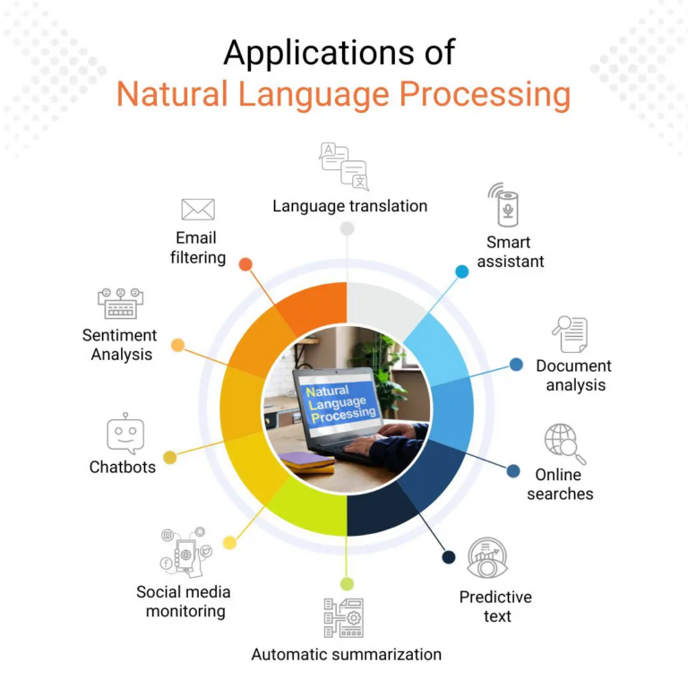

> Estimated reading time: \~5 minutes

# Introduction

Natural Language Processing (NLP) enables computational systems to interpret, represent, and generate human language. Human speech or writing arrives as **unstructured text**; NLP methods convert it into **structured representations** (features, tags, semantic frames, entities) for downstream reasoning.

Conceptual split:

-   Natural Language Understanding (NLU): unstructured → structured

-   Natural Language Generation (NLG): structured → natural language

Focus here: NLU.

# Representative Use Cases

Some applications of NLU are summarized below. Each transforms raw text into structured outputs that enable further processing or decision-making.

| Use Case | Goal | Illustrative Outputs |
|----|----|----|
| Machine Translation | Cross-language meaning preservation | Translated sentence |
| Virtual Assistants / Chatbots | Intent + slot extraction | Intent label, slot values |
| Sentiment Analysis | Polarity / emotion classification | Positive / negative / neutral |
| Spam Detection | Filter unsolicited / malicious content | Spam / ham |
| Information Extraction | Entities, relations, events | (Entity, type), (Relation, args) |
| Content Moderation | Policy / safety screening | Violation flags |

# From Unstructured to Structured: Pipeline Overview

Modern end‑to‑end transformers internalize many steps, yet the classical pipeline aids transparency, control, and low‑resource adaptation.

## Ingestion and Normalization

Lowercasing (task dependent), Unicode normalization, punctuation and whitespace standardization, optional spelling correction.

## Tokenization

Split text into tokens (words, subwords, characters). Subword (BPE, WordPiece) balances vocabulary size and unknown word handling.

## Stemming vs. Lemmatization

| Aspect | Stemming | Lemmatization |
|----|----|----|
| Method | Heuristic affix stripping | Morphological + lexical analysis |
| Example (“better”) | bet | good |
| Precision | Lower | Higher |
| Speed | Higher | Lower |

Choice depends on semantic sensitivity.

## Part-of-Speech (POS) Tagging

Assign syntactic categories (NN, VB, JJ) using sentence context; supports parsing, disambiguation, feature construction.

## Named Entity Recognition (NER)

Detect and classify spans (e.g., PERSON, ORG, GPE) to enable structured indexing and knowledge graph population.

## Additional Possible Steps

Dependency parsing, constituency parsing, coreference, semantic role labeling, entity linking, intent/slot extraction.

## Output Structuring Example

Raw text: “add eggs and milk to my shopping list”

``` json
{
  "intent": "ADD_TO_LIST",
  "items": [
    {"name": "eggs", "qty": 1},
    {"name": "milk", "qty": 1}
  ],
  "target_list": "shopping"
}
```

# Machine Translation Nuance

Literal word mapping fails for idioms, morphology, syntax divergence. Neural MT (sequence-to-sequence with attention, later transformers) models contextual dependencies, improving fluency and adequacy over phrase-based statistical systems.

# Ambiguity and Context

Lexical items (e.g., “make”) shift syntactic role with context. Contextual encoders (transformers) outperform earlier HMM/CRF taggers by modeling long-range dependencies and polysemy resolution.

# Illustrative Error Anecdote

Round-trip translation distortions of idioms show need for semantic modeling beyond word-level substitution; motivates context-aware architectures and richer evaluation (e.g., [COMET](https://arxiv.org/abs/2009.09025), [BLEURT](https://arxiv.org/abs/2004.04696)) beyond surface n‑gram overlap.

# Modern Neural Integration

Large pretrained language models implicitly perform tokenization (subword), contextual representation, and multi-task adaptation (POS, NER, sentiment). Explicit intermediate artifacts remain useful for interpretability, rule hybrids, compliance logging, and constrained generation.

# Evaluation Considerations

| Task | Metrics | Notes |
|----|----|----|
| MT | BLEU, chrF, COMET | Combine automatic + human adequacy |
| Sentiment | Accuracy, F1 | Handle class imbalance |
| NER | Precision / Recall / F1 (span) | Exact span boundaries matter |
| Spam | Precision, Recall, ROC-AUC | Threshold tunes cost trade-off |
| POS | Token Accuracy | Downstream impact varies |

Robust evaluation includes adversarial, domain-shift, fairness, and temporal drift slices.

# Practical Implementation Notes

-   Subword units curb OOV but may fragment semantics; aggregate when needed.
-   Lemmatization requires language-specific morphological resources.
-   Domain adaptation: continued pretraining or fine-tuning on in-domain corpus.
-   Governance: version prompts/models, log preprocessing config and decoding parameters.

# Ethical and Robustness Considerations

| Area | Risk | Mitigations |
|----|----|----|
| Bias | Demographic stereotypes | Diverse corpora, bias audits, debiasing filters |
| Safety | Toxic / harmful outputs | Content filters, refusal policies |
| Privacy | PII leakage in logs | Redaction, minimization, access control |
| Drift | Language & topic shift | Scheduled re-evals, active learning |
| Hallucination | Fabricated facts | Retrieval grounding, citation enforcement |

# Summary

NLP transforms raw language into structured, machine-actionable representations via layered processing (tokenization, morphological normalization, syntactic/semantic tagging). Pretrained transformers unify many steps but explicit pipelines remain critical for transparency, control, specialized optimization, and risk management.

# References

\[1\] Jurafsky & Martin. 2023. Speech and Language Processing (3rd ed. draft).\
\[2\] Porter. 1980. An Algorithm for Suffix Stripping. Program.\
\[3\] Miller. 1995. WordNet: A Lexical Database for English. CACM.\
\[4\] Brill. 1995. Transformation-Based Error-Driven Learning and POS Tagging. ACL.\
\[5\] Tjong Kim Sang & De Meulder. 2003. CoNLL-2003 Shared Task (NER).\
\[6\] Pang & Lee. 2008. Opinion Mining and Sentiment Analysis. Found. Trends IR.\
\[7\] Sahami et al. 1998. A Bayesian Approach to Filtering Junk E-Mail. AAAI Workshop.\
\[8\] Sutskever, Vinyals, Le. 2014. Sequence to Sequence Learning with Neural Networks. NeurIPS.\
\[9\] Bahdanau, Cho, Bengio. 2015. Neural Machine Translation by Jointly Learning to Align and Translate. ICLR.\
\[10\] Vaswani et al. 2017. Attention Is All You Need. NeurIPS.\
\[11\] Devlin et al. 2019. BERT: Pre-training of Deep Bidirectional Transformers. NAACL.\
\[12\] Brown et al. 2020. Language Models are Few-Shot Learners. NeurIPS.\
\[13\] Wolf et al. 2020. Transformers: State-of-the-Art NLP. EMNLP.\
\[14\] Bird, Klein, Loper. 2009. Natural Language Processing with Python. O’Reilly.\
\[15\] Raffel et al. 2020. Exploring the Limits of Transfer Learning with a Unified Text-to-Text Transformer (T5). JMLR.
