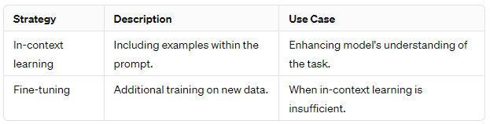

 \> Estimated reading time: \~4 minutes

## 1. What Is In‑Context Learning?

In‑context learning (ICL) is the ability of a large language model (LLM) to **infer a new task pattern directly from examples placed inside the prompt at inference time**—without updating its weights or performing explicit gradient-based fine‑tuning. You provide a handful of natural‑language demonstrations; the model generalizes the pattern on the fly.

### 1.1 Key Properties

-   **No parameter updates**: Adaptation happens purely through the prompt.
-   **Few-shot efficiency**: Often just 2–6 curated demonstrations improve quality.
-   **Rapid iteration**: Swap or refine examples to steer behavior instantly.
-   **Ephemeral adaptation**: Behavior reverts once examples are removed (no lasting memory).

### 1.2 When It Shines vs. When It Struggles

| Scenario | ICL Advantage | Consider Alternatives |
|----|----|----|
| Quick prototype of a new classification style | No training pipeline needed | If volume is huge & latency critical → lightweight fine‑tuned model |
| Highly structured transformation (formatting, extraction) | Fast prompt tweaking | If accuracy must exceed strict thresholds |
| Domain with sparse labeled data | Few curated exemplars suffice | If task requires reasoning beyond context window |
| Long, complex multi-step reasoning | May partially follow pattern | Consider chain-of-thought prompting or tool augmentation |

## 2. Prompt Engineering: Designing the Interaction Surface

Prompt engineering is the **systematic crafting and refinement of instructions + context** to reliably elicit desired outputs from an LLM. Think of a prompt as a mini contract between you (intent) and the model (completion behavior).

### 2.1 Core Objectives

-   Increase **clarity** (unambiguous task specification).
-   Provide **relevance** (only information the model should leverage).
-   Enforce **structure** (schemas, delimiters, output markers) to simplify parsing.
-   Control **style & tone** when needed.

### 2.2 Four Canonical Prompt Components

| Component | Purpose | Practical Tip |
|----|----|----|
| Instruction | States the task plainly | Use imperative voice ("Classify", "Summarize") |
| Context | Supplies background / constraints | Separate with clear labels or fenced blocks |
| Input Data | The concrete content to act on | Delimit with markers (e.g. `TEXT ...`) |
| Output Indicator | Signals where / how to respond | Prefix with `Answer:` or `Sentiment:` etc. |

### 2.3 Example (Sentiment Classification)

``` text
Instruction: Classify the customer review as Positive, Neutral, or Negative.
Context: Product launched last week; early shipping delays reported.
Review: "The product arrived late but the quality exceeded my expectations."
Output Format: Sentiment=<ONE_WORD>
Sentiment:
```

### 2.4 Example (Few‑Shot In‑Context Learning)

``` text
You are a sentiment classifier. Use only: Positive | Neutral | Negative.

Review: "Packaging was damaged and instructions missing." → Negative
Review: "Arrived early; setup was quick." → Positive
Review: "Works as described." → Neutral
Review: "Support was slow but ultimately helpful." → Neutral

Now classify:
Review: "The product arrived late but the quality exceeded my expectations." →
```

## 3. Advantages of Strong Prompt Design

-   **Higher accuracy** vs. naïve, underspecified prompts.
-   **Reduced hallucination** via explicit scope & constraints.
-   **Lower need for repeated fine‑tuning** on iterative task variants.
-   **Consistent structure** enables downstream automation (parsers, evaluators).

## 4. Limitations & Mitigations

| Limitation | Root Cause | Mitigation Strategy |
|----|----|----|
| Context window saturation | Excess examples or verbose background | Compress / summarize; choose prototypical examples |
| Inconsistent style outputs | Ambiguous or absent formatting guidance | Provide explicit output template + negative examples |
| Overfitting to exemplar wording | Too few / non-diverse demonstrations | Vary phrasing; rotate representative cases |
| Hidden bias in examples | Skewed demonstration set | Audit example distribution; add balancing samples |
| Complex reasoning failures | Requires deeper multi-step logic | Add chain-of-thought or tool invocation steps |

## 5. Workflow: Iterative Prompt Refinement Loop

1.  **Baseline Draft**: Write minimal instruction + one exemplar. Measure shortcomings.
2.  **Error Log**: Categorize failures (format drift, misclassification, ambiguity, hallucination).
3.  **Targeted Adjustments**: Add only examples addressing distinct failure modes.
4.  **Schema Locking**: Introduce explicit output format / markers once semantics stabilize.
5.  **Regression Set**: Maintain a lightweight evaluation batch to prevent regressions.
6.  **Operationalize**: Version prompt variants; tie changes to metric deltas.

## 6. Quick Diagnostic Checklist

-   [ ] Instruction is imperative & concise
-   [ ] Irrelevant context removed
-   [ ] Examples are diverse & representative
-   [ ] Output schema explicitly defined
-   [ ] Ambiguity / negative instructions included where needed
-   [ ] Edge cases present in regression set

## 7. Frequently Used Enhancements

| Technique | Goal | Snippet |
|----|----|----|
| Role Priming | Set behavioral frame | "You are a meticulous data auditor." |
| Delimiters | Prevent spillover | Use XML-like tags: `<input>...</input>` |
| Explicit Constraints | Bound scope | "Answer with ONLY one of: A,B,C" |
| Error Mode Hints | Reduce hallucinations | "If uncertain, answer: Unknown" |
| Self-Check Prompt | Encourage validation | "List assumptions before final answer." |

## 8. Putting It Together: Composite Prompt Pattern

``` text
SYSTEM ROLE: You are an analytical assistant that outputs a single JSON object.
TASK: Extract sentiment and justification.
CONSTRAINTS: Sentiment ∈ {Positive, Neutral, Negative}. If mixed, choose dominant tone.
EXAMPLES:
1) Text: "Loved the speed." -> {"sentiment":"Positive","reason":"praise speed"}
2) Text: "Okay performance." -> {"sentiment":"Neutral","reason":"mediocre"}
3) Text: "Arrived broken." -> {"sentiment":"Negative","reason":"defect"}
INPUT TEXT: <<The product arrived late but the quality exceeded my expectations.>>
OUTPUT ONLY JSON:
```

## 9. When to Graduate Beyond Pure Prompting

| Trigger | Next Step |
|----|----|
| Stable high-volume task | Fine‑tune or distill for cost & latency |
| Need strict reproducibility | Constrain decoding; use structured parsers |
| Requires external knowledge | Add retrieval (RAG) layer |
| Complex tool use / workflows | Introduce orchestration framework (e.g., LangChain / LangGraph) |

## 10. Key Takeaways

-   In‑context learning offers rapid, training‑free adaptation using embedded examples.
-   Well‑structured prompts balance instruction clarity, focused context, and explicit output markers.
-   Iterative logging + regression evaluation prevents silent degradation.
-   Use ICL for agility; move to fine‑tuning or retrieval when scale, precision, or knowledge breadth demand it.

## 11. References & Further Reading

-   Brown et al. 2020. *Language Models are Few-Shot Learners.* ([arXiv](https://arxiv.org/abs/2005.14165))
-   Wei et al. 2022. *Chain-of-Thought Prompting Elicits Reasoning.* ([arXiv](https://arxiv.org/abs/2201.11903))
-   Prompt Engineering Guide ([site](https://www.promptingguide.ai/))
-   LangChain Documentation ([site](https://python.langchain.com/))
-   OpenAI Model Guidelines ([docs](https://platform.openai.com/docs/))
-   Anthropic Claude Docs ([docs](https://docs.anthropic.com/))

------------------------------------------------------------------------

*This primer rephrases and condenses educational material on in‑context learning and prompt engineering for rapid practitioner onboarding.*
