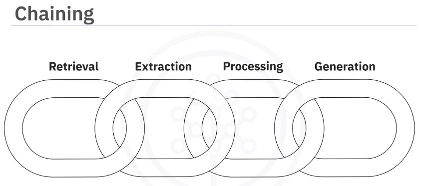

{width=100%}
> Estimated reading time: ~5 minutes

## Introduction

LangChain is an open-source Python framework designed to simplify the development of applications powered by large language models (LLMs). By providing modular components and interfaces, LangChain enables developers to efficiently integrate LLMs into their AI solutions, facilitating tasks such as information retrieval, data extraction, and automated content generation.

## Key Features and Benefits

### Modularity

LangChain’s architecture is highly modular, allowing developers to assemble applications from reusable building blocks. This approach not only accelerates development but also encourages code reuse, reducing maintenance overhead and fostering rapid prototyping.

### Extensibility

The framework is built with extensibility in mind. Developers can easily add new features, adapt existing components, and integrate with external systems. This flexibility ensures that LangChain can evolve alongside emerging AI technologies and changing project requirements.

### Decomposition Capabilities

LangChain excels at breaking down complex queries and tasks into manageable steps, mirroring human problem-solving strategies. This decomposition enables the framework to make accurate inferences from context, resulting in precise and relevant responses.

### Integration with Vector Databases

A standout feature of LangChain is its seamless integration with vector databases. By leveraging embeddings, LangChain enables efficient semantic searches and information retrieval across large datasets, including text, images, audio, and video. This capability is crucial for applications requiring quick access to relevant information.

## Practical Applications

LangChain’s versatility makes it suitable for a wide range of AI tasks:

- **Content Summarization:** Automatically condense articles, reports, and documents, helping users grasp the essence of complex materials such as legal documents.
- **Data Extraction:** Extract key statistics and insights from textual data, transforming raw information into actionable intelligence.
- **Question and Answer Systems:** Enhance customer support and knowledge-based services by providing contextually relevant answers throughout multi-turn conversations.
- **Automated Content Generation:** Streamline routine writing tasks, including drafting emails, brainstorming ideas, and creating technical documentation.

## Working with Multiple Data Types

While LangChain is primarily designed for text-based applications, it can also process images, audio, and video by integrating with external libraries and models (e.g., speech-to-text tools). Embeddings generated from these data types enable semantic searches and similarity matching, broadening LangChain’s applicability across diverse AI domains.

## Conclusion

LangChain empowers AI developers to build robust, scalable, and context-aware applications by offering modularity, extensibility, decomposition capabilities, and seamless integration with vector databases. Its practical use cases span content summarization, data extraction, advanced Q&A systems, and automated writing, making it a valuable tool for modern AI development.

## References

- [LangChain Documentation](https://python.langchain.com/docs/)
- [Vector Databases in AI](https://towardsdatascience.com/vector-databases-in-ai-7e2b6c5b8b6b)
- [OpenAI: Large Language Models](https://openai.com/research/)