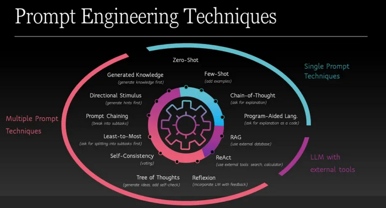

> Estimated reading time: \~6 minutes


## Overview

This article summarizes key advanced prompting strategies for large language models (LLMs), explains when to use them, and outlines supporting tooling ecosystems. Techniques covered: zero-shot, one-shot, few-shot, chain-of-thought (CoT), and self-consistency prompting. It also introduces prompt templates and agent-based applications using frameworks such as LangChain.

## 1. Core Prompting Paradigms

### 1.1 Zero-Shot Prompting
You supply only an instruction or question. The model relies on its pretraining to infer the task (e.g., fact classification). Best when the task is common or well-aligned with general world knowledge.

### 1.2 One-Shot Prompting
You provide a single example plus a new input. The example establishes format or output style. Useful when output structure is non-obvious but limited context suffices.

### 1.3 Few-Shot Prompting
You include a small set (typically 2–10) of labeled examples to demonstrate task patterns (classification, transformation, style). This helps the model generalize formatting, label space, or subtle semantic distinctions without full fine-tuning.

### 1.4 Chain-of-Thought (CoT) Prompting
You explicitly ask the model to reason step-by-step. This decomposes multi-step arithmetic, logical, or commonsense problems. It increases transparency and often accuracy on reasoning benchmarks by surfacing intermediate inferences.

### 1.5 Self-Consistency
Instead of taking a single CoT output, you sample multiple independent reasoning traces (with temperature > 0), then aggregate (e.g., majority vote on final answer). This mitigates variance in reasoning paths and often boosts correctness on math and logic tasks.

## 2. Technique Selection Guide

| Scenario | Recommended Technique | Rationale |
|----------|----------------------|-----------|
| Simple fact recall | Zero-shot | Minimal overhead |
| Format imitation | One-shot | Single template suffices |
| Subtle label mapping | Few-shot | Disambiguates intent |
| Multi-step reasoning | Chain-of-thought | Structured decomposition |
| High-stakes reasoning | Self-consistency + CoT | Aggregated robustness |

## 3. Prompt Design Considerations

- Clarity: Use unambiguous task verbs (classify, translate, summarize).
- Structure: Separate instruction, examples, and query with consistent delimiters.
- Brevity: Avoid extraneous prose; reduce noise that can distract token allocation.
- Specificity: Constrain style, length, or format (e.g., “Output JSON with keys: label, rationale”).
- Incremental Improvement: Iteratively adjust based on observed failure modes (hallucination, formatting drift).

## 4. Tooling Ecosystem

| Tool / Platform | Utility |
|-----------------|---------|
| OpenAI Playground / API | Rapid prompt iteration & model selection |
| Hugging Face Model Hub | Access to diverse open models |
| LangChain | Composable prompt templates, chains, agents |
| IBM AI / Classroom resources | Educational experimentation environment |
| Evaluation Harnesses (e.g., LangChain eval, custom scripts) | Quantitative comparison of prompt variants |

These tools accelerate iterative design, sharing, versioning, and evaluation of prompts across teams.

## 5. Prompt Templates

Prompt templates encapsulate reusable instruction patterns with placeholders. Benefits: consistency, parameterization, reduced duplication, and easier A/B testing (swap adjective, tone, domain).

### Example (LangChain)

````{python}
# filepath: /home/ameck/Downloads/langchain_prompt_example.py
from langchain_core.prompts import PromptTemplate

joke_template = PromptTemplate.from_template(
    "Tell me a {adjective} joke about {topic}."
)

prompt = joke_template.format(adjective="witty", topic="penguins")
print(prompt)
# -> "Tell me a witty joke about penguins."

````
