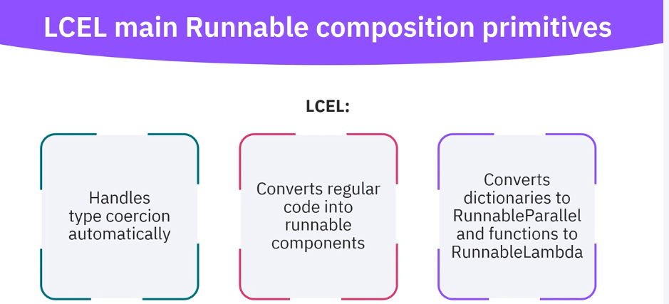

 \> Estimated reading time: \~7 minutes (≈1,300 words \@ \~185 wpm)

## 1. Introduction

LangChain Expression Language (LCEL) is the current recommended approach for assembling language model workflows. It replaces verbose legacy chain classes with a clear pipe (`|`) operator that links modular components (prompt templates, models, transformations, parsers) into readable, testable dataflows.

This article rephrases and restructures the provided material into a cohesive guide, adding context, code examples, and references.

## 2. What LCEL Solves

Earlier patterns (e.g. classic LLMChain) became cumbersome as pipelines gained formatting steps, branching logic, or post-processing layers. LCEL addresses this by:

-   Linear readability: Left-to-right flow mirrors conceptual processing.
-   Composability: Mix sequential and parallel stages seamlessly.
-   Automatic coercion: Functions, dicts, templates auto-wrap into runnable components.
-   Flexibility: Insert validation, parsing, enrichment without wholesale refactors.
-   Operational readiness: Supports async, streaming, tracing, and fan‑out.

## 3. Core Concepts

| Concept | Summary |
|----------------------------------|--------------------------------------|
| Runnable | Unified abstraction: accepts input, returns output. |
| Pipe Operator (`|`) | Composes runnables into a sequential data pipeline. |
| RunnableSequence | Implicit when chaining with `|`; passes output downstream. |
| RunnableParallel | Executes multiple branches concurrently on the same input (dict fan‑out). |
| Type Coercion | Functions → RunnableLambda; dict → parallel runnable; prompt template → runnable formatter. |
| Prompt Template | Text pattern with variable placeholders (e.g. `{topic}`). |

## 4. High-Level Workflow Pattern

1.  Define variables and a structured prompt template.
2.  Build a chain by piping formatters, models, and parsers.
3.  (Optionally) Add parallel enrichment branches.
4.  Invoke synchronously, asynchronously, or stream tokens.
5.  Wrap reusable segments into modules for reuse.

## 5. Building Blocks

| Building Block | Role |
|------------------------------------------------------|------------------|
| PromptTemplate | Deterministic formatting layer. |
| Chat / LLM Model | Generates language output. |
| RunnableLambda | Arbitrary Python transform (pre/post processing). |
| Output Parser | Normalizes model response (string, JSON, schema). |
| Dict of Runnables | Parallel fan‑out producing a result object keyed by branch name. |

## 6. Minimal Sequential Chain

A simple pipeline: format → generate → parse.

```{python}
# Minimal LCEL sequential chain (open-source model, no API key)
# Prerequisites:
#   pip install "langchain>=0.2.0" "langchain-huggingface>=0.0.3" transformers accelerate torch safetensors
# (If no GPU, set device_map=None and remove torch_dtype for pure CPU execution.)

from langchain_core.prompts import PromptTemplate

# Prefer new package; fall back to community if needed
try:
    from langchain_huggingface import HuggingFacePipeline
except Exception:
    from langchain_community.llms import HuggingFacePipeline
from langchain_core.output_parsers import StrOutputParser
from transformers import AutoModelForCausalLM, AutoTokenizer, pipeline
import torch

MODEL_ID = "TinyLlama/TinyLlama-1.1B-Chat-v1.0"

tokenizer = AutoTokenizer.from_pretrained(MODEL_ID)
model = AutoModelForCausalLM.from_pretrained(
    MODEL_ID,
    torch_dtype=torch.float16 if torch.cuda.is_available() else torch.float32,
    device_map="auto" if torch.cuda.is_available() else None
)

gen_pipe = pipeline(
    "text-generation",
    model=model,
    tokenizer=tokenizer,
    max_new_tokens=96,
    temperature=0.7,
    do_sample=True,
    top_p=0.9
)

llm = HuggingFacePipeline(pipeline=gen_pipe)

prompt = PromptTemplate.from_template("Tell a {adjective} joke about {topic}.")
parser = StrOutputParser()

joke_chain = prompt | llm | parser

print(joke_chain.invoke({"adjective": "absurd", "topic": "penguins"}))
```

## 7. Explicit Formatting Stage (RunnableLambda)

Add a preprocessing function before generation.

```{python}
from langchain_core.runnables import RunnableLambda

def normalize_payload(d: dict):
    return {
        "adjective": d["adjective"].strip().lower(),
        "topic": d["topic"].strip()
    }

format_stage = RunnableLambda(normalize_payload) | prompt
chain = format_stage | llm | parser

print(chain.invoke({"adjective": " Witty ", "topic": " Space Exploration  "}))
```

## 8. Parallel Fan-Out (RunnableParallel)

Run multiple tasks (summary, translation, sentiment) simultaneously. A dict automatically becomes a parallel runnable.

```{python}
# Parallel fan-out example (open-source model, no API key)
# Prerequisites:
#   pip install "langchain>=0.2.0" "langchain-huggingface>=0.0.3" transformers accelerate torch safetensors

from langchain_core.prompts import PromptTemplate
from langchain_core.output_parsers import StrOutputParser
from langchain_huggingface import HuggingFacePipeline
from transformers import AutoModelForCausalLM, AutoTokenizer, pipeline
from langchain_core.runnables import RunnableParallel
import torch

MODEL_ID = "TinyLlama/TinyLlama-1.1B-Chat-v1.0"

tokenizer = AutoTokenizer.from_pretrained(MODEL_ID)
model = AutoModelForCausalLM.from_pretrained(
    MODEL_ID,
    torch_dtype=torch.float16 if torch.cuda.is_available() else torch.float32,
    device_map="auto" if torch.cuda.is_available() else None
)

gen_pipe = pipeline(
    "text-generation",
    model=model,
    tokenizer=tokenizer,
    max_new_tokens=128,
    temperature=0.0,      # deterministic
    do_sample=False
)

llm_zero_temp = HuggingFacePipeline(pipeline=gen_pipe)

summary_t = PromptTemplate.from_template("Summarize in one sentence:\n{text}")
translate_t = PromptTemplate.from_template("Translate to French:\n{text}")
sentiment_t = PromptTemplate.from_template("Classify sentiment (positive, neutral, negative):\n{text}")

summary_chain = summary_t | llm_zero_temp | StrOutputParser()
translation_chain = translate_t | llm_zero_temp | StrOutputParser()
sentiment_chain = sentiment_t | llm_zero_temp | StrOutputParser()

parallel = RunnableParallel({
    "summary": summary_chain,
    "translation": translation_chain,
    "sentiment": sentiment_chain,
})

sample = "The product launch exceeded expectations, delighting early adopters despite minor shipping delays."
print(parallel.invoke({"text": sample}))
```

## 9. Type Coercion in Practice

Functions become transformation runnables; dictionaries become parallel composites—no manual wrapping required.

```{python}
def enrich(d: dict):
    d["topic"] = d["topic"].lower()
    d["adjective"] = d["adjective"] or "concise"
    return d

# This function is auto-coerced to RunnableLambda when piped
coercion_chain = enrich | prompt | llm | parser
print(coercion_chain.invoke({"adjective": "", "topic": "Quantum Computing"}))
```

## 10. Structured Output with Post-Processing

Add resilient parsing to guard against minor format drift.

```{python}
import json
from langchain_core.prompts import PromptTemplate
from langchain_core.runnables import RunnableLambda

analysis_template = PromptTemplate.from_template(
    "Text: {text}\n\n1) Sentiment (positive, neutral, negative)\n2) Extract 3 keywords\n\nReturn JSON: {{\"sentiment\": str, \"keywords\": list}}"
)

def build_prompt(d):
    return analysis_template.format(**d)

def safe_json(raw: str):
    try:
        return json.loads(raw)
    except Exception:
        return {"raw_response": raw}

analysis_chain = RunnableLambda(build_prompt) | llm_zero_temp | StrOutputParser() | RunnableLambda(safe_json)

print(analysis_chain.invoke({"text": "User adoption is accelerating and early feedback is enthusiastic."}))
```

## 11. Streaming Tokens

Receive incremental output for responsive UIs.

```{python}
stream_chain = prompt | llm  # parser optional for streaming

for chunk in stream_chain.stream({"adjective": "brief", "topic": "gravity"}):
    # chunk can be a delta string or model-specific object
    print(chunk, end="", flush=True)
print()
```

## 12. Asynchronous Invocation

Use `.ainvoke()` for concurrency (e.g. in web servers).

```{python}
import asyncio

async def run_async():
    result = await joke_chain.ainvoke({"adjective": "wholesome", "topic": "otters"})
    print(result)

await run_async()
```

## 13. Putting It All Together

Hybrid pipeline: preprocessing → parallel enrichment → consolidation.

```{python}
# Optional variant: keep original input alongside parallel results.

from langchain_core.runnables import RunnableLambda, RunnableParallel

def tag_input(d):
    return {"original": d, "text": d["text"]}

base = RunnableLambda(tag_input)

fanout = RunnableParallel({
    "summary": summary_chain,
    "sentiment": sentiment_chain,
    "translation_fr": translation_chain
})

merge = RunnableLambda(lambda d: {
    "original_text": d["original"]["text"],
    **{k: v for k, v in d.items() if k != "original"}
})

pipeline = base | (lambda d: {"original": d["original"], **fanout.invoke({"text": d["text"]})}) | merge
print(pipeline.invoke({"text": "Platform signups rose while churn decreased steadily."}))
```

## 14. When to Move Beyond LCEL (Use LangGraph)

LCEL excels at: - Linear sequences - Moderate branching (fan-out) - Lightweight transforms - Format / parse pipelines

Adopt LangGraph if you require: - Complex conditional routing - Stateful decision loops - Tool arbitration with memory of prior branches - Dynamic retry / fallback policies

LCEL chains still plug into nodes inside a LangGraph state machine.

## 15. Design Guidelines

| Goal | Recommendation |
|--------------------|----------------------------------------------------|
| Clarity | Keep each pipe stage single-purpose. |
| Reusability | Factor prompt templates and parsing logic into reusable variables. |
| Observability | Instrument callbacks for timing and token costs. |
| Robustness | Validate JSON / schema early; add retry wrappers if needed. |
| Performance | Use parallel fan‑out for independent augmentations. |
| Maintainability | Version prompt templates; document variable semantics. |
| Safety | Constrain output format; sanitize user-provided variables. |

## 16. Common Pitfalls & Mitigations

| Pitfall | Symptom | Mitigation |
|----------------------|----------------------|-----------------------------|
| Missing template var | KeyError | Add validation; default values. |
| JSON parsing failures | Exceptions | Constrain response; robust fallback parser. |
| Latency spikes | Sequential dependent calls | Introduce fan‑out where possible. |
| Drift in style | Inconsistent responses | Centralize template definitions. |
| Coupled transforms | Hard to modify chain | Break into granular runnables. |

## 17. Practical Checklist

-   [ ] Define prompt templates early.
-   [ ] Separate formatting, generation, parsing layers.
-   [ ] Use dict fan‑out for multi-perspective enrichment.
-   [ ] Add safe parsing & validation.
-   [ ] Employ async / streaming where UX benefits.
-   [ ] Log inputs, outputs, model + parameters for auditability.
-   [ ] Escalate to LangGraph for complex routing.

## 18. Summary

LCEL provides a concise, composable interface for constructing AI workflows: - Pipe operator yields legible dataflow. - Automatic coercion minimizes boilerplate. - Parallel execution accelerates multi-task enrichment. - Modular structure eases maintenance, testing, and scaling.

Use LCEL as your default orchestration layer; escalate only when stateful or heavily conditional flows demand more advanced graph semantics.

## 19. References

1.  LangChain Documentation (Runnables & LCEL). https://python.langchain.com\
2.  LangChain GitHub Repository. https://github.com/langchain-ai/langchain\
3.  LangGraph (Advanced Orchestration). https://github.com/langchain-ai/langgraph\
4.  OpenAI API Reference. https://platform.openai.com/docs\
5.  Li, D. et al. (2023). A Survey on Prompt Engineering. arXiv:2305.00050.\
6.  Best Practices in LLM Chaining (Community Discussions). (Consult official docs for authoritative updates.)
