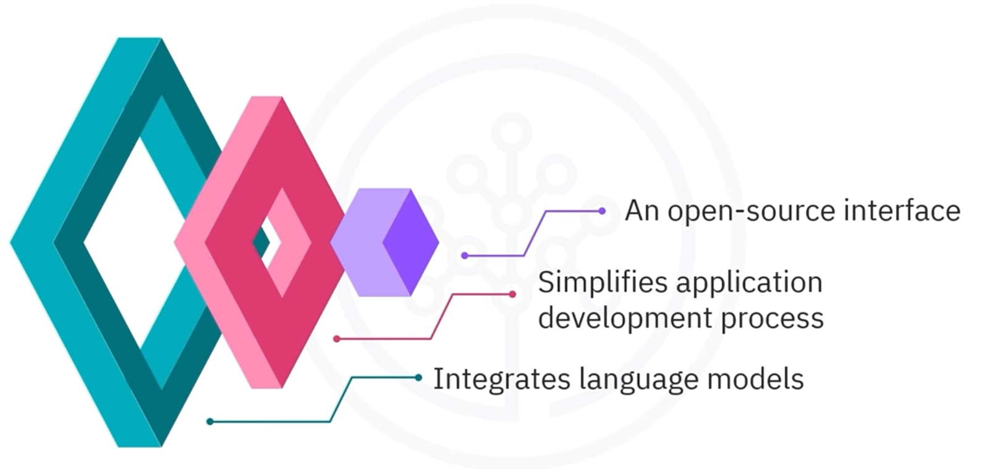

> Estimated Reading time: ~4 minutes

## Overview

LangChain is an open-source interface that standardizes how applications use large language models (LLMs). It provides a structured way to build features such as question answering, retrieval, and dialogue systems by composing well-defined building blocks. While LangChain includes many pieces (e.g., Documents, Chains, Agents), this guide focuses on five you’ll use most often:
- Language Models
- Chat Models and Chat Messages
- Prompt Templates
- Example Selectors (for few-shot prompts)
- Output Parsers

## Language Models

Language models (LLMs) turn text inputs into text outputs. They’re used for tasks like drafting content, summarizing documents, and reasoning over text. LangChain provides a common interface over multiple providers, including IBM watsonx.ai, OpenAI, Google, and Meta [1, 2].

Example workflow:
- Choose a provider and base model (e.g., an instruction-tuned model such as Mixtral 8x7B Instruct via IBM watsonx.ai).
- Configure generation parameters (e.g., max tokens, temperature).
- Send a prompt and receive generated text.

The uniform interface allows you to swap models without rewriting your application logic.

## Chat Models and Chat Messages

Chat models are optimized for multi-turn conversations. Instead of a single string, they consume a list of role-tagged messages—commonly:
- system: instructions or behavior guidelines for the assistant,
- human (user): end-user inputs,
- ai (assistant): model responses,
- tool/function: tool call results and function outputs.

This structure helps the model maintain context, follow instruction style, and interact with tools. You can:
- Provide only a human message for a simple Q&A, or
- Include a system message to set persona/goals, plus prior human/AI turns to simulate chat history and guide the next response.

## Prompt Templates

Prompt templates translate user intent into precise instructions for the model. They support:
- String prompt templates: simple single-message formatting.
- Chat prompt templates: multi-message prompts with roles.
- Role-specific message templates: System, Human, AI, and generic Chat messages.
- Placeholders and parameters for flexible, reusable prompts.

By standardizing how you build prompts, you can systematically control tone, constraints, and structure while reusing the same template across tasks or models [3].

## Example Selectors (Few-Shot Prompts)

Few-shot prompting improves quality by adding examples that demonstrate the task. Example selectors help you pick the most relevant examples automatically from a library. Common strategies include:
- Semantic similarity: choose examples closest in meaning,
- Max Marginal Relevance (MMR): balance relevance and diversity,
- N-gram overlap: favor examples with similar phrasing.

These selectors make prompts more adaptive and robust, especially when you have a varied corpus of candidate examples [4].

## Output Parsers

Output parsers transform raw model text into structured data so downstream code is reliable and predictable. LangChain includes parsers for common formats like JSON, XML, CSV, and pandas DataFrames [5]. For instance, a “comma-separated list” parser can enforce that an answer is returned as CSV, simplifying analysis in spreadsheets or scripts.

By designing your prompts alongside appropriate parsers, you reduce post-processing errors and make outputs easier to validate and consume.

## Quick Mental Model

- Prompt Templates: say what you want, consistently.
- Example Selectors: show, don’t just tell.
- Chat Messages: add roles and history to steer behavior.
- Language/Chat Models: generate answers.
- Output Parsers: shape the result for your app.

## Recap

- LangChain provides a consistent interface to LLMs and chat models across providers such as IBM, OpenAI, Google, and Meta.
- Use chat messages (system, human, AI, tool/function) to control behavior and preserve conversation context.
- Prompt templates make instructions reusable and maintainable.
- Example selectors upgrade prompts with relevant few-shot examples.
- Output parsers convert model text into structured formats you can trust.

## References

1) LangChain — Introduction and Concepts
   https://python.langchain.com/docs/get_started/introduction/

2) IBM watsonx.ai — Foundation models and tooling
   https://www.ibm.com/products/watsonx-ai

3) LangChain — Prompt Templates
   https://python.langchain.com/docs/modules/model_io/prompts/

4) LangChain — Example Selectors
   https://python.langchain.com/docs/modules/model_io/prompts/example_selectors/

5) LangChain — Output Parsers
   https://python.langchain.com/docs/modules/model_io/output_parsers/
