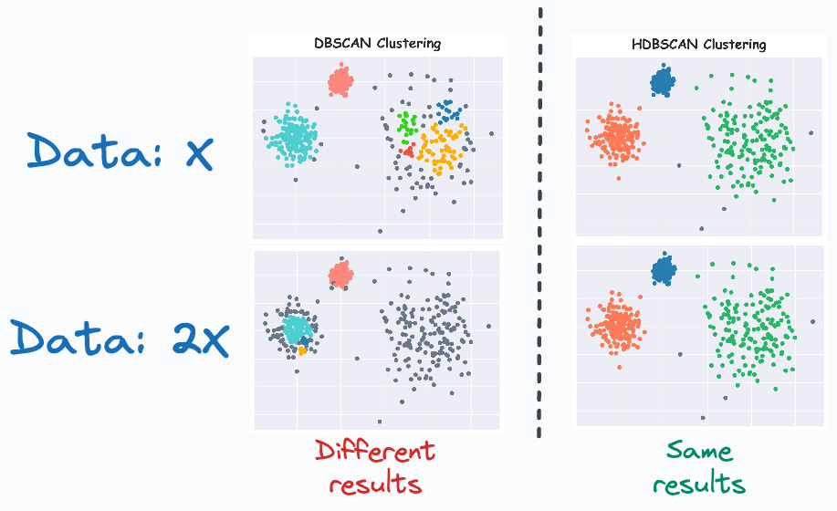
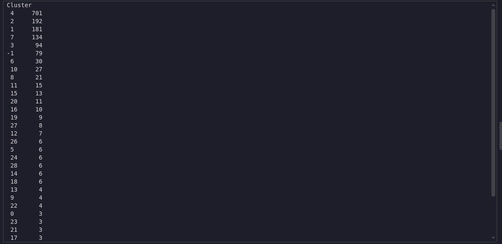
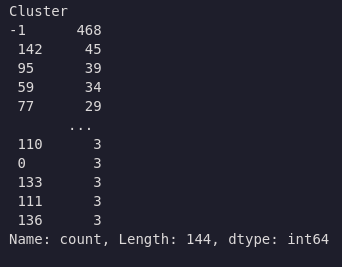
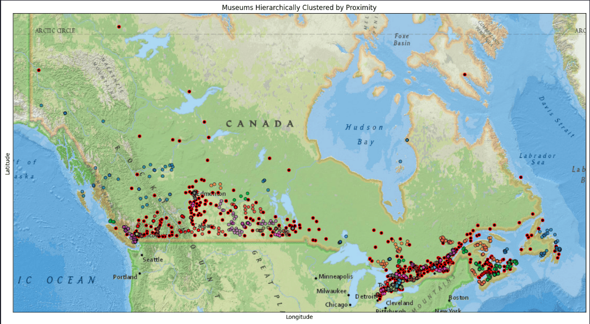

> Estimated reading time: \~10 minutes

# Comparing DBSCAN and HDBSCAN Clustering

## Objectives

-   Use scikit-learn to implement DBSCAN and HDBSCAN clustering models on real data
-   Compare the performances of the two models

## Introduction

In this article, we create two clustering models using data containing the names, types, and locations of cultural and art facilities across Canada, focusing on museum locations. The data is open and publicly available.

## Import the required libraries

``` python
import numpy as np
import pandas as pd
import matplotlib.pyplot as plt
from sklearn.cluster import DBSCAN
import hdbscan
from sklearn.preprocessing import StandardScaler
import geopandas as gpd
import contextily as ctx
from shapely.geometry import Point
import warnings
warnings.filterwarnings('ignore')
```

## Download the Canada map for reference

``` python
import requests
import zipfile
import io
import os
zip_file_url = 'https://cf-courses-data.s3.us.cloud-object-storage.appdomain.cloud/YcUk-ytgrPkmvZAh5bf7zA/Canada.zip'
output_dir = './'
os.makedirs(output_dir, exist_ok=True)
response = requests.get(zip_file_url)
response.raise_for_status()
with zipfile.ZipFile(io.BytesIO(response.content)) as zip_ref:
    for file_name in zip_ref.namelist():
        if file_name.endswith('.tif'):
            zip_ref.extract(file_name, output_dir)
            print(f"Downloaded and extracted: {file_name}")
```

> Downloaded and extracted: Canada.tif

## Helper function for plotting

``` python
def plot_clustered_locations(df,  title='Museums Clustered by Proximity'):
    gdf = gpd.GeoDataFrame(df, geometry=gpd.points_from_xy(df['Longitude'], df['Latitude']), crs="EPSG:4326")
    gdf = gdf.to_crs(epsg=3857)
    fig, ax = plt.subplots(figsize=(15, 10))
    non_noise = gdf[gdf['Cluster'] != -1]
    noise = gdf[gdf['Cluster'] == -1]
    noise.plot(ax=ax, color='k', markersize=30, ec='r', alpha=1, label='Noise')
    non_noise.plot(ax=ax, column='Cluster', cmap='tab10', markersize=30, ec='k', legend=False, alpha=0.6)
    ctx.add_basemap(ax, source='./Canada.tif', zoom=4)
    plt.title(title)
    plt.xlabel('Longitude')
    plt.ylabel('Latitude')
    ax.set_xticks([])
    ax.set_yticks([])
    plt.tight_layout()
    plt.show()
```

## Data Preparation

``` python
url = 'https://cf-courses-data.s3.us.cloud-object-storage.appdomain.cloud/r-maSj5Yegvw2sJraT15FA/ODCAF-v1-0.csv'
df = pd.read_csv(url, encoding = "ISO-8859-1")
df = df[df.ODCAF_Facility_Type == 'museum']
df = df[['Latitude', 'Longitude']]
df = df[df['Latitude'] != '..']
df[['Latitude', 'Longitude']] = df[['Latitude', 'Longitude']].astype(float)
```

## Build a DBSCAN model

DBSCAN (Density-Based Spatial Clustering of Applications with Noise) is a clustering algorithm that groups together points that are closely packed (points with many nearby neighbors), marking as outliers points that lie alone in low-density regions. It requires two parameters: ε (epsilon, the neighborhood radius) and MinPts (minimum number of points required to form a dense region). The algorithm can find arbitrarily shaped clusters and is robust to noise.

### Mathematical Formulation

-   **ε-neighborhood:** For a point p, the ε-neighborhood is defined as Nε(p) = {q ∈ D \| dist(p, q) ≤ ε}, where D is the dataset and dist is a distance metric (e.g., Euclidean).
-   **Core point:** A point p is a core point if \|Nε(p)\| ≥ MinPts.
-   **Directly density-reachable:** q is directly density-reachable from p if q ∈ Nε(p) and p is a core point.
-   **Density-reachable:** q is density-reachable from p if there is a chain of points p1, ..., pn, with p1 = p and pn = q, where each pi+1 is directly density-reachable from pi.
-   **Density-connected:** Two points p and q are density-connected if there is a point o such that both p and q are density-reachable from o.

### Pseudocode

``` text
DBSCAN(D, ε, MinPts):
    C = 0
    for each point P in dataset D:
        if P is not visited:
            mark P as visited
            N = regionQuery(P, ε)
            if |N| < MinPts:
                mark P as noise
            else:
                C = next cluster
                expandCluster(P, N, C, ε, MinPts)

expandCluster(P, N, C, ε, MinPts):
    add P to cluster C
    for each point P' in N:
        if P' is not visited:
            mark P' as visited
            N' = regionQuery(P', ε)
            if |N'| >= MinPts:
                N = N ∪ N'
        if P' is not yet member of any cluster:
            add P' to cluster C

regionQuery(P, ε):
    return all points within P's ε-neighborhood
```

``` python
coords_scaled = df.copy()
coords_scaled["Latitude"] = 2*coords_scaled["Latitude"]
dbscan = DBSCAN(eps=1.0, min_samples=3, metric='euclidean').fit(coords_scaled)
df['Cluster'] = dbscan.fit_predict(coords_scaled)
df['Cluster'].value_counts()
```



## Plot DBSCAN results

``` python
plot_clustered_locations(df, title='Museums Clustered by Proximity')
```


## Build an HDBSCAN clustering model

### HDBSCAN Algorithm

HDBSCAN (Hierarchical Density-Based Spatial Clustering of Applications with Noise) is an advanced clustering algorithm that extends DBSCAN by building a hierarchy of clusters based on varying density levels. It performs DBSCAN over a range of epsilon values, constructs a cluster hierarchy, and extracts the most stable clusters. HDBSCAN can find clusters of varying densities, is robust to parameter selection, and is well-suited for exploratory data analysis. The main parameter is the minimum cluster size, which is intuitive to set.

### Mathematical Description

-   **Core distance:** For each point, the core distance is the distance to its k-th nearest neighbor (where k = min_samples).
-   **Mutual reachability distance:** For points a and b:\
    d_mreach(a, b) = max{core_k(a), core_k(b), d(a, b)}\
    where d(a, b) is the distance between a and b.
-   **Minimum spanning tree (MST):** Build an MST using mutual reachability distances.
-   **Cluster hierarchy:** Remove edges in order of increasing distance to form a hierarchy of clusters.
-   **Condensed hierarchy:** Only keep clusters with at least min_cluster_size points.
-   **Cluster selection:** Select clusters with the highest persistence (stability) across the hierarchy.

### Pseudocode

``` text
HDBSCAN(D, min_samples, min_cluster_size):
    1. For each point, compute core distance (distance to min_samples-th neighbor)
    2. Compute mutual reachability distances for all pairs
    3. Build MST using mutual reachability distances
    4. Construct cluster hierarchy by removing edges in order of increasing distance
    5. Condense hierarchy: only keep clusters with at least min_cluster_size points
    6. Select clusters with highest persistence (stability)
    7. Label points: assign to clusters or mark as noise

# Core distance: core_k(p) = distance from p to its k-th nearest neighbor
# Mutual reachability: d_mreach(a, b) = max{core_k(a), core_k(b), d(a, b)}
```

``` python
import hdbscan
hdb = hdbscan.HDBSCAN(min_samples=None, min_cluster_size=3, metric='euclidean')
df['Cluster'] = hdb.fit_predict(coords_scaled)
df['Cluster'].value_counts()
```



## Plot HDBSCAN results

``` python
plot_clustered_locations(df, title='Museums Hierarchically Clustered by Proximity')
```



## Summary

This article demonstrated how to implement DBSCAN and HDBSCAN clustering models using scikit-learn on real data, focusing on museum locations across Canada. The performance of the two clustering techniques was compared.

## Citation

Ester, M., Kriegel, H.-P., Sander, J., & Xu, X. (1996). A Density-Based Algorithm for Discovering Clusters in Large Spatial Databases with Noise. Proceedings of the Second International Conference on Knowledge Discovery and Data Mining (KDD-96), 226–231. McInnes, L., Healy, J., & Astels, S. (2017). hdbscan: Hierarchical density based clustering. The Journal of Open Source Software, 2(11), 205.\
McInnes, L., & Healy, J. (2017). Accelerated Hierarchical Density Based Clustering. 2017 IEEE International Conference on Data Mining Workshops (ICDMW), 33-42.\
Campello, R.J.G.B., Moulavi, D., & Sander, J. (2013). Density-Based Clustering Based on Hierarchical Density Estimates. Advances in Knowledge Discovery and Data Mining, Springer, 160-172.
