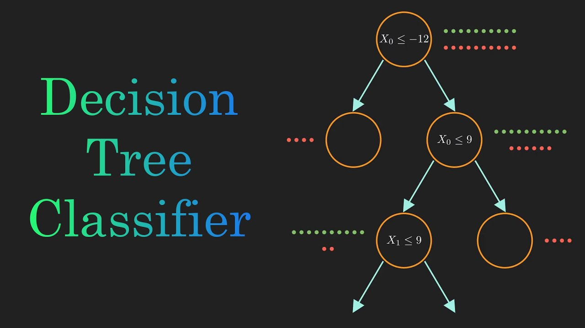
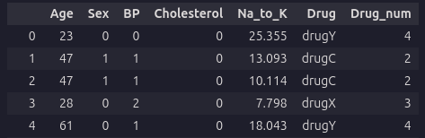
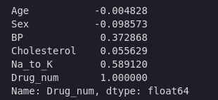
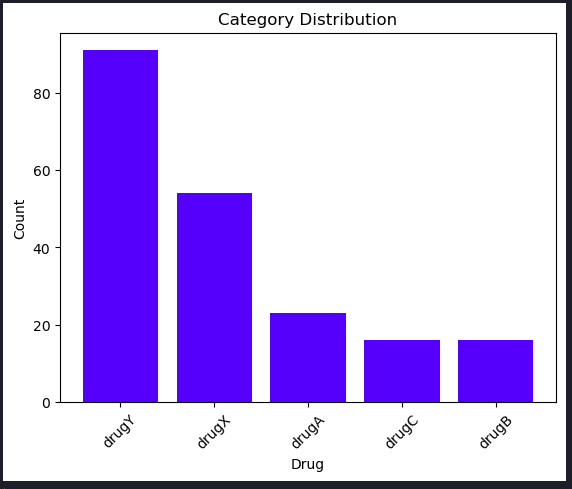
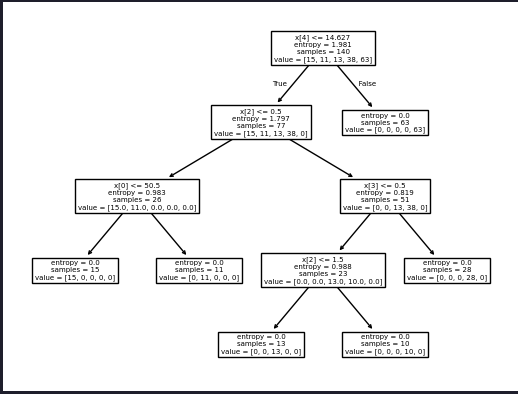

>Estimated reading time: \~10 minutes

# Decision Trees for Classification

## Objectives

-   Develop a classification model using Decision Tree Algorithm
-   Apply Decision Tree classification on a real world dataset

## Introduction

This article explores decision tree classification, a machine learning technique for making data-driven decisions. We build, visualize, and evaluate decision trees using a real-world dataset for drug prediction based on health parameters.

## Importing Libraries

``` python
import numpy as np
import pandas as pd
from matplotlib import pyplot as plt
from sklearn.preprocessing import LabelEncoder
from sklearn.model_selection import train_test_split
from sklearn.tree import DecisionTreeClassifier, plot_tree
from sklearn import metrics
%matplotlib inline
import warnings
warnings.filterwarnings('ignore')
```

## About the dataset

The dataset contains patient health parameters and the drug each patient responded to. Features include Age, Sex, Blood Pressure, and Cholesterol. The target is the drug prescribed.

## Downloading the Data

``` python
path= 'https://cf-courses-data.s3.us.cloud-object-storage.appdomain.cloud/IBMDeveloperSkillsNetwork-ML0101EN-SkillsNetwork/labs/Module%203/data/drug200.csv'
my_data = pd.read_csv(path)
my_data.head()
```



## Data Analysis and Pre-processing

``` python
my_data.info()
label_encoder = LabelEncoder()
my_data['Sex'] = label_encoder.fit_transform(my_data['Sex'])
my_data['BP'] = label_encoder.fit_transform(my_data['BP'])
my_data['Cholesterol'] = label_encoder.fit_transform(my_data['Cholesterol'])
my_data.isnull().sum()
custom_map = {'drugA':0,'drugB':1,'drugC':2,'drugX':3,'drugY':4}
my_data['Drug_num'] = my_data['Drug'].map(custom_map)
my_data.drop('Drug', axis=1).corr()['Drug_num']
```




```python
category_counts = my_data['Drug'].value_counts()

# Plot the count plot
plt.bar(category_counts.index, category_counts.values, color='blue')
plt.xlabel('Drug')
plt.ylabel('Count')
plt.title('Category Distribution')
plt.xticks(rotation=45)  # Rotate labels for better readability if needed
plt.show()
```


## Modeling

``` python
y = my_data['Drug']
X = my_data.drop(['Drug','Drug_num'], axis=1)
X_trainset, X_testset, y_trainset, y_testset = train_test_split(X, y, test_size=0.3, random_state=32)
drugTree = DecisionTreeClassifier(criterion="entropy", max_depth = 4)
drugTree.fit(X_trainset,y_trainset)
```

## Evaluation

``` python
tree_predictions = drugTree.predict(X_testset)
print("Decision Trees's Accuracy: ", metrics.accuracy_score(y_testset, tree_predictions))
```

> Decision Trees's Accuracy:  0.9833333333333333

## Visualize the tree

``` python
plot_tree(drugTree)
plt.show()
```



## Practice: Shallower Tree

``` python
shallow_tree = DecisionTreeClassifier(criterion="entropy", max_depth=3)
shallow_tree.fit(X_trainset, y_trainset)
shallow_preds = shallow_tree.predict(X_testset)
print("Decision Tree (max_depth=3) Accuracy:", metrics.accuracy_score(y_testset, shallow_preds))
```

> Decision Tree (max_depth=3) Accuracy: 0.8166666666666667

## Summary

This article demonstrated how to build and evaluate a decision tree classifier for drug prediction, including data preprocessing, model training, evaluation, and visualization.
