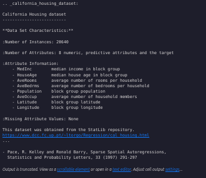
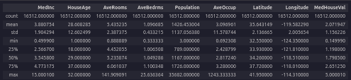
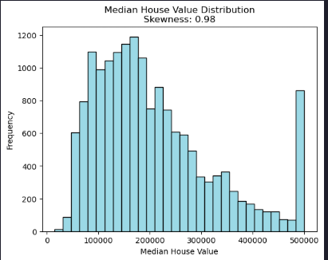
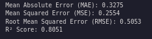
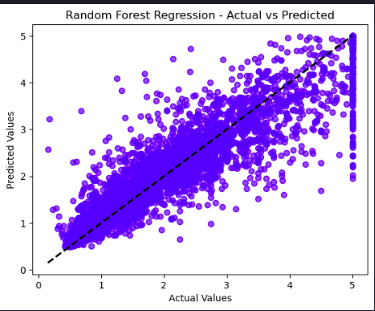
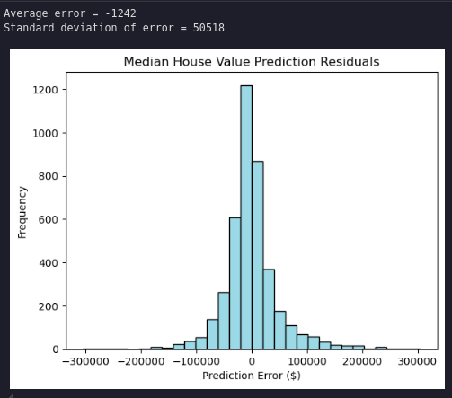
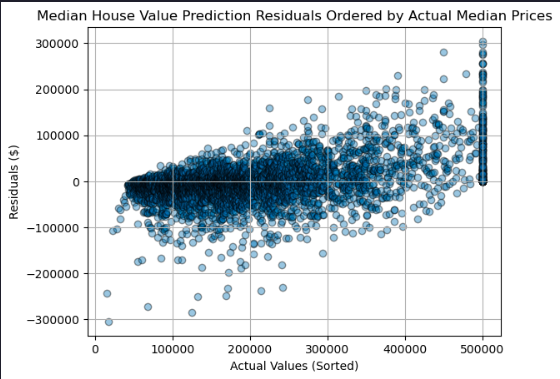
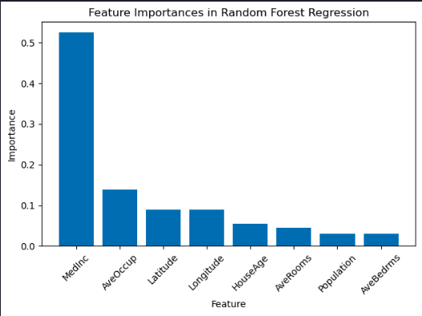

# Evaluating Random Forest Performance

>Estimated time needed: **30** minutes

## Objectives

-   Implement and evaluate the performance of random forest regression models on real-world data
-   Interpret various evaluation metrics and visualizations
-   Describe the feature importances for a regression model

## Introduction

In this article, you will: - Use the California Housing data set included in scikit-learn to predict the median house price based on various attributes - Create a random forest regression model and evaluate its performance - Investigate the feature importances for the model

Our goal here is not to find the best regressor, but to practice interpreting modeling results in the context of a real-world problem.

## Steps

### Import the required libraries

``` python
import numpy as np
import pandas as pd
import matplotlib.pyplot as plt
from sklearn.datasets import fetch_california_housing
from sklearn.model_selection import train_test_split
from sklearn.ensemble import RandomForestRegressor
from sklearn.metrics import mean_squared_error, root_mean_squared_error, mean_absolute_error, r2_score
from scipy.stats import skew
```

### Load the California Housing data set

``` python
data = fetch_california_housing()
X, y = data.data, data.target
```

### Print the description of the California Housing data set

``` python
print(data.DESCR)
```



### Split the data into training and testing sets (20% for evaluation)

``` python
X_train, X_test, y_train, y_test = train_test_split(X, y, test_size=0.2, random_state=42)
```

### Explore the training data

``` python
eda = pd.DataFrame(data=X_train)
eda.columns = data.feature_names
eda['MedHouseVal'] = y_train
eda.describe()
```



#### What range are most of the median house prices valued at?

Most median house values fall between about \$120k and \$265k (the interquartile range from the training data).

### How are the median house prices distributed?

``` python
plt.hist(1e5*y_train, bins=30, color='lightblue', edgecolor='black')
plt.title(f'Median House Value Distribution\nSkewness: {skew(y_train):.2f}')
plt.xlabel('Median House Value')
plt.ylabel('Frequency')
```



Evidently the distribution is skewed and there are quite a few clipped values at around \$500,000.

### Model fitting and prediction

Let's fit a random forest regression model to the data and use it to make median house price predictions.

``` python
rf_regressor = RandomForestRegressor(n_estimators=100, random_state=42)
rf_regressor.fit(X_train, y_train)
y_pred_test = rf_regressor.predict(X_test)
```

### Estimate out-of-sample MAE, MSE, RMSE, and R²

``` python
mae = mean_absolute_error(y_test, y_pred_test)
mse = mean_squared_error(y_test, y_pred_test)
rmse = root_mean_squared_error(y_test, y_pred_test)
r2 = r2_score(y_test, y_pred_test)
print(f"Mean Absolute Error (MAE): {mae:.4f}")
print(f"Mean Squared Error (MSE): {mse:.4f}")
print(f"Root Mean Squared Error (RMSE): {rmse:.4f}")
print(f"R² Score: {r2:.4f}")
```



#### What do these statistics mean?

-   MAE: average absolute dollar error per prediction (lower is better)
-   MSE/RMSE: penalize larger errors more; RMSE (in dollars) is easier to interpret than MSE (lower is better)
-   R²: proportion of variance explained (0–1). Higher is better, but it can be misleading with skew/outliers.

These metrics suggest overall fit but don’t show where the model underperforms. It is important to include residual plots, error distribution, and key drivers (feature importances) to explain strengths and limitations.

### Plot Actual vs Predicted values

``` python
plt.scatter(y_test, y_pred_test, alpha=0.5, color="blue")
plt.plot([y_test.min(), y_test.max()], [y_test.min(), y_test.max()], 'k--', lw=2)
plt.xlabel("Actual Values")
plt.ylabel("Predicted Values")
plt.title("Random Forest Regression - Actual vs Predicted")
plt.show()
```



### Plot the histogram of the residual errors (dollars)

``` python
residuals = 1e5 * (y_test - y_pred_test)
plt.hist(residuals, bins=30, color='lightblue', edgecolor='black')
plt.title('Median House Value Prediction Residuals')
plt.xlabel('Prediction Error ($)')
plt.ylabel('Frequency')
print('Average error = ' + str(int(np.mean(residuals))))
print('Standard deviation of error = ' + str(int(np.std(residuals))))
```



The residuals are normally distributed with a very small average error and a standard deviation of about \$50,000.

### Plot the model residual errors by median house value

``` python
residuals_df = pd.DataFrame({
    'Actual': 1e5 * y_test,
    'Residuals': residuals
})
residuals_df = residuals_df.sort_values(by='Actual')
plt.scatter(residuals_df['Actual'], residuals_df['Residuals'], marker='o', alpha=0.4, ec='k')
plt.title('Median House Value Prediction Residuals Ordered by Actual Median Prices')
plt.xlabel('Actual Values (Sorted)')
plt.ylabel('Residuals ($)')
plt.grid(True)
plt.show()
```



Residuals trend from negative to positive as actual prices increase: lower-priced homes tend to be overpredicted and higher-priced homes underpredicted, indicating heteroscedasticity and potential target clipping effects.

### Display the feature importances as a bar chart

``` python
importances = rf_regressor.feature_importances_
indices = np.argsort(importances)[::-1]
features = data.feature_names
plt.bar(range(X.shape[1]), importances[indices], align="center")
plt.xticks(range(X.shape[1]), [features[i] for i in indices], rotation=45)
plt.xlabel("Feature")
plt.ylabel("Importance")
plt.title("Feature Importances in Random Forest Regression")
plt.tight_layout()
plt.show()
```



Median income is the strongest driver, which is plausible. Latitude and longitude together encode location and may share importance; combined, they likely rival or exceed single engineered features. Some variables (e.g., rooms, bedrooms, occupancy) may be correlated and distribute importance among themselves. A correlation matrix or permutation importance would clarify shared effects.
