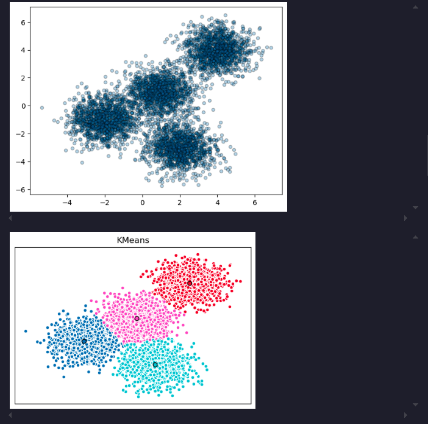
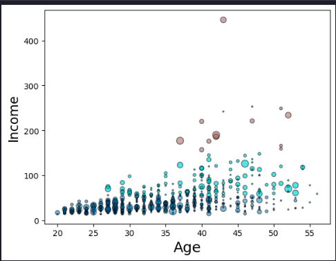
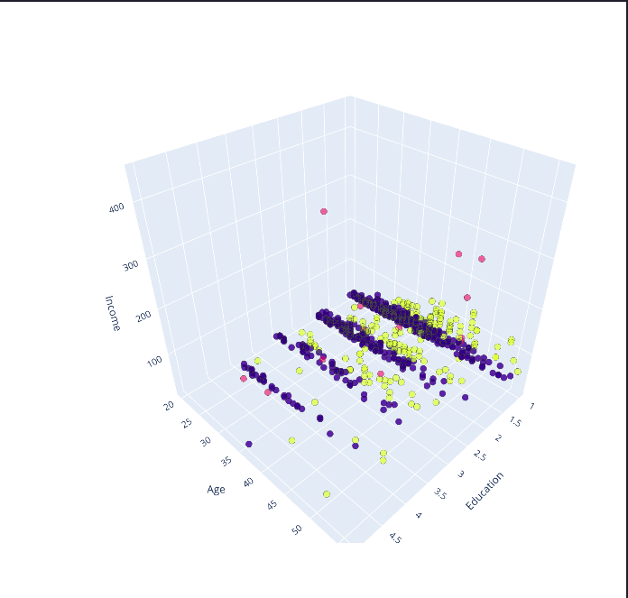

>Estimated reading time: \~10 minutes
# K-Means Clustering for Customer Segmentation

## Objectives

-   Use scikit-learn's k-means clustering to cluster data
-   Apply k-means clustering on real world data for customer segmentation

## Introduction

K-means is widely used for clustering in data science applications, especially for discovering insights from unlabeled data. Applications include customer segmentation, pattern recognition, and feature engineering.

## Import the required libraries

``` python
import numpy as np
import pandas as pd
import matplotlib.pyplot as plt
from sklearn.cluster import KMeans
from sklearn.datasets import make_blobs
from sklearn.preprocessing import StandardScaler
import plotly.express as px
%matplotlib inline
import warnings
warnings.filterwarnings('ignore')
```

## K-Means on a synthetic data set

``` python
np.random.seed(0)
X, y = make_blobs(n_samples=5000, centers=[[4,4], [-2, -1], [2, -3], [1, 1]], cluster_std=0.9)
plt.scatter(X[:, 0], X[:, 1], marker='.',alpha=0.3,ec='k',s=80)
```

## Setting up k-means

``` python
k_means = KMeans(init = "k-means++", n_clusters = 4, n_init = 12)
k_means.fit(X)
k_means_labels = k_means.labels_
k_means_cluster_centers = k_means.cluster_centers_
```

## Visualize the clusters

``` python
fig = plt.figure(figsize=(6, 4))
colors = plt.cm.tab10(np.linspace(0, 1, len(set(k_means_labels))))
ax = fig.add_subplot(1, 1, 1)
for k, col in zip(range(len([[4, 4], [-2, -1], [2, -3], [1, 1]])), colors):
    my_members = (k_means_labels == k)
    cluster_center = k_means_cluster_centers[k]
    ax.plot(X[my_members, 0], X[my_members, 1], 'w', markerfacecolor=col, marker='.',ms=10)
    ax.plot(cluster_center[0], cluster_center[1], 'o', markerfacecolor=col,  markeredgecolor='k', markersize=6)
ax.set_title('KMeans')
ax.set_xticks(())
ax.set_yticks(())
plt.show()
```



## Customer Segmentation with k-means

``` python
cust_df = pd.read_csv("https://cf-courses-data.s3.us.cloud-object-storage.appdomain.cloud/IBMDeveloperSkillsNetwork-ML0101EN-SkillsNetwork/labs/Module%204/data/Cust_Segmentation.csv")
cust_df = cust_df.drop('Address', axis=1)
cust_df = cust_df.dropna()
X = cust_df.values[:,1:]
Clus_dataSet = StandardScaler().fit_transform(X)
clusterNum = 3
k_means = KMeans(init = "k-means++", n_clusters = clusterNum, n_init = 12)
k_means.fit(X)
labels = k_means.labels_
cust_df["Clus_km"] = labels
```

## Visualize customer clusters

``` python
area = np.pi * ( X[:, 1])**2
plt.scatter(X[:, 0], X[:, 3], s=area, c=labels.astype(float), cmap='tab10', ec='k',alpha=0.5)
plt.xlabel('Age', fontsize=18)
plt.ylabel('Income', fontsize=16)
plt.show()
```



We can also see this distribution in 3 dimensions for better understanding. Here, the education parameter will represent the third axis instead of the marker size.



k-means will partition your customers into mutually exclusive groups, for example, into 3 clusters. The customers in each cluster are similar to each other demographically.

## Summary

This article demonstrated how to use k-means clustering for customer segmentation, including synthetic data and real-world customer data.
