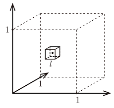
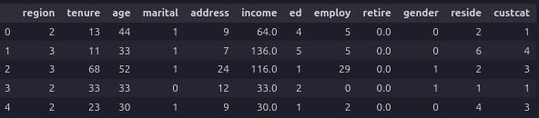
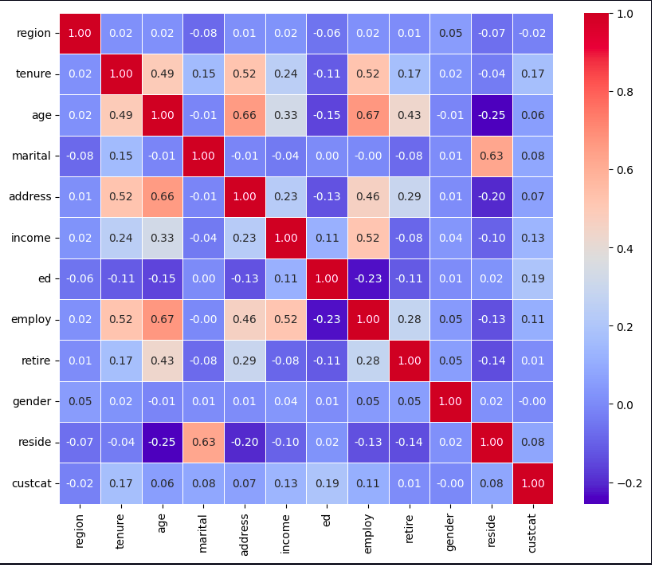
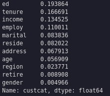
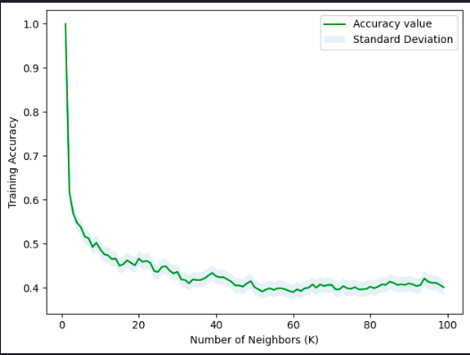

>Estimated reading time: \~10 minutes

# K-Nearest Neighbors Classification

## Objectives

-   Use K-Nearest Neighbors to classify data
-   Apply KNN classifier on a real world data set

## Introduction

This article demonstrates how to use K-Nearest Neighbors (KNN) to classify customer data, including model training, evaluation, and hyperparameter tuning.

## Import the libraries

``` python
import numpy as np
import matplotlib.pyplot as plt
import pandas as pd
import seaborn as sns
from sklearn.preprocessing import StandardScaler
from sklearn.model_selection import train_test_split
from sklearn.neighbors import KNeighborsClassifier
from sklearn.metrics import accuracy_score
%matplotlib inline
```

## Load Data

``` python
df = pd.read_csv('https://cf-courses-data.s3.us.cloud-object-storage.appdomain.cloud/IBMDeveloperSkillsNetwork-ML0101EN-SkillsNetwork/labs/Module%203/data/teleCust1000t.csv')
df.head()
```



## Data Visualization and Analysis

``` python
df['custcat'].value_counts()
correlation_matrix = df.corr()
plt.figure(figsize=(10, 8))
sns.heatmap(correlation_matrix, annot=True, cmap='coolwarm', fmt='.2f', linewidths=0.5)
correlation_values = abs(df.corr()['custcat'].drop('custcat')).sort_values(ascending=False)
correlation_values
```





## Prepare Data

``` python
X = df.drop('custcat',axis=1)
y = df['custcat']
X_norm = StandardScaler().fit_transform(X)
X_train, X_test, y_train, y_test = train_test_split(X_norm, y, test_size=0.2, random_state=4)
```

## KNN Classification

``` python
k = 3
knn_classifier = KNeighborsClassifier(n_neighbors=k)
knn_model = knn_classifier.fit(X_train,y_train)
yhat = knn_model.predict(X_test)
print("Test set Accuracy: ", accuracy_score(y_test, yhat))
```

>Test set Accuracy:  0.315

## Hyperparameter Tuning

``` python
# Plot training accuracy for Ks = 100
Ks = 100
acc = np.zeros((Ks-1))
std_acc = np.zeros((Ks-1))
for n in range(1, Ks):
    knn_model_n = KNeighborsClassifier(n_neighbors=n).fit(X_train, y_train)
    yhat_train = knn_model_n.predict(X_train)
    acc[n-1] = accuracy_score(y_train, yhat_train)
    std_acc[n-1] = np.std(yhat_train == y_train) / np.sqrt(yhat_train.shape[0])

print( "The best accuracy was with", acc.max(), "with k =", acc.argmax()+1)

plt.plot(range(1, Ks), acc, 'g')
plt.fill_between(range(1, Ks), acc - 1 * std_acc, acc + 1 * std_acc, alpha=0.10)
plt.legend(('Accuracy value', 'Standard Deviation'))
plt.ylabel('Training Accuracy')
plt.xlabel('Number of Neighbors (K)')
plt.tight_layout()
plt.show()
```

>The best accuracy was with 0.34 with k = 9



## Summary

This article demonstrated how to use K-Nearest Neighbors for classification, including model training, evaluation, and hyperparameter tuning.
