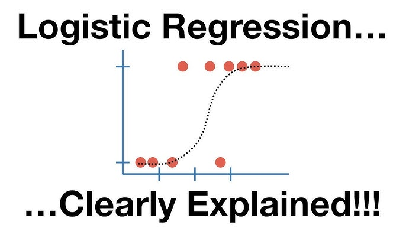

> Estimated reading time: \~**30** minutes

# Logistic Regression with Python


## Objectives

-   Use Logistic Regression for classification
-   Preprocess data for modeling
-   Implement Logistic regression on real world data

## Classification with Logistic Regression

Assume you are working for a telecommunications company concerned about customer churn. The goal is to predict which customers are likely to leave.

### Load the Telco Churn data

Telco Churn is a hypothetical dataset for predicting customer churn. Each row represents a customer with various demographic and service usage information.

### Data Preprocessing

For this lab, we use a subset of fields: 'tenure', 'age', 'address', 'income', 'ed', 'employ', 'equip', and 'churn'.

``` python
import pandas as pd
import numpy as np
from sklearn.model_selection import train_test_split
from sklearn.linear_model import LogisticRegression
from sklearn.preprocessing import StandardScaler
from sklearn.metrics import log_loss
import matplotlib.pyplot as plt
%matplotlib inline
import warnings
warnings.filterwarnings('ignore')

url = "https://cf-courses-data.s3.us.cloud-object-storage.appdomain.cloud/IBMDeveloperSkillsNetwork-ML0101EN-SkillsNetwork/labs/Module%203/data/ChurnData.csv"
churn_df = pd.read_csv(url)
churn_df = churn_df[['tenure', 'age', 'address', 'income', 'ed', 'employ', 'equip', 'churn']]
churn_df['churn'] = churn_df['churn'].astype('int')
```

### Feature Selection

``` python
X = np.asarray(churn_df[['tenure', 'age', 'address', 'income', 'ed', 'employ', 'equip']])
y = np.asarray(churn_df['churn'])
```

### Standardization

``` python
X_norm = StandardScaler().fit(X).transform(X)
```

### Splitting the dataset

``` python
X_train, X_test, y_train, y_test = train_test_split(X_norm, y, test_size=0.2, random_state=4)
```

## Logistic Regression Classifier modeling

- Model (binary outcome)

  $$P(y=1\mid x)=\sigma(\eta)=\frac{1}{1+e^{-\eta}},\quad \eta=x^\top \beta.$$

  Equivalently, the log-odds are linear:

  $$\log\frac{P(y=1\mid x)}{1-P(y=1\mid x)}=x^\top \beta.$$

- Random-utility (discrete-choice) view

  Latent index model:

  $$y^\ast=x^\top\beta+\varepsilon,\quad y=\mathbf{1}\{y^\ast\ge 0\}.$$

  If $$\varepsilon\sim\text{Logistic}(0,1)$$ (difference of i.i.d. Gumbel/Type‑I EV errors), then

  $$P(y=1\mid x)=\sigma(x^\top\beta).$$

  This is the same logit link used in discrete-choice models.

- Likelihood, log-likelihood, cross-entropy

  With observations $$\{(y_i,x_i)\}_{i=1}^n$$ and $$p_i=\sigma(x_i^\top\beta)$$, the Bernoulli likelihood is

  $$L(\beta)=\prod_{i=1}^n p_i^{y_i}(1-p_i)^{1-y_i},\qquad
  \ell(\beta)=\sum_{i=1}^n\left[y_i\log p_i+(1-y_i)\log(1-p_i)\right].$$

  The empirical cross-entropy (what sklearn’s `log_loss` reports) is

  $$\text{CE}(\beta)=-\frac{1}{n}\,\ell(\beta).$$

- Score, Hessian, convexity

  Stack rows in $$X\in\mathbb{R}^{n\times p}$$, let $$p=(p_1,\dots,p_n)^\top$$ and $$W=\mathrm{diag}(p_i(1-p_i))$$. Then

  $$\nabla\ell(\beta)=X^\top(y-p),\qquad \nabla^2\ell(\beta)=-X^\top W X.$$

  Since $$-\,\nabla^2\ell(\beta)\succeq 0$$, $$\ell(\beta)$$ is concave, so the negative log-likelihood (cross-entropy) is convex and has a unique minimizer when it exists.

- IRLS / Newton updates

  One Newton step yields

  $$\beta_{\text{new}}=\beta_{\text{old}}+(X^\top W X)^{-1}X^\top(y-p),$$

  which is the iteratively reweighted least squares (IRLS) algorithm. A WLS form uses the pseudo-response

  $$z=\eta+\frac{y-p}{p(1-p)},\quad \text{solve } (X^\top W X)\beta=X^\top W z.$$

- Standard errors and tests (MLE)

  At the MLE $$\hat\beta$$, the asymptotic covariance is

  $$\mathrm{Var}(\hat\beta)\approx (X^\top W X)^{-1}.$$

  Wald: $$\hat\beta_j/\mathrm{SE}(\hat\beta_j)$$; LR test: $$2(\ell_{\text{full}}-\ell_{\text{restr}})\sim\chi^2$$.

- Marginal effects and odds ratios

  $$\frac{\partial}{\partial x_j}P(y=1\mid x)=p(1-p)\,\beta_j,\qquad \text{odds ratio}=\exp(\beta_j).$$

- Regularization (as in sklearn by default)

  L2-penalized log-likelihood:

  $$\ell_\lambda(\beta)=\ell(\beta)-\frac{\lambda}{2}\lVert\beta\rVert_2^2,$$

  so

  $$\nabla\ell_\lambda(\beta)=X^\top(y-p)-\lambda\beta,\quad \nabla^2\ell_\lambda(\beta)=-X^\top W X-\lambda I.$$

  L1 replaces $$\lVert\beta\rVert_2^2$$ with $$\lVert\beta\rVert_1$$ (subgradients, promotes sparsity).

- Existence issues

  With (quasi) separation, the unpenalized MLE may not exist (coefficients diverge). L2 or bias-reduction fixes help.


``` python
LR = LogisticRegression().fit(X_train, y_train)
yhat = LR.predict(X_test)
yhat_prob = LR.predict_proba(X_test)
```

### Feature Importance

``` python
coefficients = pd.Series(LR.coef_[0], index=churn_df.columns[:-1])
coefficients.sort_values().plot(kind='barh')
plt.title("Feature Coefficients in Logistic Regression Churn Model")
plt.xlabel("Coefficient Value")
plt.show()
```

## Performance Evaluation

``` python
log_loss(y_test, yhat_prob)
```

The log loss is a measure of how well the model's predicted probabilities match the actual outcomes. A lower log loss indicates better performance.

## Feature Selection

Let's experiment on adding and removing some features and assess how the performance of the model change.

```python
# Helper to recompute pipeline and log loss for a given feature list

def compute_log_loss_for(features):
    # Prefer full dataset if available to access optional columns
    df = globals().get('churn_full_df', churn_df)

    # Build feature matrix and target
    X_local = np.asarray(df[features])
    y_local = np.asarray(df['churn'].astype(int))

    # Scale then split with fixed seed to match above
    X_local_norm = StandardScaler().fit_transform(X_local)
    X_tr, X_te, y_tr, y_te = train_test_split(X_local_norm, y_local, test_size=0.2, random_state=4)

    # Train and evaluate
    model = LogisticRegression()
    model.fit(X_tr, y_tr)
    y_proba = model.predict_proba(X_te)
    return log_loss(y_te, y_proba)

# Sanity check: baseline features from earlier section
base_features = ['tenure', 'age', 'address', 'income', 'ed', 'employ', 'equip']
base_log_loss = compute_log_loss_for(base_features)
base_log_loss
```

> 0.6257718410257236

```python
#add 'wireless'
features_b = ['tenure', 'age', 'address', 'income', 'ed', 'employ', 'equip', 'wireless']
log_loss_b = compute_log_loss_for(features_b)

#add both 'callcard' and 'wireless'
features_c = ['tenure', 'age', 'address', 'income', 'ed', 'employ', 'equip', 'callcard', 'wireless']
log_loss_c = compute_log_loss_for(features_c)

#remove 'equip'
features_d = ['tenure', 'age', 'address', 'income', 'ed', 'employ']
log_loss_d = compute_log_loss_for(features_d)

#remove 'income' and 'employ'
features_e = ['tenure', 'age', 'address', 'ed', 'equip']
log_loss_e = compute_log_loss_for(features_e)

pd.DataFrame({
    'Features': ['Base', 'Base + wireless', 'Base + callcard + wireless', 'Base - equip', 'Base - income - employ'],
    'Log Loss': [base_log_loss, log_loss_b, log_loss_c, log_loss_d, log_loss_e]
}).sort_values('Log Loss')
```


The best performance is obtained by removing `equip` feature from the base set. So adding features does not necessarily improve the model.
