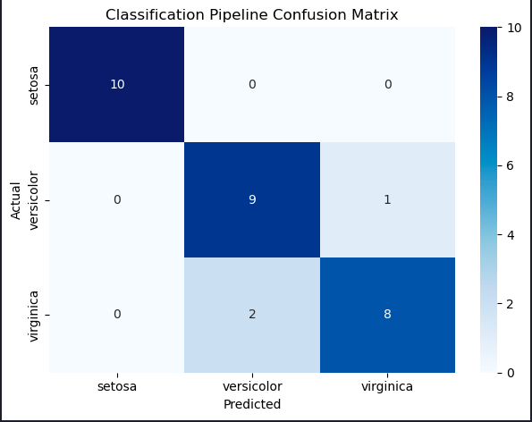
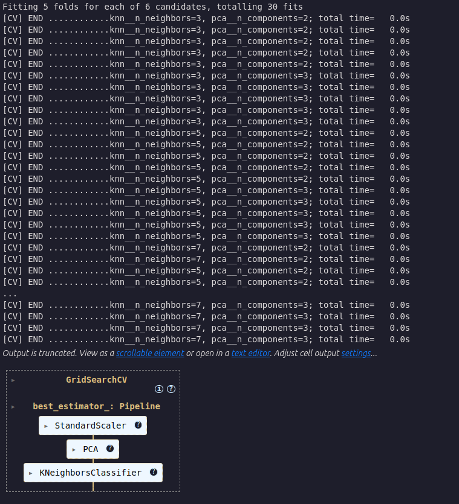
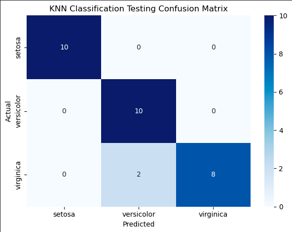

> Estimated reading time: \~**25** minutes

# Machine Learning Pipelines and GridSearchCV


## Objectives

-   Build and evaluate a machine learning pipeline
-   Implement GridSearchCV for hyperparameter tuning with cross-validation
-   Implement and optimize a complex classification pipeline using real-world data
-   Extract feature importances from a trained pipeline

## Introduction

In machine learning workflows, the Pipeline class from Scikit-Learn is invaluable for streamlining data preprocessing and model training into a single, coherent sequence. A pipeline is essentially a sequence of data transformers that culminates with an optional final predictor. This structure enables seamless integration of preprocessing and predictive modeling, ensuring that the same data transformations applied during training are consistently applied to new data during prediction.

Each intermediate step in a pipeline must be a transformer, meaning it should implement both fit and transform methods. The final step, which is typically a predictive model, or estimator, only requires a fit method. The entire pipeline can be trained simultaneously using a method like GridSearchCV, resulting in a self-contained predictor that can be used to make predictions on unseen data.

Importantly, the pipeline allows you to set the parameters of each of these steps using their names and parameter names connected by a double underscore `__`. For example, if a pipeline step is named `imputer` and you want to change its strategy, you can pass a parameter like `imputer__strategy='median'`. Additionally, steps can be entirely swapped out by assigning a different estimator or even bypassed by setting them to `'passthrough'` or `None`.

A major advantage of using a pipeline is that it enables comprehensive cross-validation and hyperparameter tuning for all steps simultaneously. By integrating the pipeline within GridSearchCV, you can fine-tune not only the model but also the preprocessing steps, leading to optimized overall performance. Pipelines are essential for scenarios where preprocessing involves estimators performing operations like scaling, encoding categorical variables, imputing missing values, and dimensionality reduction. Pipelines ensure these steps are reproducibly applied to both training and test data.

## Steps

### Import the required libraries

``` python
import matplotlib.pyplot as plt
from sklearn.datasets import load_iris
from sklearn.model_selection import train_test_split, GridSearchCV, StratifiedKFold
from sklearn.preprocessing import StandardScaler
from sklearn.decomposition import PCA
from sklearn.neighbors import KNeighborsClassifier
from sklearn.pipeline import Pipeline
import seaborn as sns
from sklearn.metrics import confusion_matrix
```

### Train a model using a pipeline

We'll start with an example of building a pipeline, fitting it to the Iris data, and evaluating its accuracy.

``` python
data = load_iris()
X, y = data.data, data.target
labels = data.target_names
```

#### Instantiate a pipeline consisting of StandardScaler, PCA, and KNeighborsClassifier

``` python
pipeline = Pipeline([
    ('scaler', StandardScaler()),       # Step 1: Standardize features
    ('pca', PCA(n_components=2)),       # Step 2: Reduce dimensions to 2 using PCA
    ('knn', KNeighborsClassifier(n_neighbors=5))  # Step 3: K-Nearest Neighbors classifier
])
```


#### Split the data into training and test sets (stratified)

``` python
X_train, X_test, y_train, y_test = train_test_split(
    X, y, test_size=0.2, random_state=42, stratify=y
)
```

#### Fit the pipeline on the training set and evaluate accuracy

``` python
pipeline.fit(X_train, y_train)
# Measure the pipeline accuracy on the test data
test_score = pipeline.score(X_test, y_test)
print(f"{test_score:.3f}")
```
> test_score: 0.900

#### Get the model predictions

``` python
y_pred = pipeline.predict(X_test)
```

#### Generate the confusion matrix for the KNN model and plot it

``` python
conf_matrix = confusion_matrix(y_test, y_pred)
plt.figure()
sns.heatmap(conf_matrix, annot=True, cmap='Blues', fmt='d',
            xticklabels=labels, yticklabels=labels)
plt.title('Classification Pipeline Confusion Matrix')
plt.xlabel('Predicted')
plt.ylabel('Actual')
plt.tight_layout()
plt.show()
```



#### Describe the errors made by the model

The model incorrectly classified two virginica irises as versicolor, and one versicolor as virginica. Only three classification errors out of 30 irises on our first attempt!

## Tune hyperparameters using a pipeline within cross-validation grid search

We created a model but haven't yet attempted to optimize its performance. Let's see if we can do better. The correct way to handle this tuning is to use cross-validation.

#### Instantiate the pipeline

``` python
pipeline = Pipeline([
    ('scaler', StandardScaler()),
    ('pca', PCA()),
    ('knn', KNeighborsClassifier())
])
```

#### Define a model parameter grid to search over

``` python
param_grid = {'pca__n_components': [2, 3],
              'knn__n_neighbors': [3, 5, 7]}
```

#### Choose a cross validation method

``` python
cv = StratifiedKFold(n_splits=5, shuffle=True, random_state=42)
```

#### Determine the best parameters using GridSearchCV

``` python
best_model = GridSearchCV(
    estimator=pipeline,
    param_grid=param_grid,
    cv=cv,
    scoring='accuracy',
    verbose=2,
)
```



#### Fit the best GridSearchCV model to the training data

``` python
best_model.fit(X_train, y_train)
```

#### Evaluate the accuracy of the best model on the test set

``` python
test_score = best_model.score(X_test, y_test)
print(f"{test_score:.3f}")
```

> test_score: 0.933

We've made a great accuracy improvement from 90% to 93%.

#### Display the best parameters

``` python
best_model.best_params_
```
> {'knn__n_neighbors': 3, 'pca__n_components': 2}

#### Plot the confusion matrix for the predictions on the test set

``` python
y_pred = best_model.predict(X_test)
conf_matrix = confusion_matrix(y_test, y_pred)
plt.figure()
sns.heatmap(conf_matrix, annot=True, cmap='Blues', fmt='d',
            xticklabels=labels, yticklabels=labels)
plt.title('KNN Classification Testing Confusion Matrix')
plt.xlabel('Predicted')
plt.ylabel('Actual')
plt.tight_layout()
plt.show()
```



That's impressive, only two errors where the predictions were Versicolor but the iris was actually a Virginica.
