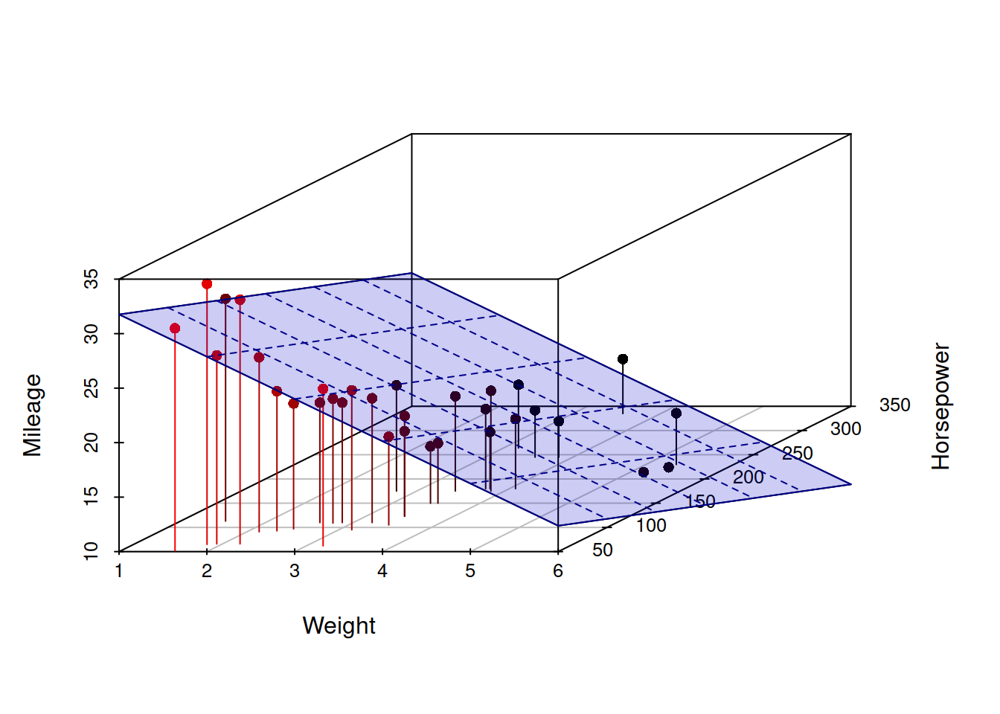
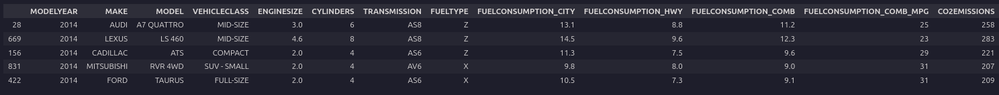
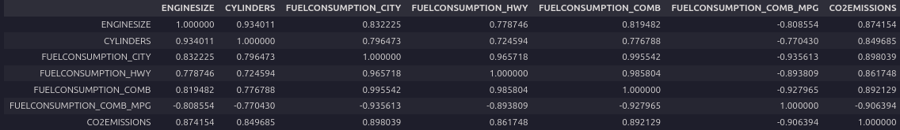
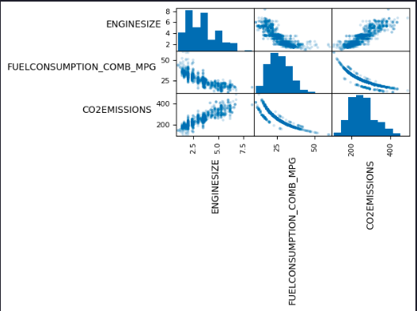
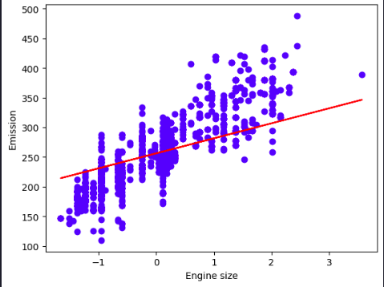
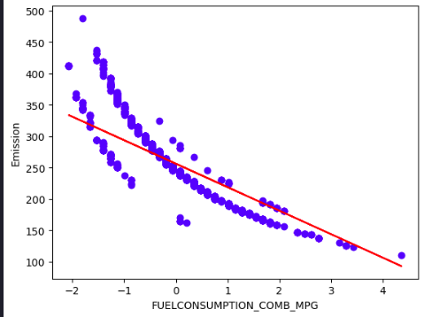

> Estimated reading time: \~**15** minutes

# Multiple Linear Regression

Before diving in the application, let's explore the theory behind this simple statistical model.

### Model and notation

- Data: n observations, k regressors (including intercept).
- Regression model:
  $$y = X\beta + u,$$
  where
  - $y$ is $n\times 1$,
  - $X$ is $n\times k$ (full column rank $k$), with first column often $\mathbf{1}$ for an intercept,
  - $\beta$ is $k\times 1$,
  - $u$ is $n\times 1$ error.

### Economic interpretation

- $\beta_j$ is the ceteris paribus (partial) effect of regressor $j$ on the conditional mean of $y$, holding other regressors fixed.
- Linearity is in parameters, not necessarily in variables (polynomials, interactions are allowed as columns in $X$).

### Gauss–Markov assumptions (classical OLS)

1) Linearity and full rank: $\operatorname{rank}(X)=k$.

2) Exogeneity: $\mathbb{E}[u\,|\,X]=0$ (orthogonality $X^{\top}u$ has mean zero).

3) Spherical errors (for efficiency): $\operatorname{Var}(u\,|\,X)=\sigma^2 I_n$ (homoskedastic, no autocorrelation).

4) Optional normality for exact finite-sample inference: $u\,|\,X \sim \mathcal{N}(0, \sigma^2 I_n)$.

### Algebraic OLS solution

- OLS minimizes the sum of squared residuals:
  $$\hat\beta = \arg\min_{\beta} (y - X\beta)^{\top}(y - X\beta).$$

- Normal equations:

  $$X^{\top}X\,\hat\beta = X^{\top}y.$$
- Closed form (when $X^{\top}X$ is invertible):

  $$\hat\beta = (X^{\top}X)^{-1} X^{\top} y.$$

- Fitted values and residuals:

  $$\hat y = X\hat\beta,\qquad \hat u = y - \hat y.$$

### Projection geometry

- Hat (projection) matrix:

  $$P_X = X(X^{\top}X)^{-1}X^{\top},\qquad \hat y = P_X y.$$

- Residual maker:

  $$M_X = I_n - P_X,\qquad \hat u = M_X y.$$

- Orthogonality: $X^{\top}\hat u = 0$.

### Variance, standard errors, and inference

- Error variance estimator (unbiased under spherical errors):

  $$\hat\sigma^2 = \frac{\hat u^{\top}\hat u}{n - k}.$$

- Variance–covariance of OLS:

  $$\operatorname{Var}(\hat\beta \mid X) = \sigma^2 (X^{\top}X)^{-1},\quad \widehat{\operatorname{Var}}(\hat\beta) = \hat\sigma^2 (X^{\top}X)^{-1}.$$

- t-test for $H_0\!: \beta_j = \beta_{j0}$:

  $$t = \frac{\hat\beta_j - \beta_{j0}}{\sqrt{\widehat{\operatorname{Var}}(\hat\beta_j)}} \sim t_{n-k}\ \text{(under normality)}.$$

- General linear F-test for $H_0\!: R\beta = r$ (q restrictions):

  $$F = \frac{(R\hat\beta - r)^{\top} \left[ R (X^{\top}X)^{-1} R^{\top} \right]^{-1} (R\hat\beta - r)/q}{\hat\sigma^2} \sim F_{q,\,n-k}.$$

### Goodness of fit

- Total, explained, and residual sums of squares:

  $$\mathrm{SST} = \sum_i (y_i - \bar y)^2,\quad \mathrm{SSR} = \sum_i (\hat y_i - \bar y)^2,\quad \mathrm{SSE} = \sum_i \hat u_i^2,$$
  with $\mathrm{SST} = \mathrm{SSR} + \mathrm{SSE}$.

- $R^2$ and adjusted $\bar R^2$:

  $$R^2 = 1 - \frac{\mathrm{SSE}}{\mathrm{SST}},\qquad \bar R^2 = 1 - \frac{\mathrm{SSE}/(n-k)}{\mathrm{SST}/(n-1)}.$$

### Frisch–Waugh–Lovell (partialling out)

- The coefficient on $x_j$ equals the slope from regressing $y$ residualized on $X_{-j}$ on $x_j$ residualized on $X_{-j}$.
- Equivalent to solving OLS with all regressors; useful for interpretation and computation.

### Identification and multicollinearity

- $X^{\top}X$ must be invertible (no exact collinearity). If nearly singular (multicollinearity), standard errors inflate; fitted values remain the same but inference weakens.
- Remedies: collect more variation, drop/merge collinear variables, reparameterize, or use ridge (penalized) methods when prediction is the goal.

### Robust and generalized least squares

- Heteroskedasticity-robust (Eicker–White) covariance:

  $$\widehat{\operatorname{Var}}_{\text{HC}}(\hat\beta) = (X^{\top}X)^{-1} \left( X^{\top}\,\widehat S\,X \right) (X^{\top}X)^{-1},$$
  where $\widehat S$ is $n\times n$ with diagonal elements $\hat s_{ii} = \hat u_i^2$ (and variants HC1–HC5).

- Autocorrelation- and heteroskedasticity-consistent (HAC/Newey–West): same sandwich form with $S$ estimated allowing off-diagonals.

- GLS (known $\Omega = \operatorname{Var}(u\,|\,X)$):

  $$\hat\beta_{\text{GLS}} = (X^{\top}\Omega^{-1}X)^{-1} X^{\top}\Omega^{-1} y.$$
  Feasible GLS replaces $\Omega$ with an estimate.

### Endogeneity and IV (when $\mathbb{E}[u\,|\,X] \neq 0$)

- If regressors are endogenous, OLS is biased/inconsistent. Use instrumental variables (2SLS):

  $$\hat\beta_{\text{2SLS}} = (X^{\top}P_Z X)^{-1} X^{\top} P_Z y,$$
  where $Z$ are instruments and $P_Z = Z(Z^{\top}Z)^{-1}Z^{\top}$.

### Numerical solution (practical linear algebra)

- Normal equations are algebraically clear but can be numerically unstable (condition number of $X^{\top}X$).
- Prefer orthogonal factorizations:
  - QR: $X = QR$ with $Q^{\top}Q = I$ $\Rightarrow$ $\hat\beta$ solves $R\hat\beta = Q^{\top} y$.
  - SVD: $X = U\,\Sigma\,V^{\top}$ $\Rightarrow$ $\hat\beta = V\,\Sigma^{+}\,U^{\top} y$ (handles rank deficiency via the pseudoinverse).
- Intercept handling: include a column of ones; centering variables can improve conditioning (does not change fitted values when an intercept is included).
- Standardizing regressors does not change fitted $\hat y$ or $R^2$ but rescales coefficients.

### Common special cases and extensions

- With intercept only: $\hat\beta_0 = \bar y$.
- Adding dummies and interactions is linear in parameters; just add columns to $X$.
- Polynomial regression: include $x, x^2, \ldots$ as additional regressors.

### Summary of steps to solve OLS algebraically

1) Form $X$ ($n\times k$) and $y$ ($n\times 1$) with an intercept column in $X$ if desired.
2) Compute $\hat\beta = (X^{\top}X)^{-1} X^{\top} y$ (or via QR/SVD).
3) Compute fitted values $\hat y = X\hat\beta$ and residuals $\hat u = y - \hat y$.
4) Estimate $\sigma^2$ by $\hat\sigma^2 = (\hat u^{\top}\hat u)/(n - k)$.
5) Get $\operatorname{Var}(\hat\beta) = \hat\sigma^2 (X^{\top}X)^{-1}$ (or robust/HAC variant).
6) Conduct inference via t and F tests as required.


## Implementation Objectives

-   Use scikit-learn to implement multiple linear regression
-   Create, train, and test a multiple linear regression model on real data

### Import needed packages

``` python
import numpy as np
import matplotlib.pyplot as plt
import pandas as pd
%matplotlib inline
```

## Load the data

``` python
url = "https://cf-courses-data.s3.us.cloud-object-storage.appdomain.cloud/IBMDeveloperSkillsNetwork-ML0101EN-SkillsNetwork/labs/Module%202/data/FuelConsumptionCo2.csv"
df = pd.read_csv(url)
df.sample(5)
```



### Feature Selection and Preprocessing

``` python
# Drop categoricals and any useless columns
df = df.drop(['MODELYEAR', 'MAKE', 'MODEL', 'VEHICLECLASS', 'TRANSMISSION', 'FUELTYPE'], axis=1)
```

Now that you have eliminated some features, take a look at the relationships among the remaining features.

Analyzing a correlation matrix that displays the pairwise correlations between all features indicates the level of independence between them.

It also indicates how predictive each feature is of the target.

You want to eliminate any strong dependencies or correlations between features by selecting the best one from each correlated group.


``` python
df.corr()
```




Look at the bottom row, which shows the correlation between each variable and the target, 'CO2EMISSIONS'. Each of these shows a fairly high level of correlation, each exceeding 85% in magnitude. Thus all of these features are good candidates.

Next, examine the correlations of the distinct pairs. 'ENGINESIZE' and 'CYLINDERS' are highly correlated, but 'ENGINESIZE' is more correlated with the target, so we can drop 'CYLINDERS'.

Similarly, each of the four fuel economy variables is highly correlated with each other. Since FUELCONSUMPTION_COMB_MPG is the most correlated with the target, you can drop the others: 'FUELCONSUMPTION_CITY,' 'FUELCONSUMPTION_HWY,' 'FUELCONSUMPTION_COMB.'

Notice that FUELCONSUMPTION_COMB and FUELCONSUMPTION_COMB_MPG are not perfectly correlated. They should be, though, because they measure the same property in different units. In practice, you would investigate why this is the case. You might find out that some or all of the data is not useable as is.


``` python
df = df.drop(['CYLINDERS', 'FUELCONSUMPTION_CITY', 'FUELCONSUMPTION_HWY', 'FUELCONSUMPTION_COMB'], axis=1)
```

To help with selecting predictive features that are not redundant, consider the following scatter matrix, which shows the scatter plots for each pair of input features. The diagonal of the matrix shows each feature's histogram.


``` python
axes = pd.plotting.scatter_matrix(df, alpha=0.2)
# need to rotate axis labels so we can read them
for ax in axes.flatten():
    ax.xaxis.label.set_rotation(90)
    ax.yaxis.label.set_rotation(0)
    ax.yaxis.label.set_ha('right')

plt.tight_layout()
plt.gcf().subplots_adjust(wspace=0, hspace=0)
plt.show()

```


### Standardization

``` python
from sklearn import preprocessing
std_scaler = preprocessing.StandardScaler()
X = df.iloc[:, [0, 1]].to_numpy()
y = df.iloc[:, [2]].to_numpy()
X_std = std_scaler.fit_transform(X)
```

### Train/Test Split

``` python
from sklearn.model_selection import train_test_split
X_train, X_test, y_train, y_test = train_test_split(X_std, y, test_size=0.2, random_state=42)
```

### Build and Train Model

``` python
from sklearn import linear_model
regressor = linear_model.LinearRegression()
regressor.fit(X_train, y_train)
```

### Model Evaluation

``` python
print('Coefficients:', regressor.coef_)
print('Intercept:', regressor.intercept_)
```
> Coefficients:  [[ 25.27339614 -37.4381472 ]]
> Intercept:  [256.29072488]

The Coefficients and Intercept parameters define the best-fit hyperplane to the data. Since there are only two variables, hence two parameters, the hyperplane is a plane. But this best-fit plane will look different in the original, unstandardized feature space.


### Visualization

``` python
plt.scatter(X_train[:,0], y_train,  color='blue')
plt.plot(X_train[:,0], coef_[0,0] * X_train[:,0] + intercept_[0], '-r')
plt.xlabel("Engine size")
plt.ylabel("Emission")
plt.show()
```



``` python
plt.scatter(X_train[:,1], y_train,  color='blue')
plt.plot(X_train[:,1], coef_[0,1] * X_train[:,1] + intercept_[0], '-r')
plt.xlabel("FUELCONSUMPTION_COMB_MPG")
plt.ylabel("Emission")
plt.show()
```



Evidently, the solution is incredibly poor because the model is trying to fit a plane to a non-planar surface.
