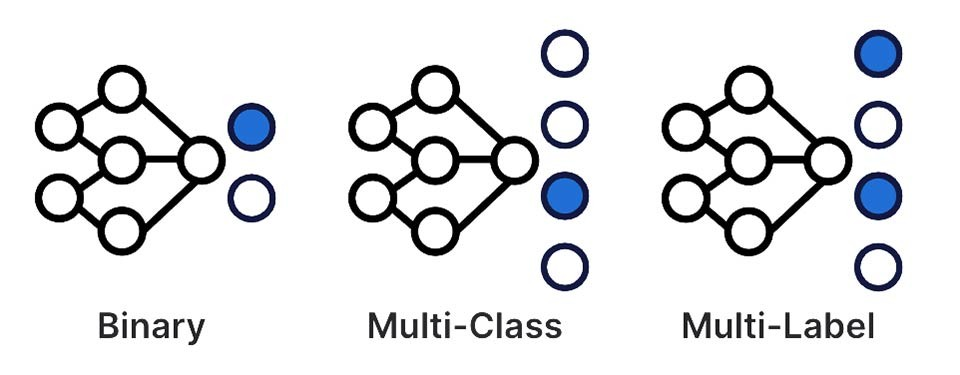
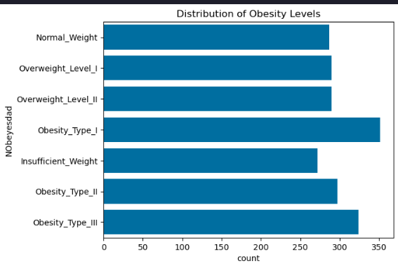
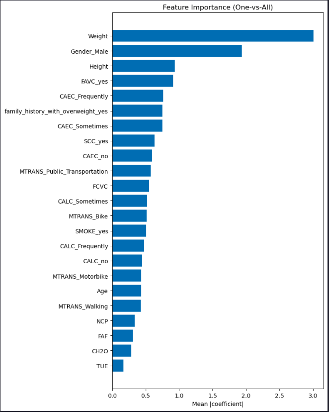
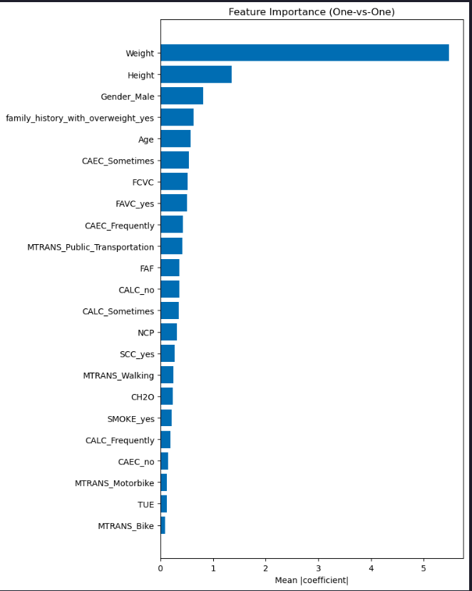

> Estimated reading time: \~**30** minutes

# Multi-class Classification


## Objectives

-   Understand one-hot encoding for categorical variables
-   Implement logistic regression for multi-class classification using One-vs-All (OvA) and One-vs-One (OvO) strategies
-   Evaluate model performance using appropriate metrics

## Dataset

Obesity Risk Prediction dataset from UCI Library. The dataset contains 17 attributes and 2,111 samples.

The attributes of the dataset are descibed below.
<style type="text/css">
.tg  {border-collapse:collapse;border-spacing:0;}
.tg td{border-color:black;border-style:solid;border-width:1px;font-family:Arial, sans-serif;font-size:14px;
  overflow:hidden;padding:10px 5px;word-break:normal;}
.tg th{border-color:black;border-style:solid;border-width:1px;font-family:Arial, sans-serif;font-size:14px;
  font-weight:normal;overflow:hidden;padding:10px 5px;word-break:normal;}
.tg .tg-7zrl{text-align:left;vertical-align:bottom}
</style>
<table class="tg"><thead>
  <tr>
    <th class="tg-7zrl">Variable Name</th>
    <th class="tg-7zrl">Type</th>
    <th class="tg-7zrl">Description</th>
  </tr></thead>
<tbody>
  <tr>
    <td class="tg-7zrl">Gender</td>
    <td class="tg-7zrl">Categorical</td>
    <td class="tg-7zrl"></td>
  </tr>
  <tr>
    <td class="tg-7zrl">Age</td>
    <td class="tg-7zrl">Continuous</td>
    <td class="tg-7zrl"></td>
  </tr>
  <tr>
    <td class="tg-7zrl">Height</td>
    <td class="tg-7zrl">Continuous</td>
    <td class="tg-7zrl"></td>
  </tr>
  <tr>
    <td class="tg-7zrl">Weight</td>
    <td class="tg-7zrl">Continuous</td>
    <td class="tg-7zrl"></td>
  </tr>
  <tr>
    <td class="tg-7zrl">family_history_with_overweight</td>
    <td class="tg-7zrl">Binary</td>
    <td class="tg-7zrl">Has a family member suffered or suffers from overweight?</td>
  </tr>
  <tr>
    <td class="tg-7zrl">FAVC</td>
    <td class="tg-7zrl">Binary</td>
    <td class="tg-7zrl">Do you eat high caloric food frequently?</td>
  </tr>
  <tr>
    <td class="tg-7zrl">FCVC</td>
    <td class="tg-7zrl">Integer</td>
    <td class="tg-7zrl">Do you usually eat vegetables in your meals?</td>
  </tr>
  <tr>
    <td class="tg-7zrl">NCP</td>
    <td class="tg-7zrl">Continuous</td>
    <td class="tg-7zrl">How many main meals do you have daily?</td>
  </tr>
  <tr>
    <td class="tg-7zrl">CAEC</td>
    <td class="tg-7zrl">Categorical</td>
    <td class="tg-7zrl">Do you eat any food between meals?</td>
  </tr>
  <tr>
    <td class="tg-7zrl">SMOKE</td>
    <td class="tg-7zrl">Binary</td>
    <td class="tg-7zrl">Do you smoke?</td>
  </tr>
  <tr>
    <td class="tg-7zrl">CH2O</td>
    <td class="tg-7zrl">Continuous</td>
    <td class="tg-7zrl">How much water do you drink daily?</td>
  </tr>
  <tr>
    <td class="tg-7zrl">SCC</td>
    <td class="tg-7zrl">Binary</td>
    <td class="tg-7zrl">Do you monitor the calories you eat daily?</td>
  </tr>
  <tr>
    <td class="tg-7zrl">FAF</td>
    <td class="tg-7zrl">Continuous</td>
    <td class="tg-7zrl">How often do you have physical activity?</td>
  </tr>
  <tr>
    <td class="tg-7zrl">TUE</td>
    <td class="tg-7zrl">Integer</td>
    <td class="tg-7zrl">How much time do you use technological devices such as cell phone, videogames, television, computer and others?</td>
  </tr>
  <tr>
    <td class="tg-7zrl">CALC</td>
    <td class="tg-7zrl">Categorical</td>
    <td class="tg-7zrl">How often do you drink alcohol?</td>
  </tr>
  <tr>
    <td class="tg-7zrl">MTRANS</td>
    <td class="tg-7zrl">Categorical</td>
    <td class="tg-7zrl">Which transportation do you usually use?</td>
  </tr>
  <tr>
    <td class="tg-7zrl">NObeyesdad</td>
    <td class="tg-7zrl">Categorical</td>
    <td class="tg-7zrl">Obesity level</td>
  </tr>
</tbody></table>

## Preprocessing

``` python
import pandas as pd
import numpy as np
import matplotlib.pyplot as plt
import seaborn as sns
from sklearn.model_selection import train_test_split
from sklearn.preprocessing import OneHotEncoder, StandardScaler
from sklearn.linear_model import LogisticRegression
from sklearn.multiclass import OneVsOneClassifier
from sklearn.metrics import accuracy_score
import warnings
warnings.filterwarnings('ignore')

file_path = "https://cf-courses-data.s3.us.cloud-object-storage.appdomain.cloud/GkDzb7bWrtvGXdPOfk6CIg/Obesity-level-prediction-dataset.csv"
data = pd.read_csv(file_path)
```

### Exploratory Data Analysis (EDA)

``` python
# Distribution of target variable
sns.countplot(y='NObeyesdad', data=data)
plt.title('Distribution of Obesity Levels')
plt.show()
```



### Feature Scaling and Encoding

``` python
continuous_columns = data.select_dtypes(include=['float64']).columns.tolist()
scaler = StandardScaler()
scaled_features = scaler.fit_transform(data[continuous_columns])
scaled_df = pd.DataFrame(scaled_features, columns=scaler.get_feature_names_out(continuous_columns))
scaled_data = pd.concat([data.drop(columns=continuous_columns), scaled_df], axis=1)
categorical_columns = scaled_data.select_dtypes(include=['object']).columns.tolist()
categorical_columns.remove('NObeyesdad')
encoder = OneHotEncoder(sparse_output=False, drop='first')
encoded_features = encoder.fit_transform(scaled_data[categorical_columns])
encoded_df = pd.DataFrame(encoded_features, columns=encoder.get_feature_names_out(categorical_columns))
prepped_data = pd.concat([scaled_data.drop(columns=categorical_columns), encoded_df], axis=1)
prepped_data['NObeyesdad'] = prepped_data['NObeyesdad'].astype('category').cat.codes
X = prepped_data.drop('NObeyesdad', axis=1)
y = prepped_data['NObeyesdad']
```

### Train/Test Split

``` python
X_train, X_test, y_train, y_test = train_test_split(X, y, test_size=0.2, random_state=42, stratify=y)
```

## Modeling

### One-vs-All (OvA)

``` python
model_ova = LogisticRegression(multi_class='ovr', max_iter=1000)
model_ova.fit(X_train, y_train)
y_pred_ova = model_ova.predict(X_test)
print("OvA Accuracy:", accuracy_score(y_test, y_pred_ova))
```
> One-vs-All (OvA) Strategy
> Accuracy: 76.12%


### One-vs-One (OvO)

``` python
model_ovo = OneVsOneClassifier(LogisticRegression(max_iter=1000))
model_ovo.fit(X_train, y_train)
y_pred_ovo = model_ovo.predict(X_test)
print("OvO Accuracy:", accuracy_score(y_test, y_pred_ovo))
```
> One-vs-One (OvO) Strategy
> Accuracy: 92.2%


### Experimenting with different test sizes

``` python
# Experiment with different test sizes
for test_size in [0.1, 0.3]:
    X_train, X_test, y_train, y_test = train_test_split(X, y, test_size=test_size, random_state=42, stratify=y)
    model_ova = LogisticRegression(multi_class='ovr', max_iter=1000)
    model_ova.fit(X_train, y_train)
    y_pred = model_ova.predict(X_test)
    acc = accuracy_score(y_test, y_pred)
    print(f"Test Size: {test_size}")
    print(f"Accuracy: {acc:.4f}")
    print("-"*30)
```

Test Size: 0.1

Accuracy: 0.7594

------------------------------

Test Size: 0.3

Accuracy: 0.7492


### Feature Importance

``` python
# Feature importance plots for OvA and OvO models

# Ensure models are trained (uses previously trained models if available)
if 'model_ova' not in globals():
    model_ova = LogisticRegression(multi_class='ovr', max_iter=1000)
    model_ova.fit(X_train, y_train)

# OvA feature importance (mean absolute coefficients across classes)
ova_importance = np.mean(np.abs(model_ova.coef_), axis=0)
order = np.argsort(ova_importance)
plt.figure(figsize=(8, 10))
plt.barh(np.array(X.columns)[order], ova_importance[order])
plt.title("Feature Importance (One-vs-All)")
plt.xlabel("Mean |coefficient|")
plt.tight_layout()
plt.show()

# OvO feature importance
if 'model_ovo' not in globals():
    model_ovo = OneVsOneClassifier(LogisticRegression(max_iter=1000))
    model_ovo.fit(X_train, y_train)

coefs = np.array([est.coef_[0] for est in model_ovo.estimators_])
ovo_importance = np.mean(np.abs(coefs), axis=0)
order = np.argsort(ovo_importance)
plt.figure(figsize=(8, 10))
plt.barh(np.array(X.columns)[order], ovo_importance[order])
plt.title("Feature Importance (One-vs-One)")
plt.xlabel("Mean |coefficient|")
plt.tight_layout()
plt.show()
```



