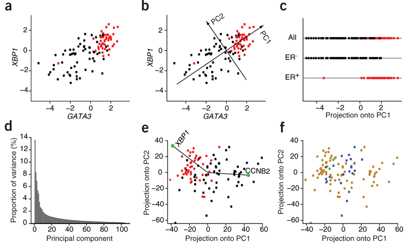
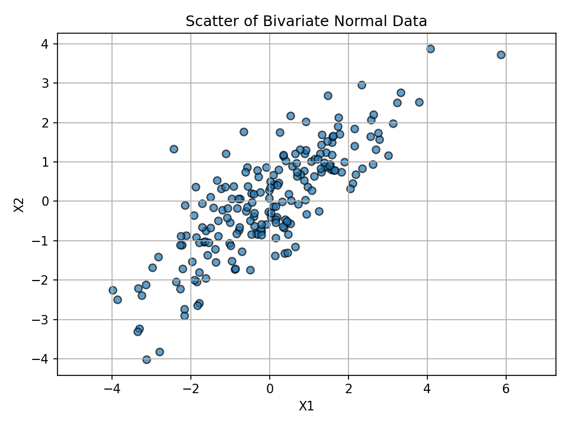
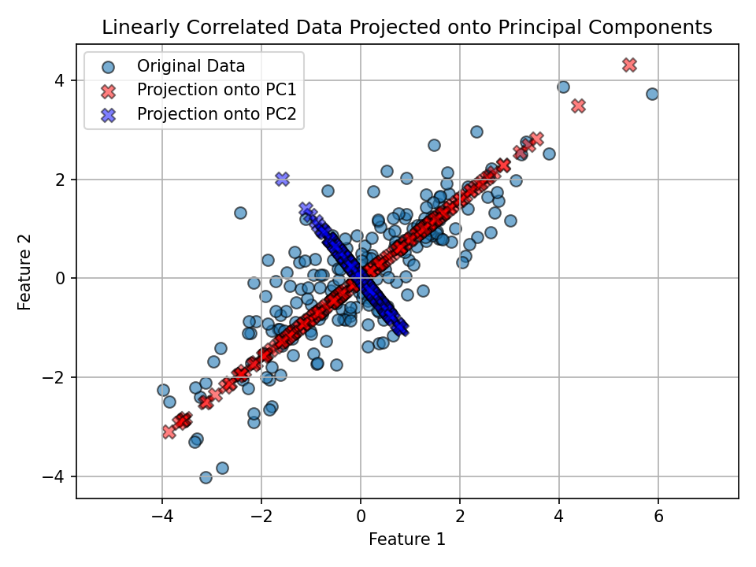
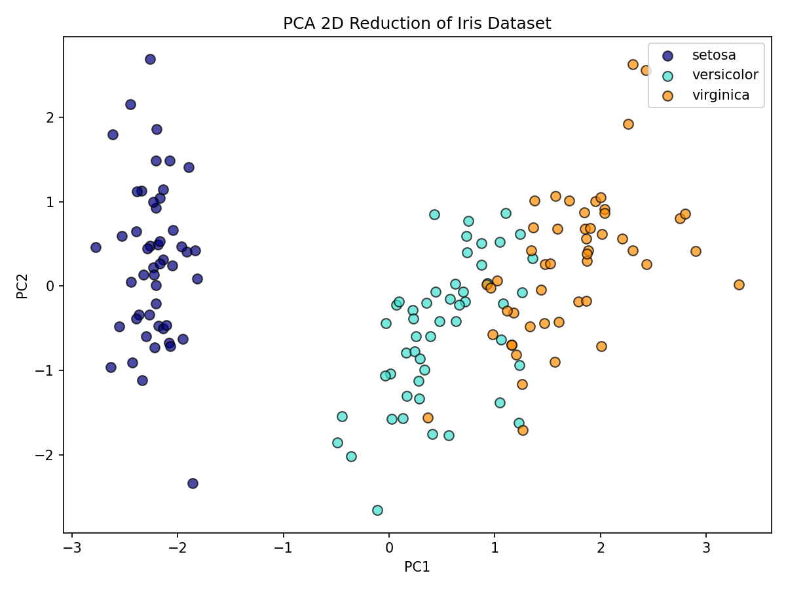
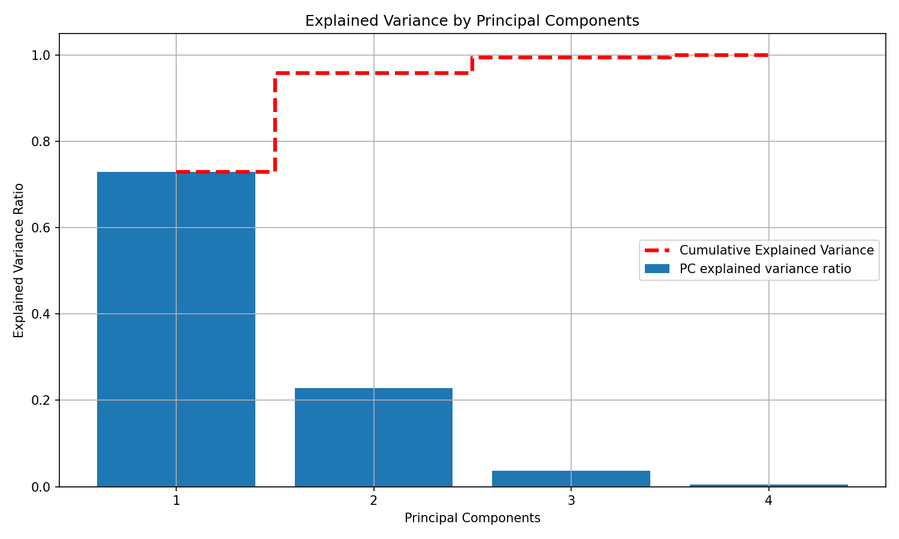

> Estimated reading time: \~**30** minutes

# Applications of Principal Component Analysis (PCA)

## Objectives

- Use PCA to project 2-D data onto its principal axes
- Use PCA for feature space dimensionality reduction
- Relate explained variance to feature importance and noise reduction

## Introduction

This article explores two practical applications of PCA:

1. Projecting 2-D data onto its principal axes, the orthogonal directions that capture the most variance.
2. Reducing higher-dimensional data to a lower-dimensional feature space to simplify modeling, reduce noise, and visualize key structure.

Along the way, you’ll visualize projections, interpret principal components, and examine explained variance.


## Part I: Projecting 2-D data onto its principal axes

We’ll generate a 2D dataset with correlated features and use PCA to find the main directions of variance.

### Setup
Code chunks are provided for reference but won’t execute during rendering.

```python
# Imports
import numpy as np
import matplotlib.pyplot as plt
from sklearn.decomposition import PCA
from sklearn import datasets
from sklearn.preprocessing import StandardScaler
```

### Create a correlated 2D dataset

We sample from a bivariate normal distribution with covariance matrix:

$$
\begin{pmatrix}
3 & 2 \\
2 & 2
\end{pmatrix}
$$

```python
np.random.seed(42)
mean = [0, 0]
cov = [[3, 2], [2, 2]]
X = np.random.multivariate_normal(mean=mean, cov=cov, size=200)
```

```python
# Scatter plot of the two features
plt.figure()
plt.scatter(X[:, 0], X[:, 1], edgecolor='k', alpha=0.7)
plt.title("Scatter Plot of Bivariate Normal Distribution")
plt.xlabel("X1")
plt.ylabel("X2")
plt.axis('equal')
plt.grid(True)
plt.show()
```



### Visualize feature relationship

The figure above shows correlated features with an elongated spread.

### Fit PCA and inspect components

```python
pca = PCA(n_components=2)
X_pca = pca.fit_transform(X)
components = pca.components_
explained = pca.explained_variance_ratio_
components, explained
```

Key intuition:

- PC1 aligns with the direction of greatest variance.
- PC2 is orthogonal to PC1 and explains the remaining variance.

### Project data onto principal axes and plot

We project each point onto the component directions and overlay those projections in the original feature space.

```python
# Projections (coordinates along PC directions)
projection_pc1 = np.dot(X, components[0])
projection_pc2 = np.dot(X, components[1])

# Back to original feature-space directions for visualization
x_pc1 = projection_pc1 * components[0][0]
y_pc1 = projection_pc1 * components[0][1]
x_pc2 = projection_pc2 * components[1][0]
y_pc2 = projection_pc2 * components[1][1]

plt.figure()
plt.scatter(X[:, 0], X[:, 1], label='Original Data', ec='k', s=50, alpha=0.6)
plt.scatter(x_pc1, y_pc1, c='r', ec='k', marker='X', s=70, alpha=0.5, label='Projection onto PC1')
plt.scatter(x_pc2, y_pc2, c='b', ec='k', marker='X', s=70, alpha=0.5, label='Projection onto PC2')
plt.title('Linearly Correlated Data Projected onto Principal Components')
plt.xlabel('Feature 1')
plt.ylabel('Feature 2')
plt.legend()
plt.grid(True)
plt.axis('equal')
plt.show()
```



Observation:
- PC1 (red) follows the direction of widest spread in the data.
- PC2 (blue) is perpendicular to PC1 and explains the remaining (smaller) variance.


## Part II: PCA for dimensionality reduction (Iris dataset)

We’ll reduce the four-dimensional Iris dataset to two principal components for visualization and insight.

### Load and standardize data

We analyze the Iris dataset, standardize features, and apply PCA to 2 components; visuals are pre-rendered below.

```python
# Load the Iris dataset
iris = datasets.load_iris()
X_iris = iris.data
y = iris.target
target_names = iris.target_names

# Standardize features before PCA
scaler = StandardScaler()
X_scaled = scaler.fit_transform(X_iris)
```

### Reduce to 2 principal components

Results are shown in the scatter plot.

```python
pca2 = PCA(n_components=2)
X_pca2 = pca2.fit_transform(X_scaled)
```

### Visualize in 2D PC space



### How much variance do PC1 and PC2 explain together?

Together, PC1 and PC2 explain most of the variance, allowing effective 2D visualization.

```python
100 * pca2.explained_variance_ratio_.sum()
```

Interpretation:
- The first two PCs typically capture most of the signal, enabling effective 2D visualization while preserving class structure.


## A deeper look at explained variance

Let’s compute explained variance ratios for all four components and visualize both per-component and cumulative variance.



```python
# Refit PCA without specifying n_components
scaler = StandardScaler()
X_scaled_full = scaler.fit_transform(X_iris)
pca_full = PCA()
X_pca_full = pca_full.fit_transform(X_scaled_full)
explained_variance_ratio = pca_full.explained_variance_ratio_

# Plot explained variance per component and cumulative
plt.figure(figsize=(10, 6))
plt.bar(x=range(1, len(explained_variance_ratio) + 1), height=explained_variance_ratio,
  alpha=1, align='center', label='PC explained variance ratio')
plt.ylabel('Explained Variance Ratio')
plt.xlabel('Principal Components')
plt.title('Explained Variance by Principal Components')

cumulative_variance = np.cumsum(explained_variance_ratio)
plt.step(range(1, 5), cumulative_variance, where='mid', linestyle='--', lw=3,
   color='red', label='Cumulative Explained Variance')
plt.xticks(range(1, 5))
plt.legend()
plt.grid(True)
plt.show()
```

Notes:
- The dashed red line shows how quickly variance accumulates as you add components.
- In practice, you can pick the smallest number of PCs that preserves a target proportion of variance (e.g., 90–95%) to reduce noise and complexity.


## Conclusion

- PCA identifies orthogonal directions of maximum variance (principal components).
- Projections onto these components reveal dominant structure and can simplify downstream models.
- On the Iris dataset, two components provide a compact, informative 2D representation and often retain most of the signal.
