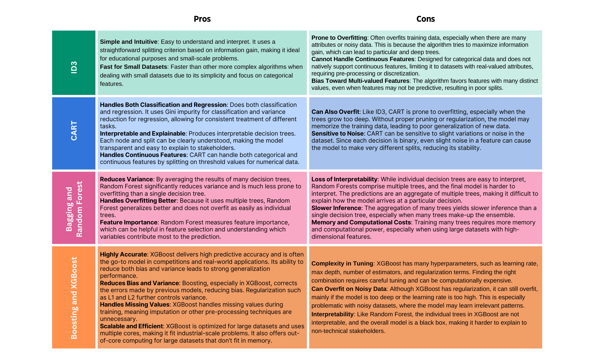
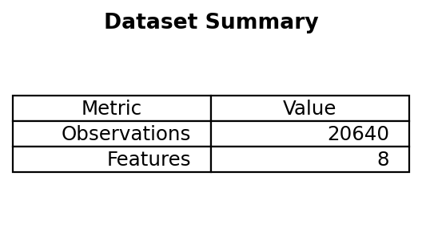
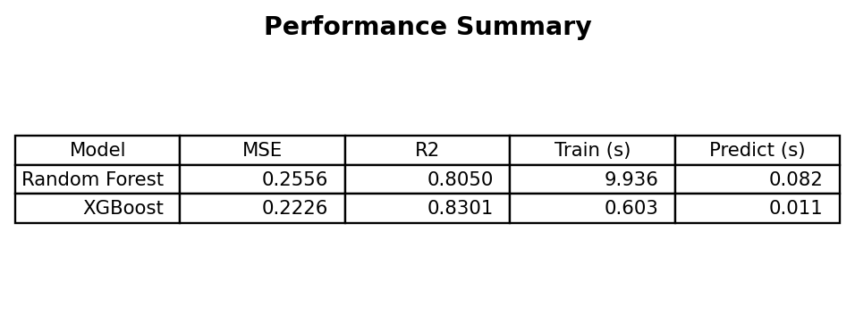
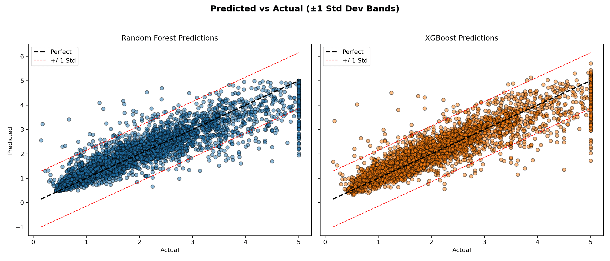

> Estimated reading time: \~**18** minutes

## Overview

Random Forest and XGBoost are widely used ensemble methods for tabular regression. This article compares their performance on the California Housing dataset using default-ish settings (100 trees) and reports:

- Predictive accuracy (MSE, R²)
- Training and prediction wall-clock times
- Error dispersion via predicted vs actual plots with ±1 standard deviation bands

All code is included for reference only (non-executable here). Figures are pre-rendered by a headless script `scripts/generate_rf_xgb_figures.py`.

## 1. Imports & dataset

```python
import numpy as np
import time
from sklearn.datasets import fetch_california_housing
from sklearn.model_selection import train_test_split
from sklearn.ensemble import RandomForestRegressor
from xgboost import XGBRegressor
from sklearn.metrics import mean_squared_error, r2_score

data = fetch_california_housing()
X, y = data.data, data.target
X_train, X_test, y_train, y_test = train_test_split(
    X, y, test_size=0.2, random_state=42
)
X.shape  # (n_observations, n_features)
```



## 2. Model initialization

```python
n_estimators = 100
rf = RandomForestRegressor(n_estimators=n_estimators, random_state=42)
xgb = XGBRegressor(n_estimators=n_estimators, random_state=42, verbosity=0)
```

## 3. Training & timing

```python
start = time.time(); rf.fit(X_train, y_train); rf_train_time = time.time() - start
start = time.time(); xgb.fit(X_train, y_train); xgb_train_time = time.time() - start
```

## 4. Prediction & timing

```python
start = time.time(); y_pred_rf = rf.predict(X_test); rf_pred_time = time.time() - start
start = time.time(); y_pred_xgb = xgb.predict(X_test); xgb_pred_time = time.time() - start
```

## 5. Metrics

```python
mse_rf = mean_squared_error(y_test, y_pred_rf)
mse_xgb = mean_squared_error(y_test, y_pred_xgb)
r2_rf = r2_score(y_test, y_pred_rf)
r2_xgb = r2_score(y_test, y_pred_xgb)
summary = {
    'Random Forest': {'MSE': mse_rf, 'R2': r2_rf, 'train_s': rf_train_time, 'pred_s': rf_pred_time},
    'XGBoost': {'MSE': mse_xgb, 'R2': r2_xgb, 'train_s': xgb_train_time, 'pred_s': xgb_pred_time}
}
summary
```



### Quick interpretation
- XGBoost often yields slightly better MSE/R² with faster prediction (and sometimes faster training depending on hardware and parameters).
- Random Forest is competitive and can be simpler to tune initially.

## 6. Predicted vs actual dispersion

```python
std_y = np.std(y_test)
# (Plotting code would create side-by-side scatter charts with ideal & ±1σ bands.)
```



### Observations
- Most residuals lie within ±1 std dev of the target for both models.
- Random Forest tends to under-shoot extremes; XGBoost may overshoot upper tail values.
- Heteroscedasticity is mild; variance remains fairly stable across target range.

## 7. When to choose which?

| Scenario | Prefer Random Forest | Prefer XGBoost |
|----------|---------------------|----------------|
| Baseline prototype | ✅ Simple start | — |
| Highly tuned leaderboard pursuit | — | ✅ Usually superior |
| Small data, low variance need | ✅ Robust | ✅ (with regularization) |
| Need calibrated feature importance (averaging) | ✅ | Mixed (gain-based) |
| Tight latency constraints | Sometimes | ✅ Often faster |

## 8. Next improvement ideas

- Hyperparameter tuning: depth, learning rate (XGBoost), min child weight, subsampling.
- Feature engineering & interaction creation.
- Cross-validation with early stopping for XGBoost.
- Shapley value analysis for interpretability.
- Consider LightGBM or CatBoost for alternative gradient boosting variants.

## 9. Key takeaways

- Both models perform strongly out-of-the-box on structured regression.
- XGBoost typically edges ahead in accuracy/time trade-off due to gradient boosting optimizations.
- Random Forest remains a solid, low-friction baseline and a robustness benchmark.
- Visualization of residual structure complements scalar metrics.

---

*Static article: code is non-executable; figures generated with `scripts/generate_rf_xgb_figures.py`.*
