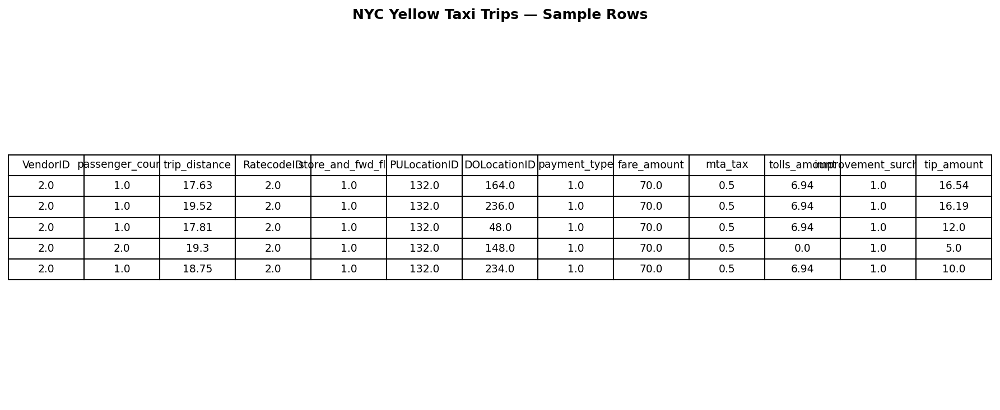
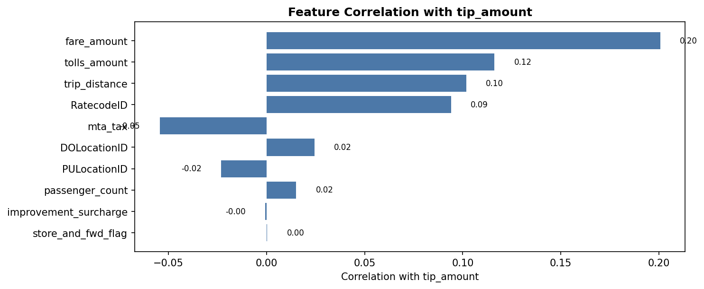
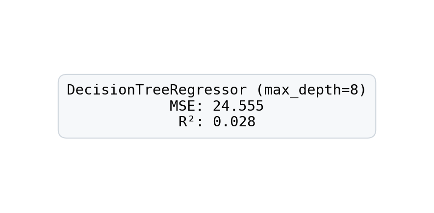
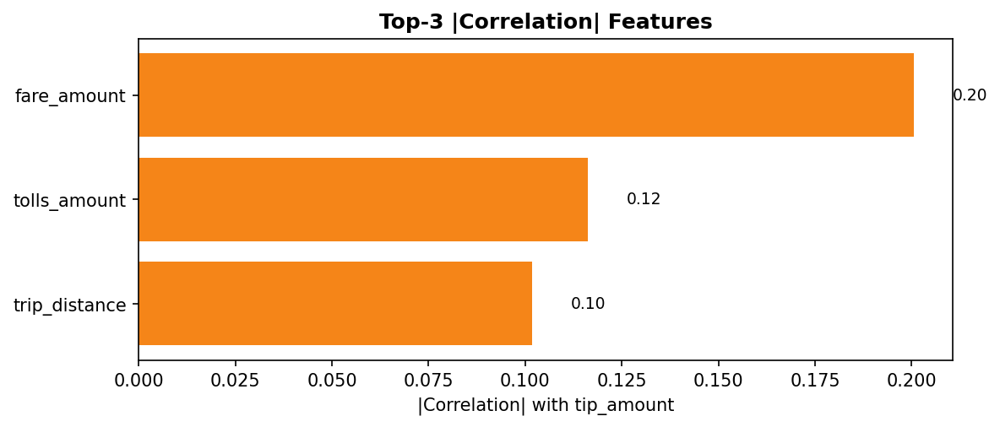

> Estimated reading time: \~**20** minutes

## Introduction

This article builds a regression tree model to predict taxi trip tips using a public NYC dataset. We explore feature-target correlations, train a DecisionTreeRegressor, and report MSE and R² on a held-out test set.

All figures are pre-rendered; code below is for reference only and does not execute when compiling the article.

## Imports and data loading

```python
import numpy as np
import pandas as pd
import matplotlib.pyplot as plt
from sklearn.model_selection import train_test_split
from sklearn.preprocessing import normalize
from sklearn.tree import DecisionTreeRegressor
from sklearn.metrics import mean_squared_error

url = 'https://cf-courses-data.s3.us.cloud-object-storage.appdomain.cloud/pu9kbeSaAtRZ7RxdJKX9_A/yellow-tripdata.csv'
raw_data = pd.read_csv(url)
raw_data.head()
```



## Feature correlation with tip_amount

```python
correlation_values = raw_data.corr(numeric_only=True)['tip_amount'].drop('tip_amount')
ax = correlation_values.sort_values(key=lambda s: s.abs()).plot(kind='barh', figsize=(10, 6))
ax.set_xlabel('Correlation with tip_amount')
ax.set_title('Feature Correlation with tip_amount')
plt.tight_layout()
```



## Preprocess, split, train model

```python
# Extract labels and features
y = raw_data[['tip_amount']].values.astype('float32')
X = raw_data.drop(['tip_amount'], axis=1).values

# Normalize features (L1 across rows)
X = normalize(X, axis=1, norm='l1', copy=False)

# Train/test split
X_train, X_test, y_train, y_test = train_test_split(
    X, y, test_size=0.3, random_state=42
)

# Decision Tree Regressor
dt_reg = DecisionTreeRegressor(
    criterion='squared_error', max_depth=8, random_state=35
)
dt_reg.fit(X_train, y_train)

# Evaluate
y_pred = dt_reg.predict(X_test)
mse_score = mean_squared_error(y_test, y_pred)
r2_score = dt_reg.score(X_test, y_test)
print(f"MSE: {mse_score:.3f}\nR^2: {r2_score:.3f}")
```



## Top-3 correlated features (absolute)

```python
correlation_values = raw_data.corr(numeric_only=True)['tip_amount'].drop('tip_amount')
top3 = correlation_values.abs().sort_values(ascending=False).head(3)
top3
```



## Ideas For Improvement

- Try different tree depths (e.g., max_depth=4 or 12) and observe how MSE and R² change.
- Remove low-correlation features (e.g., payment_type, VendorID, store_and_fwd_flag, improvement_surcharge) and compare results.
- Consider adding cross-validation and hyperparameter tuning for more robust performance estimates.
