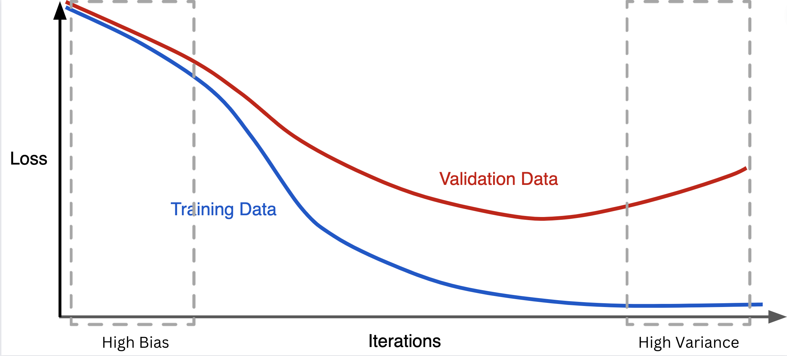

> Estimated reading time: ~**25** minutes

## Overview

This article demonstrates how regularization improves generalization and stabilizes coefficient estimates in linear regression. We:

1. Build a noisy single-feature dataset with injected outliers.
2. Fit and compare OLS (ordinary least squares), Ridge, and Lasso.
3. Explore a high-dimensional setting (100 features, only 10 informative).
4. Use Lasso for feature selection and refit models on the reduced feature set.
5. Visualize coefficient shrinkage and residual structure.

All code is provided for reference only (non-executable in this blog). Figures are pre-rendered via a headless script.

## 1. Imports and utility helpers

```python
import numpy as np
import pandas as pd
import matplotlib.pyplot as plt
from sklearn.model_selection import train_test_split
from sklearn.linear_model import LinearRegression, Ridge, Lasso
from sklearn.metrics import (explained_variance_score, mean_absolute_error,
                             mean_squared_error, r2_score)

def regression_results(y_true, y_pred, label):
    ev = explained_variance_score(y_true, y_pred)
    mae = mean_absolute_error(y_true, y_pred)
    mse = mean_squared_error(y_true, y_pred)
    r2 = r2_score(y_true, y_pred)
    print(f"{label} -> EV={ev:.4f} R2={r2:.4f} MAE={mae:.4f} MSE={mse:.4f} RMSE={mse**0.5:.4f}")
```

## 2. Single-feature synthetic data with outliers

```python
noise = 1
np.random.seed(42)
X = 2 * np.random.rand(1000, 1)
y = 4 + 3 * X + noise * np.random.randn(1000, 1)
y_ideal = 4 + 3 * X

# Inject outliers in upper range of X
from copy import deepcopy
y_outlier = deepcopy(y).ravel()
idx = np.where(X.ravel() > 1.5)[0]
sel = np.random.choice(idx, 5, replace=False)
import numpy as np
y_outlier[sel] += np.random.uniform(50, 100, len(sel))
```

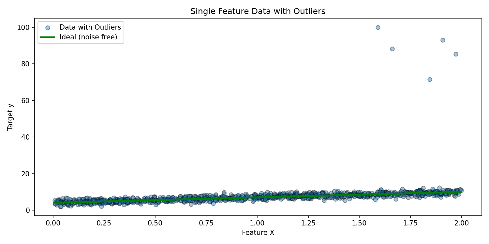

```python
# Plot without outliers (baseline structure)
# (Same X, original y and ideal line)
```

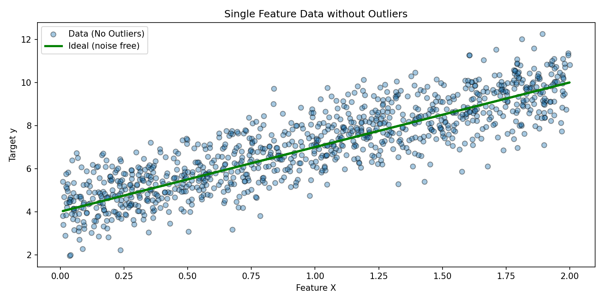

## 3. Fit OLS, Ridge, and Lasso (outlier scenario)

```python
lin = LinearRegression().fit(X, y_outlier)
ridge = Ridge(alpha=1).fit(X, y_outlier)
lasso = Lasso(alpha=0.2).fit(X, y_outlier)

y_lin = lin.predict(X)
y_ridge = ridge.predict(X)
y_lasso = lasso.predict(X)
```

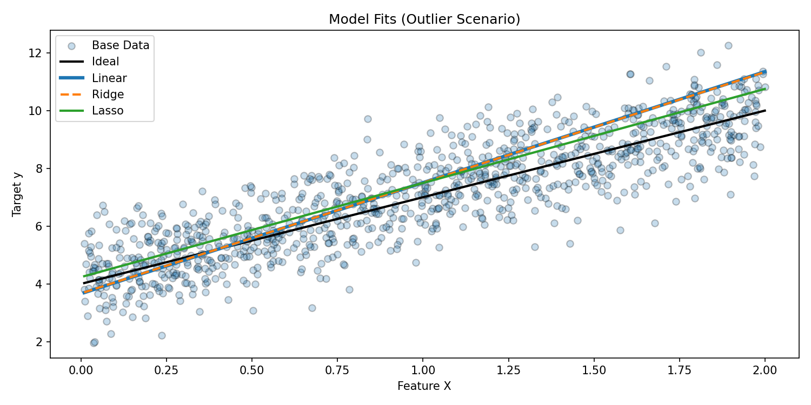

### Interpretation
Outliers pull OLS and Ridge fit lines upward. Lasso, with L1 penalty, partially dampens that distortion by shrinking coefficients.

## 4. High-dimensional regression setup (sparse informative features)

```python
from sklearn.datasets import make_regression
X_hd, y_hd, ideal_coef = make_regression(
    n_samples=100,
    n_features=100,
    n_informative=10,
    noise=10,
    random_state=42,
    coef=True
)
ideal_predictions = X_hd @ ideal_coef
X_train, X_test, y_train, y_test, ideal_train, ideal_test = train_test_split(
    X_hd, y_hd, ideal_predictions, test_size=0.3, random_state=42
)
```

```python
lasso = Lasso(alpha=0.1)
ridge = Ridge(alpha=1.0)
linear = LinearRegression()
lasso.fit(X_train, y_train)
ridge.fit(X_train, y_train)
linear.fit(X_train, y_train)
```

```python
y_pred_linear = linear.predict(X_test)
y_pred_ridge = ridge.predict(X_test)
y_pred_lasso = lasso.predict(X_test)
```

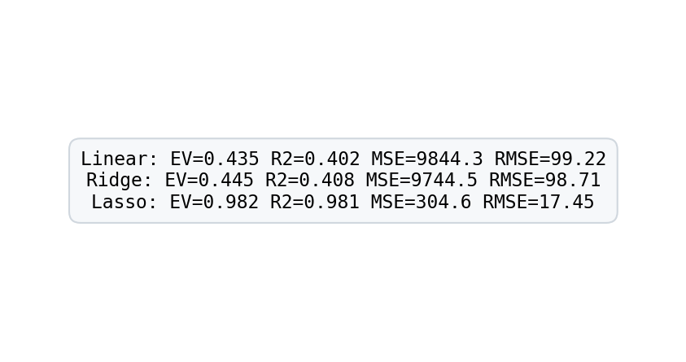

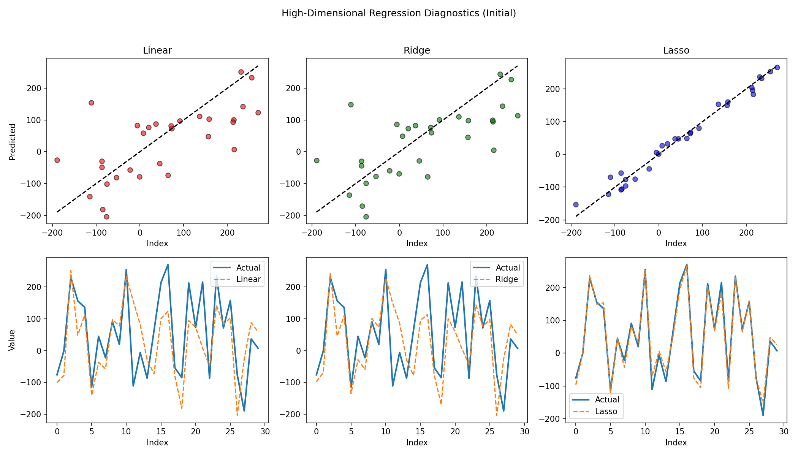

## 5. Coefficient comparison and residuals

```python
linear_coef = linear.coef_
ridge_coef = ridge.coef_
lasso_coef = lasso.coef_
```

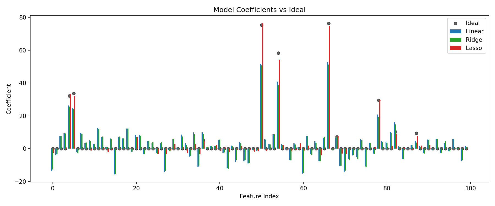

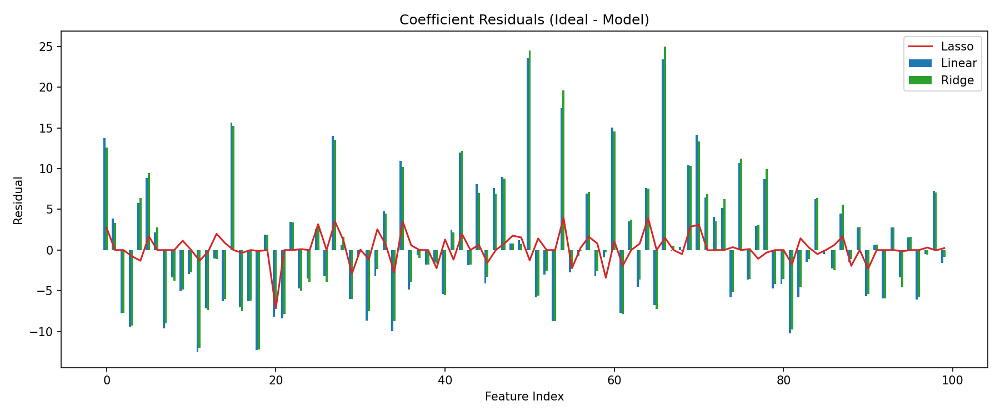

### Observations
- Lasso aggressively zeroes many non-informative weights.
- Ridge shrinks coefficients but retains dense support.
- OLS overfits noisy directions, leading to wider residual spread.

## 6. Lasso-based feature selection

```python
threshold = np.percentile(np.abs(lasso_coef[lasso_coef != 0]), 40) if np.any(lasso_coef!=0) else 0
important_idx = np.where(np.abs(lasso_coef) > threshold)[0]
X_filt = X_hd[:, important_idx]
X_train_f, X_test_f, y_train_f, y_test_f = train_test_split(
    X_filt, y_hd, test_size=0.3, random_state=42
)
lin_f = LinearRegression().fit(X_train_f, y_train_f)
ridge_f = Ridge(alpha=1.0).fit(X_train_f, y_train_f)
lasso_f = Lasso(alpha=0.1).fit(X_train_f, y_train_f)
```

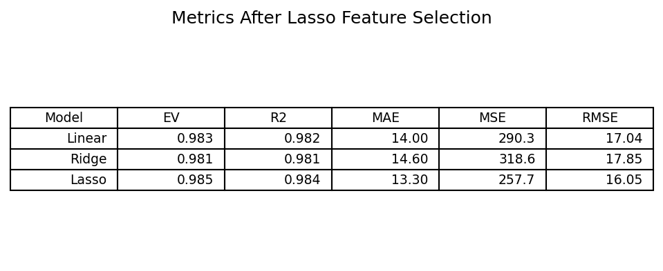

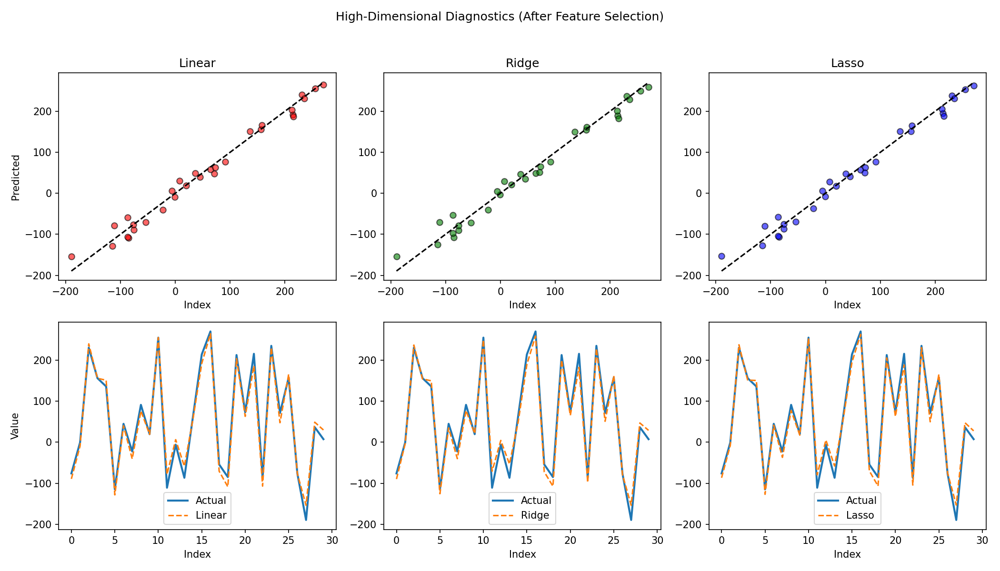

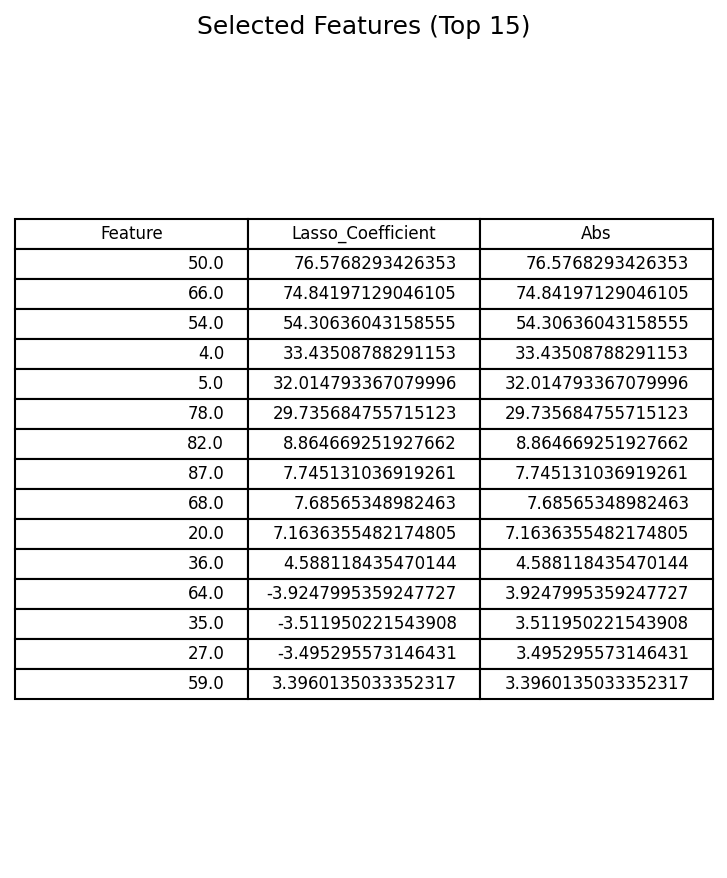

### Impact
Performance for OLS and Ridge converges toward Lasso once irrelevant features are pruned. Lasso maintains strong generalization with sparse representation.

## 7. Key takeaways

- Regularization combats overfitting by shrinking or eliminating unstable coefficients.
- L1 (Lasso) yields sparsity, enabling feature selection and interpretability.
- L2 (Ridge) distributes penalty smoothly, stabilizing solutions without forcing zeros.
- In high-dimensional regimes, combining Lasso-based filtering with simpler models can recover strong performance.

## 8. Further exploration

- Elastic Net (blend L1 + L2) for correlated groups of predictors.
- Information criteria (AIC/BIC) for model selection.
- Stability selection to validate feature importance robustness.
- Cross-validation to tune alpha systematically.
