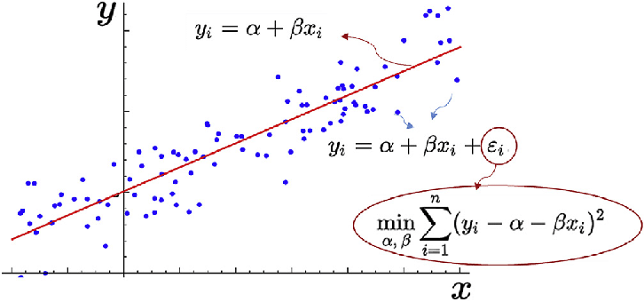
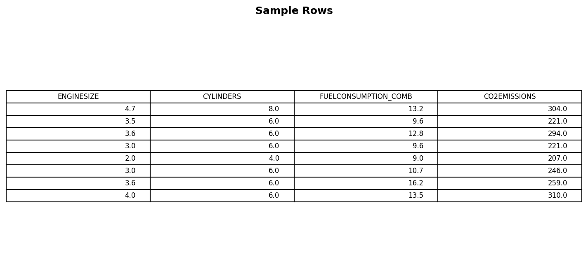
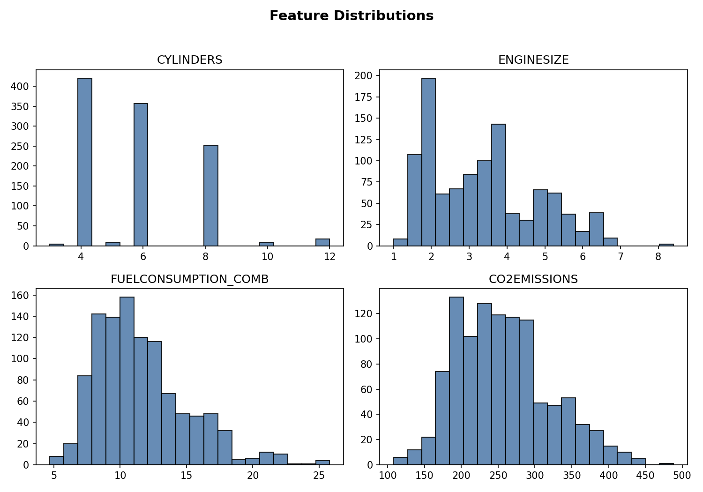
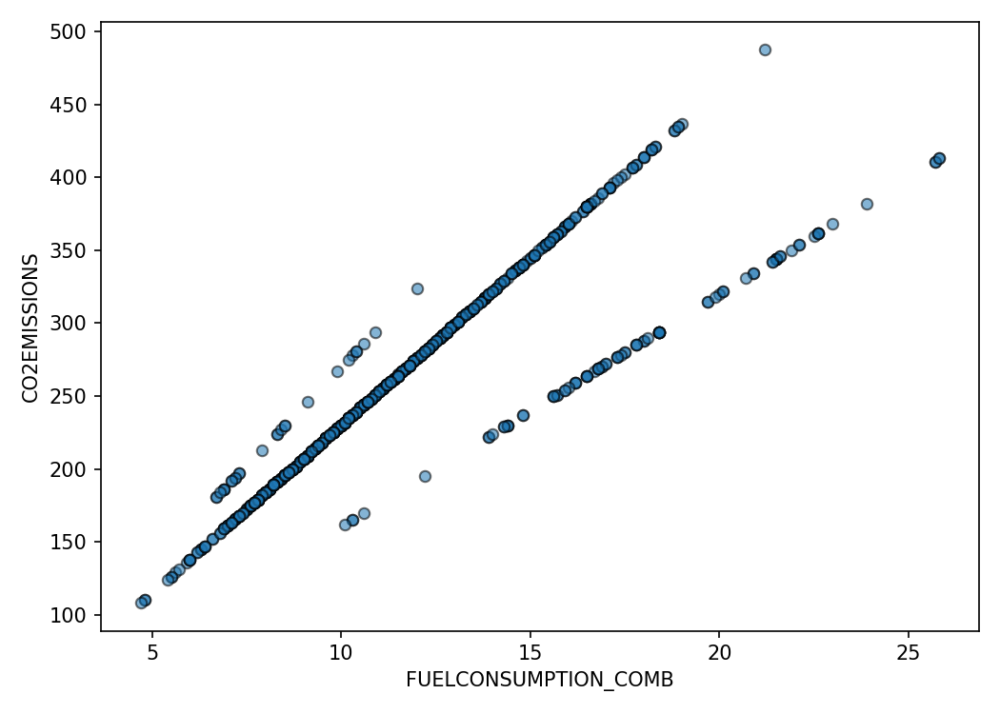
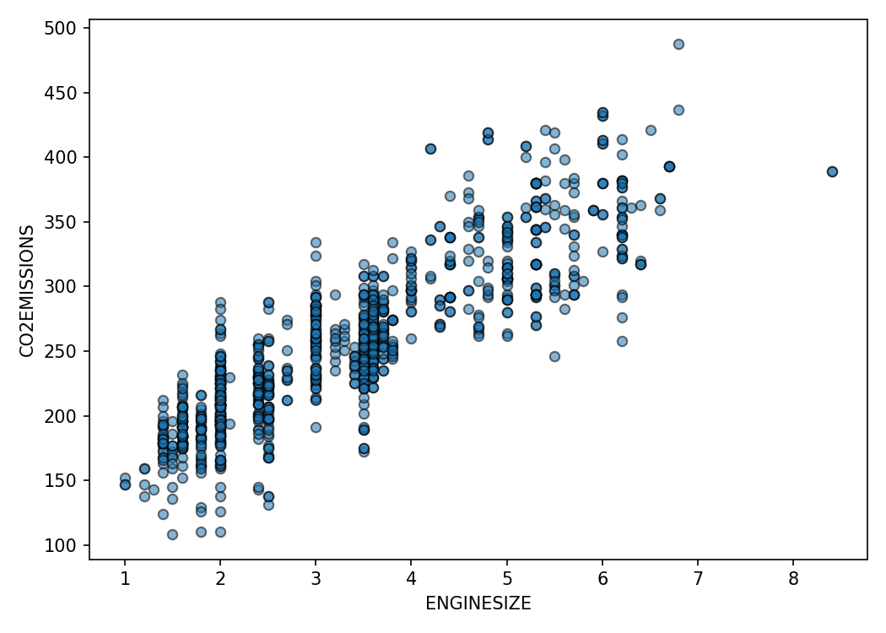
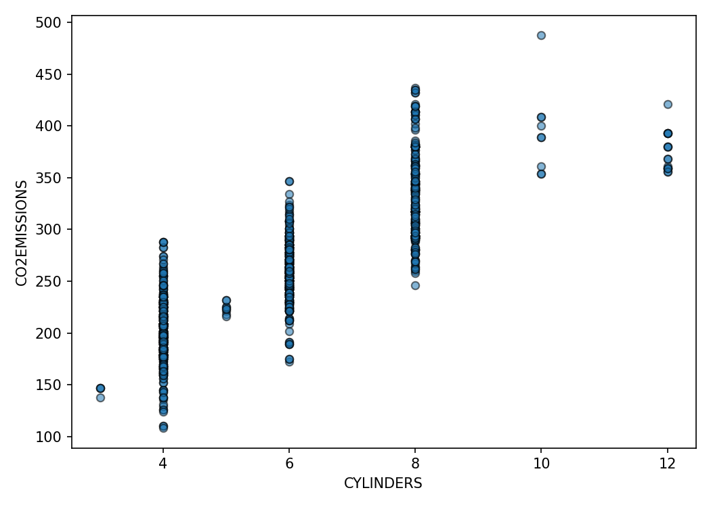
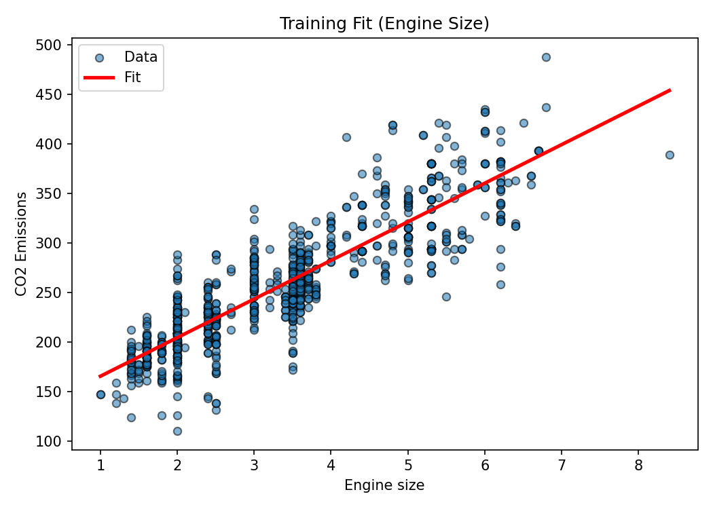
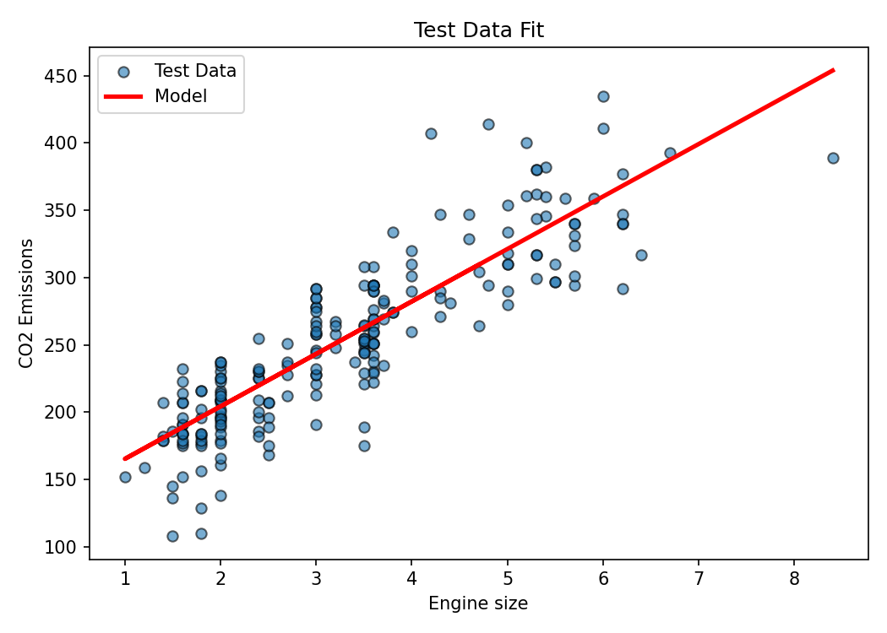
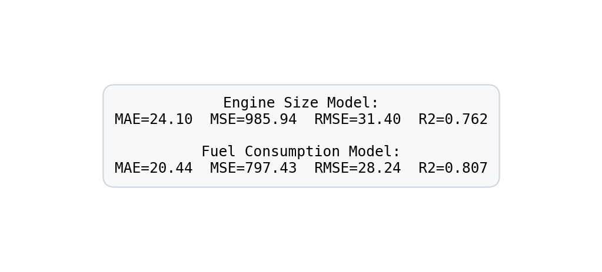

> Estimated reading time: ~**15** minutes

## Overview

This article introduces simple linear regression by modeling CO₂ emissions from vehicle attributes. We explore the dataset, visualize feature relationships, build a regression model using engine size, evaluate it, and compare performance when using fuel consumption instead. Code is provided as static reference (non-executable here); plots are pre-rendered.

## 1. Imports & data source

```python
import numpy as np
import pandas as pd
import matplotlib.pyplot as plt
from sklearn.model_selection import train_test_split
from sklearn import linear_model
from sklearn.metrics import mean_absolute_error, mean_squared_error, r2_score

url = (
    'https://cf-courses-data.s3.us.cloud-object-storage.appdomain.cloud/'
    'IBMDeveloperSkillsNetwork-ML0101EN-SkillsNetwork/labs/Module%202/data/FuelConsumptionCo2.csv'
)
df = pd.read_csv(url)
df.head()
```



## 2. Feature subset & distributions

```python
cdf = df[['ENGINESIZE','CYLINDERS','FUELCONSUMPTION_COMB','CO2EMISSIONS']]
cdf.describe()
```



### Notes
- CO₂ emission and combined fuel consumption share similar distribution shapes.
- Engine size clusters around common displacements (≈2–4L); cylinders show discrete modes (4, 6, 8).

## 3. Scatter relationships

```python
plt.scatter(cdf['FUELCONSUMPTION_COMB'], cdf['CO2EMISSIONS'])
plt.xlabel('FUELCONSUMPTION_COMB')
plt.ylabel('CO2EMISSIONS')
```



```python
plt.scatter(cdf['ENGINESIZE'], cdf['CO2EMISSIONS'])
plt.xlabel('ENGINESIZE')
plt.ylabel('CO2EMISSIONS')
```



```python
plt.scatter(cdf['CYLINDERS'], cdf['CO2EMISSIONS'])
plt.xlabel('CYLINDERS')
plt.ylabel('CO2EMISSIONS')
```



### Interpretation
Fuel consumption displays a near-linear relationship with emissions. Engine size and cylinders correlate as well but include more dispersion due to multi-factor influences.

## 4. Train/test split (engine size model)

```python
X = cdf.ENGINESIZE.to_numpy()
y = cdf.CO2EMISSIONS.to_numpy()
X_train, X_test, y_train, y_test = train_test_split(
    X, y, test_size=0.2, random_state=42
)
```

## 5. Fit simple linear regression

```python
regressor = linear_model.LinearRegression()
regressor.fit(X_train.reshape(-1,1), y_train)
coef = regressor.coef_[0]
intercept = regressor.intercept_
print('Coefficient:', coef)
print('Intercept:', intercept)
```



## 6. Evaluate on test set

```python
y_pred = regressor.predict(X_test.reshape(-1,1))
mae = mean_absolute_error(y_test, y_pred)
mse = mean_squared_error(y_test, y_pred)
rmse = mse**0.5
r2 = r2_score(y_test, y_pred)
print(f'MAE={mae:.2f} MSE={mse:.2f} RMSE={rmse:.2f} R2={r2:.3f}')
```



## 7. Alternative feature: combined fuel consumption

```python
X_fuel = cdf.FUELCONSUMPTION_COMB.to_numpy()
X_train_f, X_test_f, y_train_f, y_test_f = train_test_split(
    X_fuel, y, test_size=0.2, random_state=42
)
regr_fuel = linear_model.LinearRegression()
regr_fuel.fit(X_train_f.reshape(-1,1), y_train_f)
y_pred_fuel = regr_fuel.predict(X_test_f.reshape(-1,1))
print('Fuel consumption model R2:', r2_score(y_test_f, y_pred_fuel))
```



### Comparison
The fuel consumption model generally achieves lower error and higher R² versus engine size—consistent with domain intuition that direct energy use (fuel burned) maps more tightly to emissions than displacement alone.

## 8. Key takeaways

- Simple linear regression is interpretable: slope ≈ marginal emission increase per unit feature change.
- Feature choice matters: selecting a variable with tighter physiological or physical linkage to the target improves fit.
- Always validate on unseen data; apparent linearity in scatter plots should be confirmed via metrics.

## 9. Next exploration ideas

- Multiple linear regression (additive contributions of several predictors).
- Regularization (Ridge/Lasso) when multicollinearity emerges.
- Nonlinear feature engineering (log transforms, interaction terms).
- Residual diagnostics for heteroscedasticity and leverage points.
