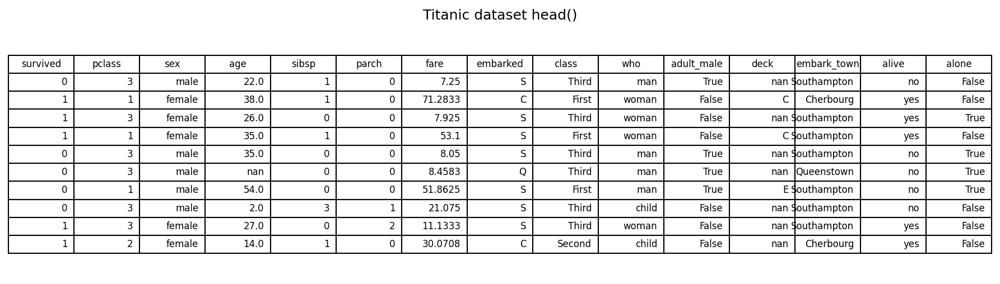
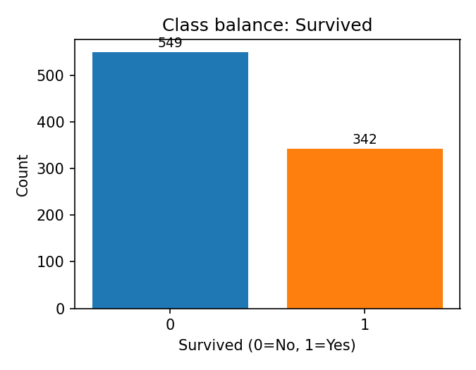
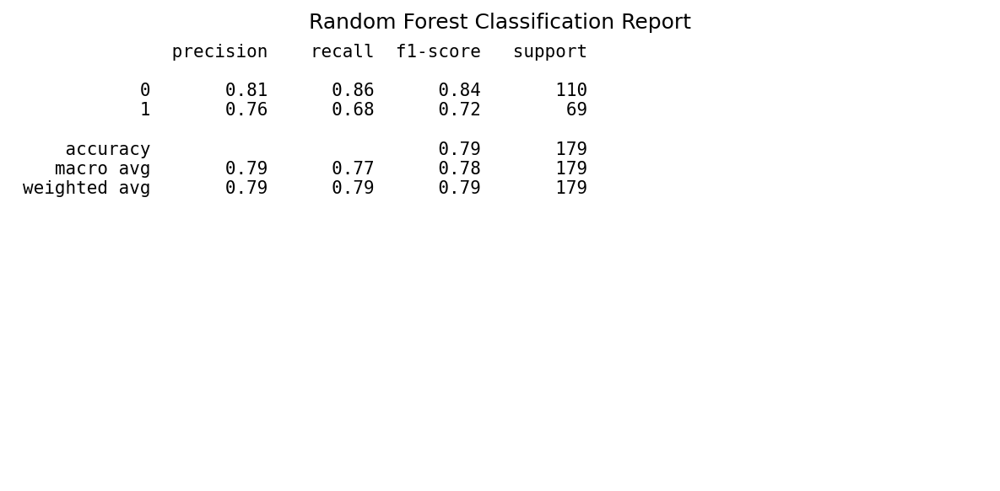
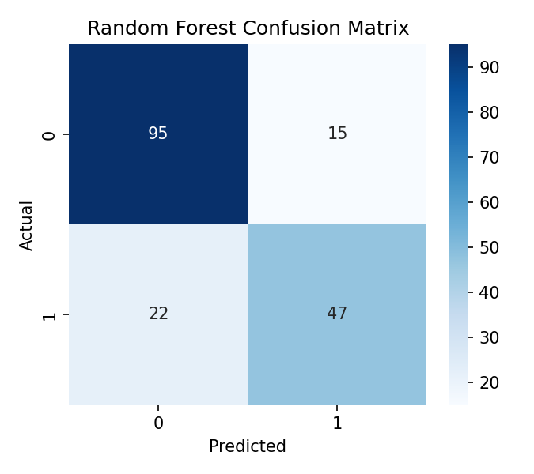
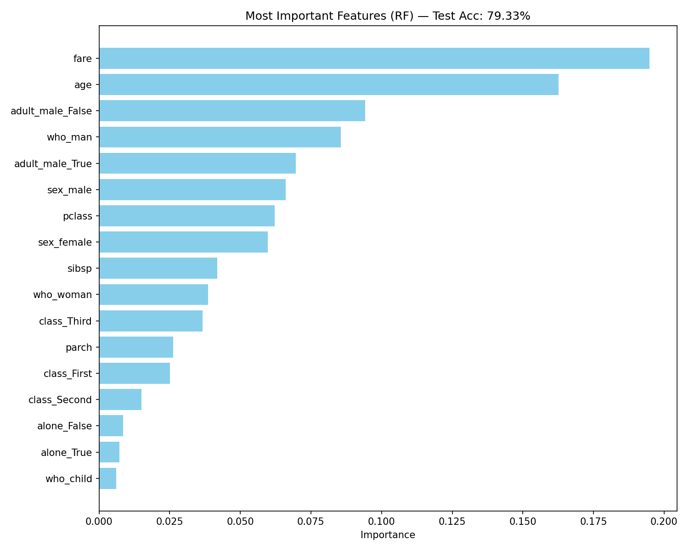
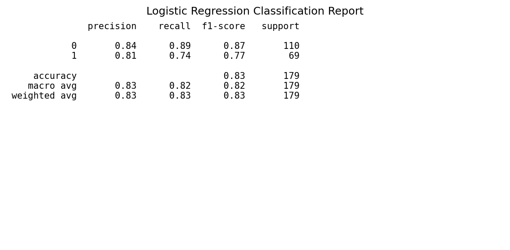
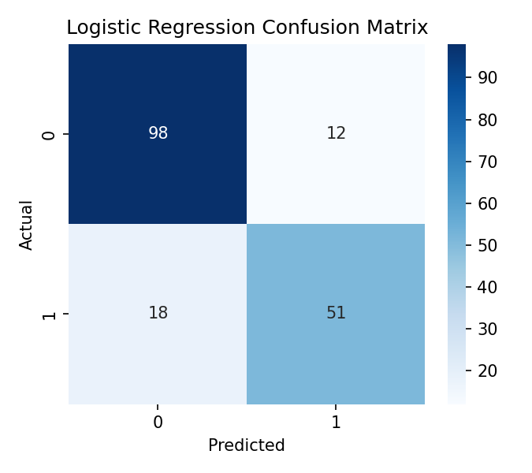
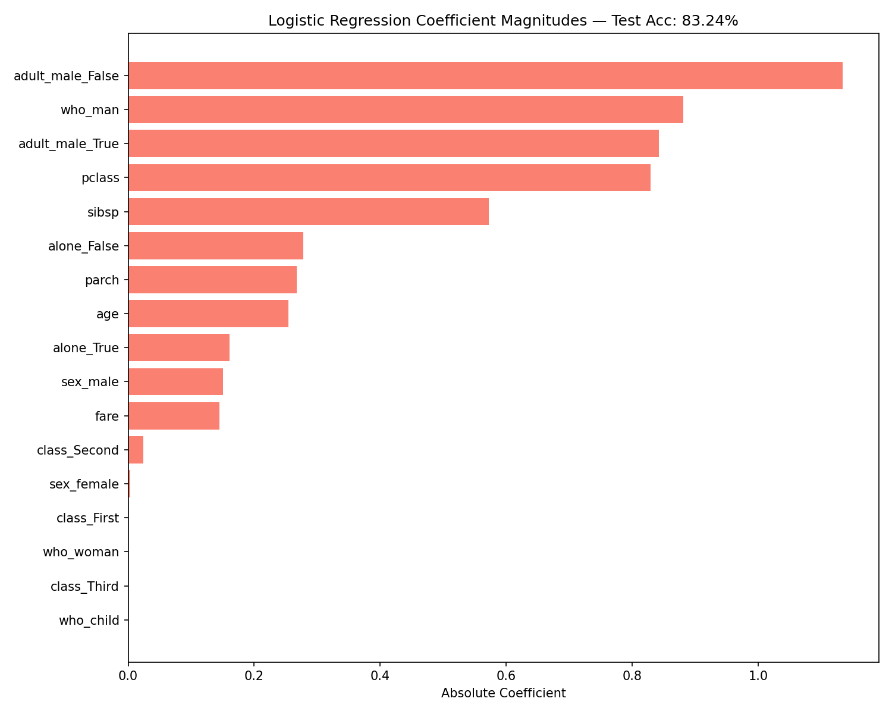

> Estimated reading time: \~**30** minutes

# Practice Project: Titanic Survival Prediction

## Objectives

- Build a classification pipeline with preprocessing and model selection
- Tune hyperparameters via cross-validation
- Compare Random Forest and Logistic Regression
- Interpret results via reports, confusion matrices, and feature importance


## Dataset and features

We use the Titanic dataset (via Seaborn). The goal is to predict `survived` from a set of demographic and ticket features. A sample of the dataset is shown below.

```python
# Imports
import matplotlib.pyplot as plt
import numpy as np
import pandas as pd
import seaborn as sns

from sklearn.model_selection import train_test_split, GridSearchCV, StratifiedKFold
from sklearn.preprocessing import StandardScaler, OneHotEncoder
from sklearn.pipeline import Pipeline
from sklearn.compose import ColumnTransformer
from sklearn.impute import SimpleImputer
from sklearn.ensemble import RandomForestClassifier
from sklearn.linear_model import LogisticRegression
from sklearn.metrics import classification_report, confusion_matrix

# Load dataset
titanic = sns.load_dataset('titanic')
titanic.head(10)
```



Target: `survived` (0 = No, 1 = Yes)

Example features used:
- Numerical: `pclass`, `age`, `sibsp`, `parch`, `fare`
- Categorical/boolean: `sex`, `class`, `who`, `adult_male`, `alone`

Class balance (counts of the target) is shown below.

```python
# Class counts (baseline check)
titanic['survived'].value_counts().sort_index()
```



## Modeling approach (no code)

- Split train/test with stratification.
- Preprocess using ColumnTransformer:
  - Numerical: impute median + standardize
  - Categorical: impute most_frequent + one-hot encode
- Model 1: RandomForestClassifier with grid search over depth and splits
- Model 2: LogisticRegression with grid search over penalty, solver, and class weights
- Evaluate on the held-out test set.

```python
# Feature selection and target
features = ['pclass', 'sex', 'age', 'sibsp', 'parch', 'fare', 'class', 'who', 'adult_male', 'alone']
target = 'survived'
X = titanic[features]
y = titanic[target]

# Train/test split with stratification
X_train, X_test, y_train, y_test = train_test_split(
  X, y, test_size=0.2, stratify=y, random_state=42
)

# Detect feature types
numerical_features = X_train.select_dtypes(include=['number']).columns.tolist()
categorical_features = X_train.select_dtypes(include=['object', 'category', 'bool']).columns.tolist()

# Preprocessing pipelines
numerical_transformer = Pipeline(steps=[
  ('imputer', SimpleImputer(strategy='median')),
  ('scaler', StandardScaler())
])

categorical_transformer = Pipeline(steps=[
  ('imputer', SimpleImputer(strategy='most_frequent')),
  ('onehot', OneHotEncoder(handle_unknown='ignore'))
])

preprocessor = ColumnTransformer(
  transformers=[
    ('num', numerical_transformer, numerical_features),
    ('cat', categorical_transformer, categorical_features)
  ]
)
```


## Random Forest results

### Classification report

```python
# Random Forest pipeline and grid search
rf_pipeline = Pipeline(steps=[
  ('preprocessor', preprocessor),
  ('classifier', RandomForestClassifier(random_state=42))
])

rf_param_grid = {
  'classifier__n_estimators': [100],
  'classifier__max_depth': [None, 10, 20],
  'classifier__min_samples_split': [2, 5]
}

cv = StratifiedKFold(n_splits=5, shuffle=True, random_state=42)
rf_model = GridSearchCV(
  estimator=rf_pipeline,
  param_grid=rf_param_grid,
  cv=cv,
  scoring='accuracy',
  verbose=0
)

rf_model.fit(X_train, y_train)
y_pred_rf = rf_model.predict(X_test)
print(classification_report(y_test, y_pred_rf))
```


### Confusion matrix

```python
# Confusion matrix (RF)
conf_rf = confusion_matrix(y_test, y_pred_rf)
plt.figure(figsize=(4.5, 4))
sns.heatmap(conf_rf, annot=True, cmap='Blues', fmt='d')
plt.title('Random Forest Confusion Matrix')
plt.xlabel('Predicted')
plt.ylabel('Actual')
plt.tight_layout()
plt.show()
```


### Feature importances

```python
# Feature importances (RF)
rf_best = rf_model.best_estimator_
rf_importances = rf_best.named_steps['classifier'].feature_importances_
ohe_feature_names = rf_best.named_steps['preprocessor'] \
  .named_transformers_['cat'] \
  .named_steps['onehot'] \
  .get_feature_names_out(categorical_features)
feature_names = numerical_features + list(ohe_feature_names)

imp_df = pd.DataFrame({'Feature': feature_names, 'Importance': rf_importances}) \
  .sort_values(by='Importance', ascending=False)

top_n = min(25, len(imp_df))
plt.figure(figsize=(10, 8))
plt.barh(imp_df['Feature'].head(top_n)[::-1], imp_df['Importance'].head(top_n)[::-1], color='skyblue')
plt.title(f'Most Important Features (RF) — Test Acc: {rf_model.score(X_test, y_test):.2%}')
plt.xlabel('Importance')
plt.tight_layout()
plt.show()
```


Notes:
- Random Forest highlights non-linear interactions and handles mixed features well.
- Feature importances rank transformed (one-hot) and numeric features together.


## Logistic Regression results

### Classification report

```python
# Logistic Regression pipeline and grid
lr_pipeline = Pipeline(steps=[
  ('preprocessor', preprocessor),
  ('classifier', LogisticRegression(random_state=42, max_iter=1000))
])

lr_param_grid = {
  'classifier__solver': ['liblinear'],
  'classifier__penalty': ['l1', 'l2'],
  'classifier__class_weight': [None, 'balanced']
}

lr_model = GridSearchCV(
  estimator=lr_pipeline,
  param_grid=lr_param_grid,
  cv=cv,
  scoring='accuracy',
  verbose=0
)

lr_model.fit(X_train, y_train)
y_pred_lr = lr_model.predict(X_test)
print(classification_report(y_test, y_pred_lr))
```


### Confusion matrix

```python
# Confusion matrix (LR)
conf_lr = confusion_matrix(y_test, y_pred_lr)
plt.figure(figsize=(4.5, 4))
sns.heatmap(conf_lr, annot=True, cmap='Blues', fmt='d')
plt.title('Logistic Regression Confusion Matrix')
plt.xlabel('Predicted')
plt.ylabel('Actual')
plt.tight_layout()
plt.show()
```


### Coefficient magnitudes

```python
# Coefficient magnitudes (LR)
lr_best = lr_model.best_estimator_
coefficients = lr_best.named_steps['classifier'].coef_[0]
ohe_feature_names_lr = lr_best.named_steps['preprocessor'] \
  .named_transformers_['cat'] \
  .named_steps['onehot'] \
  .get_feature_names_out(categorical_features)
feature_names_lr = numerical_features + list(ohe_feature_names_lr)

coef_df = pd.DataFrame({'Feature': feature_names_lr, 'Coefficient': coefficients}) \
  .sort_values(by='Coefficient', key=lambda s: s.abs(), ascending=False)

top_n = min(25, len(coef_df))
plt.figure(figsize=(10, 8))
plt.barh(coef_df['Feature'].head(top_n)[::-1], coef_df['Coefficient'].abs().head(top_n)[::-1], color='salmon')
plt.title(f'Logistic Regression Coefficient Magnitudes — Test Acc: {lr_model.score(X_test, y_test):.2%}')
plt.xlabel('Absolute Coefficient')
plt.tight_layout()
plt.show()
```


Notes:
- Coefficients reflect the linear contribution (after preprocessing).
- Magnitudes are not directly comparable to tree-based importances, but provide directionality.


## Comparison and takeaways

- Both models achieve comparable accuracy on this dataset.
- Differences in feature rankings suggest correlated variables and overlapping information (e.g., `sex`, `who_*`, `age`).
- Next steps: refine features, consider interaction terms, calibrate probabilities, and explore additional models.
