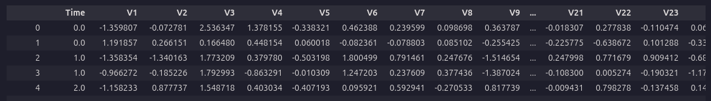
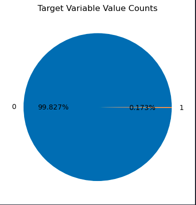

>Estimated reading time: \~10 minutes

# Credit Card Fraud Detection with Decision Trees and SVM

## Objectives

-   Perform basic data preprocessing in Python
-   Model a classification task using Scikit-Learn
-   Train Support Vector Machine and Decision Tree models
-   Assess model quality

## Introduction

This article demonstrates how to use Decision Tree and Support Vector Machine models to identify fraudulent credit card transactions using a real dataset. The dataset is highly unbalanced, with only a small fraction of transactions being fraudulent.

## Import Libraries

``` python
import pandas as pd
import matplotlib.pyplot as plt
from sklearn.model_selection import train_test_split
from sklearn.preprocessing import normalize, StandardScaler
from sklearn.utils.class_weight import compute_sample_weight
from sklearn.tree import DecisionTreeClassifier
from sklearn.metrics import roc_auc_score
from sklearn.svm import LinearSVC
import warnings
warnings.filterwarnings('ignore')
```

## Load the dataset

``` python
url= "https://cf-courses-data.s3.us.cloud-object-storage.appdomain.cloud/IBMDeveloperSkillsNetwork-ML0101EN-SkillsNetwork/labs/Module%203/data/creditcard.csv"
raw_data=pd.read_csv(url)
raw_data.head()
```



## Dataset Analysis

``` python
labels = raw_data.Class.unique()
sizes = raw_data.Class.value_counts().values
fig, ax = plt.subplots()
ax.pie(sizes, labels=labels, autopct='%1.3f%%')
ax.set_title('Target Variable Value Counts')
plt.show()
```



## Feature Correlation

``` python
correlation_values = raw_data.corr()['Class'].drop('Class')
correlation_values.plot(kind='barh', figsize=(10, 6))
```


## Dataset Preprocessing

``` python
raw_data.iloc[:, 1:30] = StandardScaler().fit_transform(raw_data.iloc[:, 1:30])
data_matrix = raw_data.values
X = data_matrix[:, 1:30]
y = data_matrix[:, 30]
X = normalize(X, norm="l1")
```

## Train/Test Split

``` python
X_train, X_test, y_train, y_test = train_test_split(X, y, test_size=0.3, random_state=42)
```

## Build a Decision Tree Classifier

### Desciption

The decision tree classifier algorithm, as introduced by J. R. Quinlan (1986), constructs a tree structure where each internal node represents a test on an attribute, each branch represents an outcome of the test, and each leaf node represents a class label. The algorithm recursively splits the dataset based on the attribute that provides the highest information gain (or another splitting criterion), aiming to maximize the separation of classes at each step.

### Mathematical Summary
At each node, the algorithm selects the attribute \( A \) that maximizes the information gain:

$$
\text{Gain}(S, A) = \text{Entropy}(S) - \sum_{v \in \text{Values}(A)} \frac{|S_v|}{|S|} \text{Entropy}(S_v)
$$

where \( S \) is the set of training examples at the node, \( S_v \) is the subset of \( S \) where attribute \( A \) has value \( v \), and Entropy is defined as:

$$
\text{Entropy}(S) = -\sum_{c \in \text{Classes}} p_c \log_2 p_c
$$

with \( p_c \) being the proportion of class \( c \) in \( S \).

### Pseudocode

```text
function DecisionTree(S, Attributes):
    if all examples in S belong to the same class:
        return a leaf node with that class
    if Attributes is empty:
        return a leaf node with the majority class in S
    A = attribute in Attributes with highest information gain
    create a decision node that splits on A
    for each value v of A:
        Sv = subset of S where A == v
        if Sv is empty:
            add a leaf node with the majority class in S
        else:
            add subtree DecisionTree(Sv, Attributes - {A})
    return the decision node
```

### "Implementation(Call)"

``` python
w_train = compute_sample_weight('balanced', y_train)
dt = DecisionTreeClassifier(max_depth=4, random_state=35)
dt.fit(X_train, y_train, sample_weight=w_train)
```

## Build a Support Vector Machine model

### Description

The Support Vector Machine (SVM) classifier is a supervised learning algorithm that finds the optimal hyperplane separating data points of different classes with the maximum margin. SVM focuses on the data points closest to the decision boundary, called support vectors. The algorithm can be extended to handle non-linear boundaries using kernel functions.


### Mathematical Summary

Given a set of training data \((x_i, y_i)\), where \(x_i \in \mathbb{R}^n\) and \(y_i \in \{-1, 1\}\), the SVM solves the following optimization problem:

$$
\min_{w, b} \frac{1}{2} \|w\|^2
$$
subject to:
$$
y_i (w^T x_i + b) \geq 1 \quad \forall i
$$

For non-linearly separable data, slack variables \(\xi_i\) and a penalty parameter \(C\) are introduced:

$$
\min_{w, b, \xi} \frac{1}{2} \|w\|^2 + C \sum_{i=1}^N \xi_i
$$
subject to:
$$
y_i (w^T x_i + b) \geq 1 - \xi_i, \quad \xi_i \geq 0
$$

The decision function for a new point \(x\) is:
$$
f(x) = \text{sign}(w^T x + b)
$$

With kernels, the inner product \(x_i^T x_j\) is replaced by \(K(x_i, x_j)\).


### Pseudocode

```text
Input: Training data (x_i, y_i), kernel function K, penalty parameter C

1. Formulate the optimization problem:
    Maximize:
        L(α) = Σ α_i - 0.5 ΣΣ α_i α_j y_i y_j K(x_i, x_j)
    Subject to:
        0 ≤ α_i ≤ C,  Σ α_i y_i = 0

2. Solve for α_i (using quadratic programming)

3. Compute w = Σ α_i y_i x_i (for linear case)

4. Compute b using support vectors

5. For a new input x:
    Compute f(x) = sign(Σ α_i y_i K(x_i, x) + b)
    Assign class label based on sign

Output: Decision function f(x)
```

### "Implementation(Call)"


``` python
svm = LinearSVC(class_weight='balanced', random_state=31, loss="hinge", fit_intercept=False)
svm.fit(X_train, y_train)
```

## Evaluate the Decision Tree Classifier

``` python
y_pred_dt = dt.predict_proba(X_test)[:,1]
roc_auc_dt = roc_auc_score(y_test, y_pred_dt)
print('Decision Tree ROC-AUC score : {0:.3f}'.format(roc_auc_dt))
```

> Decision Tree ROC-AUC score : 0.939

## Evaluate the SVM

``` python
y_pred_svm = svm.decision_function(X_test)
roc_auc_svm = roc_auc_score(y_test, y_pred_svm)
print("SVM ROC-AUC score: {0:.3f}".format(roc_auc_svm))
```
> SVM ROC-AUC score: 0.986

## Summary

This article showed how to use Decision Tree and SVM models for credit card fraud detection, including preprocessing, model training, and evaluation using ROC-AUC.
SVM outperformed the Decision Tree in this case, demonstrating its effectiveness for this classification task.

## References

Cortes, C., & Vapnik, V. (1995). Support-vector networks. Machine Learning, 20, 273–297. doi:10.1007/BF00994018*
Quinlan, J. R. (1986). Induction of Decision Trees. Machine Learning, 1(1), 81–106.*
