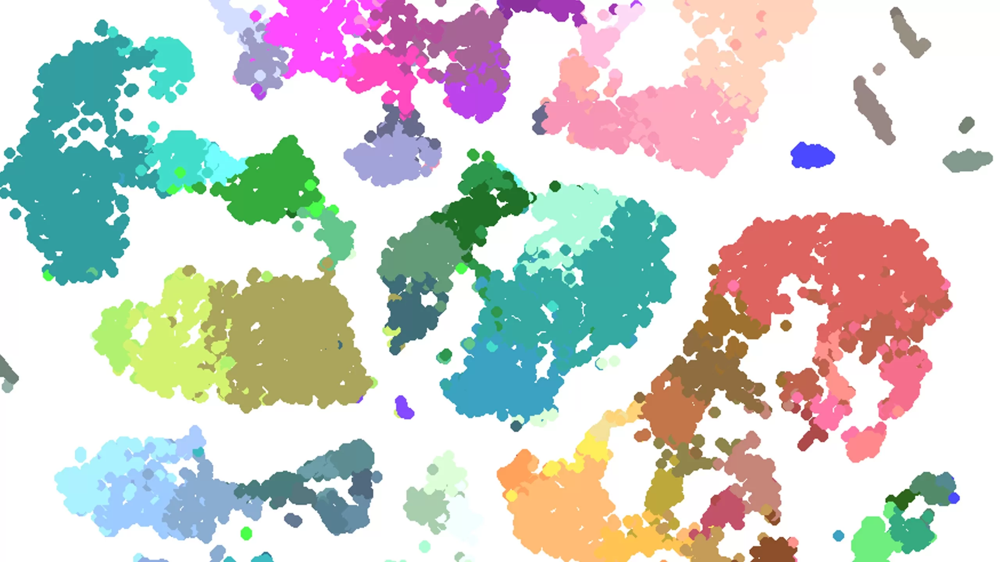
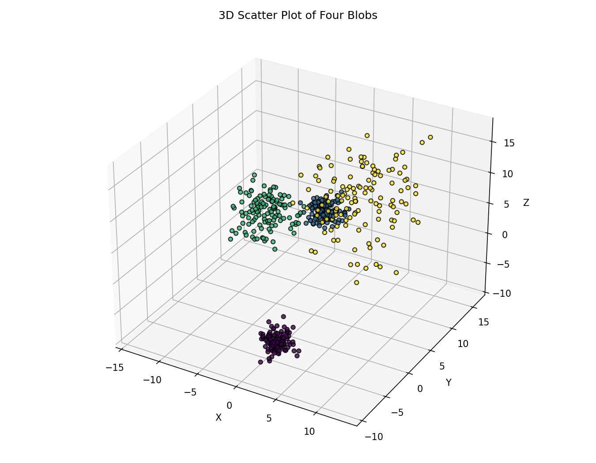
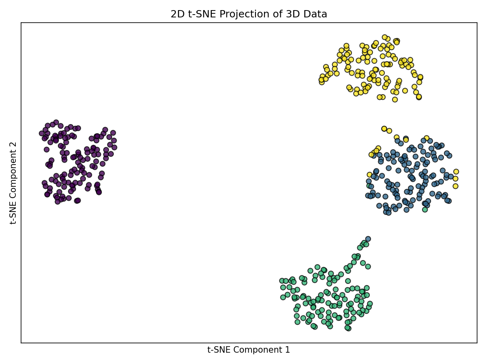
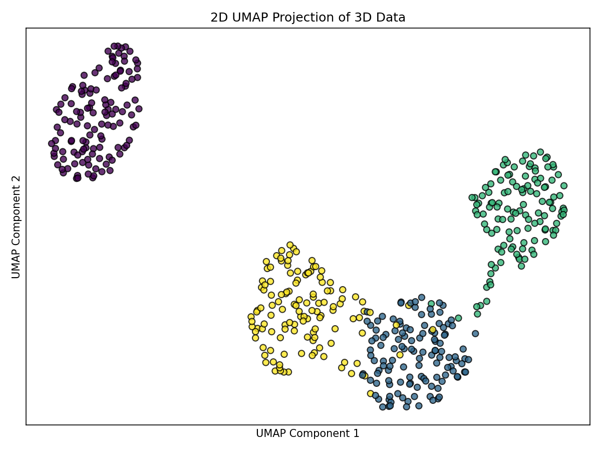
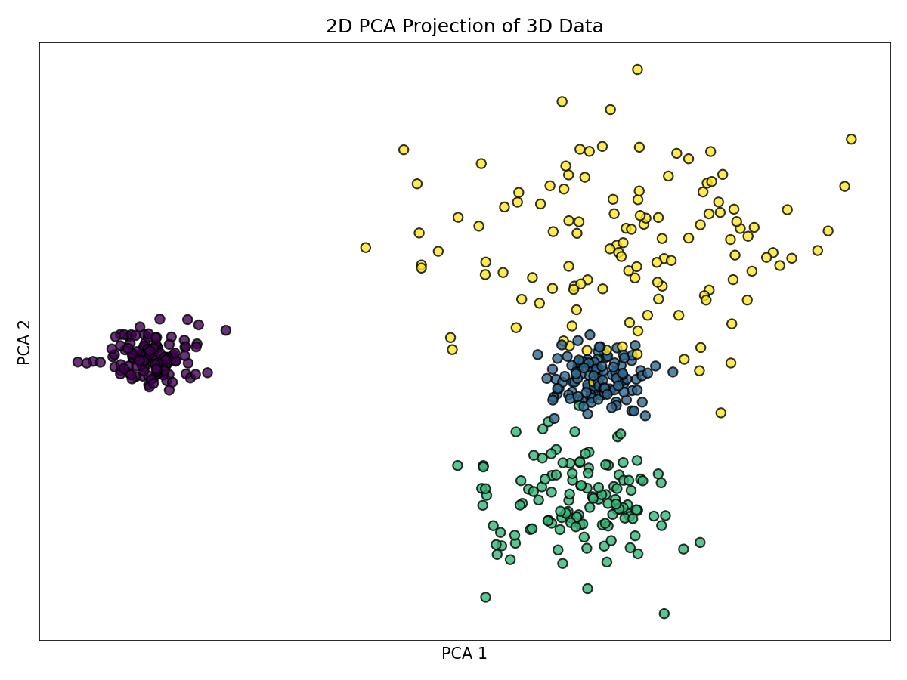

> Estimated reading time: ~\**30** minutes

# Comparing t-SNE and UMAP for Dimensionality Reduction

## Objectives

- Apply t-SNE and UMAP to reduce dimensionality of structured synthetic data
- Use PCA as a baseline for comparison
- Visually assess structure preservation (cluster separation, density, connectivity)


## Introduction

We generate four Gaussian blobs in a 3D feature space and compare 2D projections using three methods:
- t-SNE (nonlinear neighbor embedding)
- UMAP (uniform manifold approximation)
- PCA (linear projection)

All figures are pre-rendered; no code runs in this article.

```python
# Imports and data generation (reference only; not executed during render)
import numpy as np
import matplotlib.pyplot as plt
from sklearn.datasets import make_blobs
from sklearn.preprocessing import StandardScaler
from sklearn.manifold import TSNE
from sklearn.decomposition import PCA
import umap.umap_ as UMAP

# Cluster setup (four blobs in 3D)
centers = [[2, -6, -6],
           [-1, 9, 4],
           [-8, 7, 2],
           [4, 7, 9]]
cluster_std = [1, 1, 2, 3.5]

# Generate dataset and standardize
X, labels = make_blobs(n_samples=500, centers=centers, n_features=3,
                       cluster_std=cluster_std, random_state=42)
scaler = StandardScaler()
X_scaled = scaler.fit_transform(X)
```


## Data overview (3D)

The dataset contains four clusters with different spreads and separations.

```python
# 3D scatter (reference)
fig = plt.figure(figsize=(9, 7))
ax = fig.add_subplot(111, projection='3d')
ax.scatter(X[:, 0], X[:, 1], X[:, 2], c=labels, cmap='viridis', s=20, alpha=0.8, edgecolor='k')
ax.set_title('3D Scatter Plot of Four Blobs')
ax.set_xlabel('X')
ax.set_ylabel('Y')
ax.set_zlabel('Z')
plt.tight_layout()
plt.show()
```




## t-SNE projection (2D)

t-SNE aims to preserve local neighborhoods using a probabilistic formulation.

```python
# t-SNE projection (reference)
tsne = TSNE(n_components=2, random_state=42, perplexity=30, n_iter=1000)
X_tsne = tsne.fit_transform(X_scaled)

plt.figure(figsize=(8, 6))
plt.scatter(X_tsne[:, 0], X_tsne[:, 1], c=labels, cmap='viridis', s=35, alpha=0.8, edgecolor='k')
plt.title('2D t-SNE Projection of 3D Data')
plt.xlabel('t-SNE Component 1')
plt.ylabel('t-SNE Component 2')
plt.xticks([]); plt.yticks([])
plt.tight_layout(); plt.show()
```



Notes:
- Typically yields well-separated 2D clusters.
- Cluster densities often appear similar in the embedding.
- Some points may shift between clusters due to overlapping structure in the original space and t-SNE’s focus on local neighborhoods.


## UMAP projection (2D)

UMAP balances local and global structure via a fuzzy topological graph.

```python
# UMAP projection (reference)
umap_model = UMAP.UMAP(n_components=2, random_state=42, min_dist=0.5, spread=1, n_jobs=1)
X_umap = umap_model.fit_transform(X_scaled)

plt.figure(figsize=(8, 6))
plt.scatter(X_umap[:, 0], X_umap[:, 1], c=labels, cmap='viridis', s=35, alpha=0.8, edgecolor='k')
plt.title('2D UMAP Projection of 3D Data')
plt.xlabel('UMAP Component 1')
plt.ylabel('UMAP Component 2')
plt.xticks([]); plt.yticks([])
plt.tight_layout(); plt.show()
```



Notes:
- Often preserves connectivity where clusters overlap in the original space.
- Separation can be strong while maintaining partial connections for overlapping regions.
- Results depend on parameters like `min_dist` and `spread`.


## PCA projection (2D)

PCA is a linear method projecting data onto directions of maximum variance.

```python
# PCA projection (reference)
pca = PCA(n_components=2)
X_pca = pca.fit_transform(X_scaled)

plt.figure(figsize=(8, 6))
plt.scatter(X_pca[:, 0], X_pca[:, 1], c=labels, cmap='viridis', s=35, alpha=0.8, edgecolor='k')
plt.title('2D PCA Projection of 3D Data')
plt.xlabel('PCA 1')
plt.ylabel('PCA 2')
plt.xticks([]); plt.yticks([])
plt.tight_layout(); plt.show()
```



Notes:
- Preserves global variance, relative distances, and densities linearly.
- May not fully separate overlapping blobs but provides a faithful linear view.
- Fast and robust baseline for many datasets.


## Comparison and takeaways

- t-SNE and UMAP provide nonlinear embeddings that can separate clusters more clearly, but interpretability of distances can be trickier.
- UMAP often retains connectivity seen in the original space; t-SNE tends to emphasize cluster separation.
- PCA is a strong baseline: fast, interpretable, and preserves variance globally, though it can under-separate nonlinearly separable clusters.

Practical tips:
- Standardize features before projection.
- Try multiple seeds and parameter values (e.g., t-SNE perplexity; UMAP `min_dist`, `n_neighbors`).
- Always compare against PCA to gauge the value of nonlinear methods on your data.
